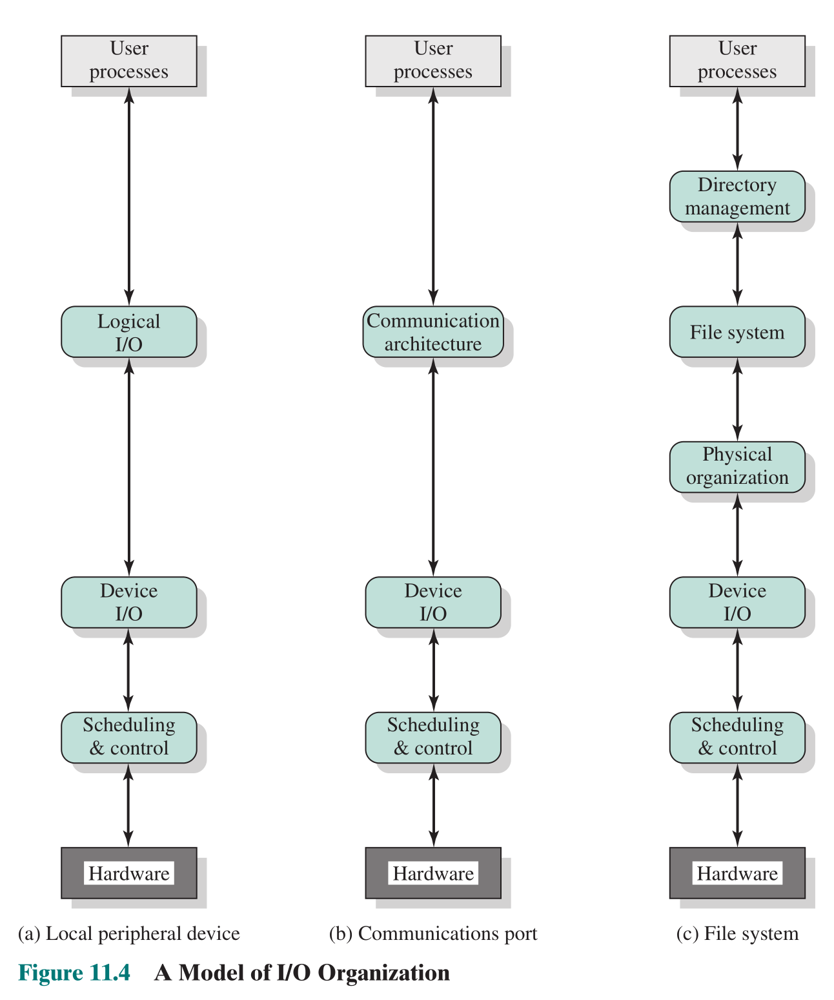
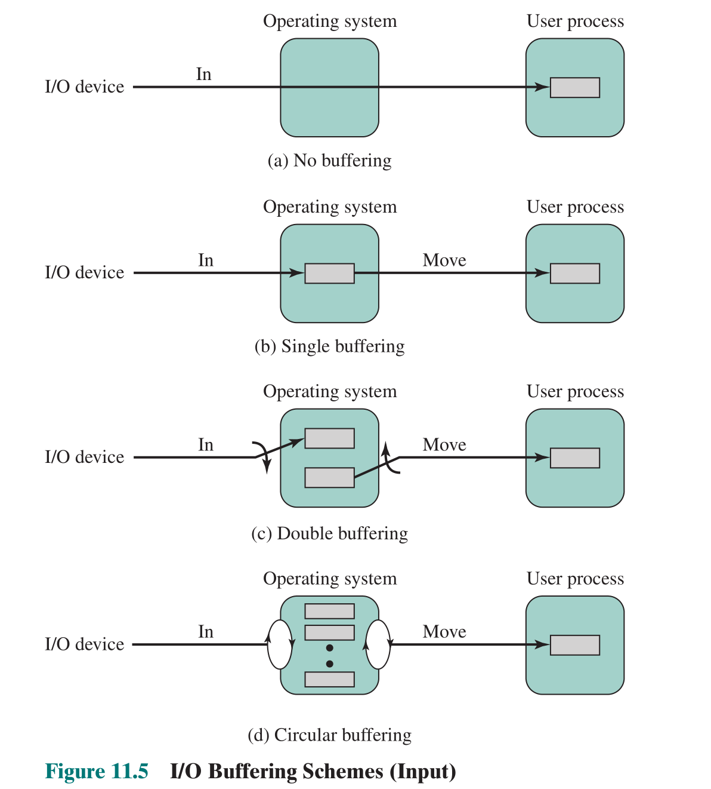
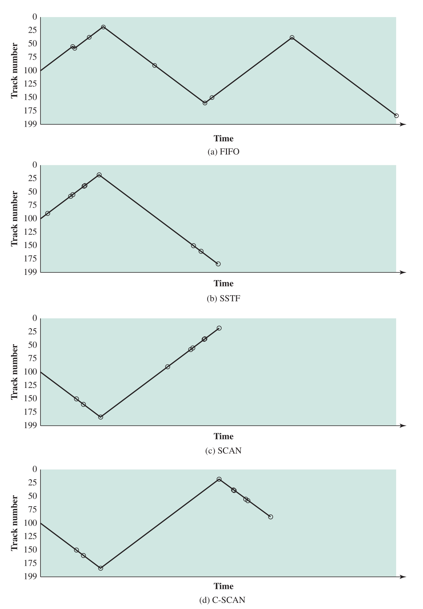
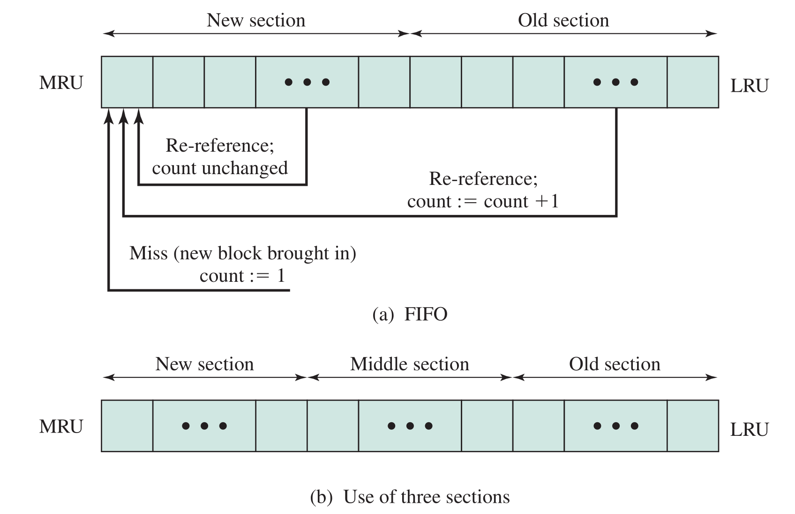

# I/O 管理和磁盘调度

## I/O 设备

I/O 系统：I/O 设备及其接口线路、控制部件、通道和管理软件的总称。

I/O 操作：计算机的主存和外围设备的介质之间的信息传送操作

### I/O 设备分类

- 用户可读
- 机器可读
- 通信

按照 I/O 特性，I/O 设备可以划分为输入型、输出型和存储型外围设备三类。

按照 I/O 信息交换的单位，I/O 设备可分为字符设备和块设备。输入型设备和输出型设备一般为字符设备，与主存进行信息交换的单位是字节。存储型设备一般为块设备。

存储型设备可以划分为顺序存取存储设备和直接存取存储设备：

- 顺序存取存储设备严格依赖信息的物理位置进行定位和读写，如磁带。
- 直接存取存储设备的重要特性是存取任何一个物理块所需的时间几乎不依赖于此信息的位置，如磁盘。

### I/O 设备的差异

- 数据速率
- 应用（影响到 OS 中的软件、策略以及支撑软件）
- 控制的复杂性
- 传输单位（字符设备、块设备）
- 数据表示（不同设备采用不同的数据编码设计）
- 错误条件（报告方式、错误的后果、响应范围）

## I/O 功能的组织

I/O 技术：程序控制 I/O，中断驱动 I/O，直接内存访问 DMA

 [I/O 技术：程序控制 I/O，中断驱动 I/O，直接内存访问 DMA](计算机系统概述.md#I%20O%20 操作技术)

I/O 功能的演变：

1.  处理器直接控制外围设备
2.  添加了控制器或 I/O 模块，处理器使用程序控制 I/O，不需要处理外围设备的具体细节
3.  具有中断的控制器或 I/O 模块，处理器不必等待 I/O 设备准备完成
4.  DMA，数据直接传输至内存，不用 CPU 参与，CPU 只在开始和结束时干涉
5.  I/O 模块有单独的处理器，CPU 指导 I/O 处理器执行内存中的 I/O 程序
6.  I/O 处理器有了自己单独的内存

4,5,6 都是 DMA，5,6 一般称为通道。

### 通道

通道是独立于 CPU 的专门负责数据输入/输出传输工作的处理机，可以执行通道程序。

引入通道的目的：为了使 CPU 从 I/O 事务中解脱出来，提高 CPU 与设备，设备与设备之间的并行工作能力。

通道相当于一个功能简单的处理机，包含通道指令（空操作，读操作，写操作，控制，转移操作），并可执行用这些指令编写的通道程序。因此可以进行较为复杂的 I/O 控制。

通道程序通常由操作系统所构造，放在内存里。执行一个通道程序可以完成几批 I/O 操作。

## 操作系统设计问题

I/O 软件总体设计目标:高效率、通用性

I/O 软件总体设计要考虑的问题：
- 设备无关性：抽象为物理设备、逻辑设备
- 出错处理
- 同步（阻塞）—异步（中断驱动）传输。
- 缓冲技术

### 高效率

I/O 比 CPU、主存慢得多，因此需要使用多道程序设计技术使得一个进程执行时一些进程等待 I/O，将一些被阻塞的进程对换出去可以换入更多进程消耗 CPU 时间，但是对换同时又是一项 I/O 操作。

### 通用性

- 为了简单性和免于出错，应以统一方式处理所有 I/O 设备
- 将设备 I/O 的大部分细节隐藏在低层例程中
- 难以完全通用化，但 I/O 功能可使用分层模块设计

### I/O 功能的逻辑结构

由操作系统分层，功能向下依赖，向上提供服务，修改某一层应该可以不修改其他层

Logical I/O：处理逻辑设备(也称为虚拟设备)实体，不涉及实际的设备控制

Device I/O：逻辑设备与物理设备间的过渡协调机构:

Scheduling and Control：物理设备控制实体；直接面对硬件设备的控制细节。这部分通常体现为设备驱动程序

Communications Port：就某个通信设备而言，I/O 结构和上述几乎一样。主要差别是 Logical I/O 模块被通信体系结构取代，通信体系结构自身也是由许多层组成的。

文件系统还有另外三层结构来代替 Logical I/O：Directory management 目录管理、File System 文件系统（文件的逻辑组织和操作）和 Physical organization 物理组织（将逻辑引用转变为物理地址等）

## I/O Buffering

对于 I/O 操作，提前输入，延迟输出更加有效（提前读、延迟写）

引入缓冲技术的目的：

- 匹配 CPU 或用户应用进程与外设的不同处理速度
- 协调逻辑记录大小与物理记录大小不一致
- 提高 CPU 和 I/O 设备之间以及各个 I/O 设备之间的处理并行性

缓冲技术实现基本思想：

进程执行写操作输出数据时，向系统申请一个缓冲区，不断把数据填到缓冲区，直到被装满。此后，进程继续它的计算，系统将缓冲区内容写到 I/O 设备上。

进程执行读操作输入数据时，向系统申请一个缓冲区，系统将一个物理记录的内容读到缓冲区，根据进程要求，把当前需要的逻辑记录从缓冲区中选出并传送给进程。

在输出数据时，只有在系统还**来不及腾空缓冲**而进程又要写数据时，它才需要等待；

在输入数据时，仅当**缓冲区空而进程又要从中读取数据时**，它才被迫等待。

缓冲区设置：硬缓冲（在设备中设置缓冲区，由硬件实现）、软缓冲（在内存中开辟一个空间，用作缓冲区）

在讨论各种缓冲方法时，有时需要区分两类 I/O 设备：

- 面向块的 I/O 设备和面向流的 I/O 设备。面向块（block-oriented）的设备（如磁盘）将信息保存在固定大小的块中，传送过程中一次传送块。通常可以通过块号访问数据。
- 面向流（stream-oriented）的设备以字节流的方式输入/输出数据，它没有块结构。
  - 终端、打印机、通信端口、鼠标和其他指示设备及其他大多数非辅存设备，都属于面向流的设备。

### 单缓冲

一个缓冲区，CPU 和外设轮流使用，一方处理完之后接着等待对方处理

- 外设将数据输入缓冲
- 当传输完成时，数据块移到用户空间
- 立即请求下一块送入缓冲
  - 这称为提前读或预读（期望用户的数据是顺序访问的）

数据处理时间约为 max[C,T]+M。T 是从外设输入一个数据块到 buffer 所需要的时间，C 是两次输入请求之间所需的计算时间。M 是把数据从系统缓冲区复制到用户内存所需要的时间。

此处计算题建议画图。

面向流（stream-oriented）的单缓冲：一次一行或一个字节。终端常按行处理，回车键作为结束。每次传送一字节适用于每次击键都很重要的设备，传感器和控制器等都属于这种类型。

### 双缓冲

在一个进程向一个缓冲区中传送数据（从这个缓冲区中取数据）的同时，外设在处理另一个缓冲区，这种技术称为双缓冲或缓冲交换（见上图）

### 循环缓冲

有多个缓冲区，适用于希望 I/O 能跟上进程执行的时候（见上图）

### 缓冲池

建立三种缓冲区队列：空闲缓冲区，输入缓冲区，输出缓冲区

## 磁盘调度

### 磁盘性能参数

寻道时间/定位时间：磁头移动到指定柱面的机械运动时间

旋转延迟：访问的扇区开始旋转到磁头位置的机械运动时间

传送时间：传输数据的时间

### 磁盘调度策略

同时有多个磁盘的读写请求时，如何安排这些请求的顺序就是磁盘调度策略。

#### FIFO

太简单，不介绍了。

特点：

- 公平
- 如果有许多进程，性能上接近随机调度
- 在磁盘 I/O 负载较轻且每次读写多个连续扇区时，性能较好

#### 优先级算法

优先级算法的目标不是优化磁盘的使用性能，而是实现系统其他目标。该算法反映进程在系统的优先级特征。

- 短期批处理作业和交互式作业可能具有更高的优先级
- 提供更优秀的交互响应时间
- 长作业则可能需要等待很久

#### LIFO 后进先出算法

对事务处理系统较好（设备给最近的用户会导致磁头臂移动得很少）

它的问题在于系统负载重时，可能有进程的磁盘 I/O 永远不能执行，处于饥饿状态。

#### SSTF 最短查找时间优先

选择从当前磁头位置出发，移动最少的磁盘 I/O 请求

该算法的目标是使每次磁头移动时间最少。它不一定是最短平均寻道时间，但比 FIFO 算法有更好的性能。

对**中间的磁道有利**，可能会有进程处于**饥饿**状态。

#### SCAN 扫描算法

移动臂在一个方向上移动，满足所有未完成的请求直到到达此方向的最后一个磁道（或该方向没有更多请求为止，Look 策略），然后反向处理（电梯调度）

该算法是对 SSTF 算法的改进，磁盘 I/O 较好，且没有进程会饿死

有利于最内侧和外侧的磁道请求，有利于扫描方向前方新到达的请求

#### C-SCAN(circular SCAN) 循环扫描算法

仅在一个方向上使用扫描，即当到达最后一个磁道时，移动臂直接移动到另一沿的第一个位置，开始扫描。

可以减少新请求的最长等待时间

#### N-step-SCAN N 步扫描算法

把磁盘 I/O 请求队列分成长度为 N 的子队列，每次使用扫描算法处理子队列，当正在处理一个队列时，新到请求加入另一队列。

算法的目标是改进前几种算法可能在多磁头系统中出现磁头静止在一个磁道上(arm stickiness,磁臂粘着)，避免扫描方向前方不断有新到达的请求导致其它进程无法及时进行磁盘 I/O。（即结合了FIFO）

#### FSCAN

磁盘 I/O 请求分成两个队列，开始扫描时，所有请求在一个队列中，另一个为空。新到请求放入另一队列，新请求的服务将推迟到所有旧请求都已处理完为止。

该算法的目标与 N 步扫描算法一致，就是将 N 步扫描算法的 N 设定为 2

## RAID

略，仅作了解，网上搜搜比书上更新更详细

## Disk Cache 磁盘缓存

主存中为磁盘扇区设置的缓冲区，含有磁盘中某些扇区的副本。当需要请求某些扇区的时候检查是否在 Disk Cache 里出现过

两种形式：

- 内存开辟固定大小的存储空间作为磁盘缓存区
- 所有未用内存空间构成缓冲池，供请求分页和磁盘缓存共享

### 数据交付

将磁盘缓存中的数据传送给请求进程的过程：

- 先查磁盘缓存，若盘块数据在磁盘缓存，则直接从磁盘缓存提取数据传送给请求进程
- 如果在磁盘缓存中没找到，含有所需信息的盘块数据从磁盘读入磁盘缓存，并传送给请求进程
- 交付数据的两种方式：
    - 数据交付：数据从缓存传送到进程工作区
    - 指针交付：指向缓存的指针交付给进程

### 磁盘缓存置换算法

磁盘缓存的置换算法**类似[虚拟存储置换](虚拟内存.md#置换策略)**算法。

磁盘的访问**频率远低于虚拟存储**，且可预见性高。

数据一致性问题解决：

- 写穿透：缓存与磁盘的相应块同时写
- 重要数据优先写回：LRU 链
- 周期性写回：所有修改过的块

通常磁盘缓存置换算法会比虚拟存储复杂

#### LRU

替换 cache 中未被访问时间最久的块

逻辑上，高速缓存由一个关于块的栈组成，最近访问过的块位于栈项。当高速缓存中的一块被访问到时，它从栈中当前的位置移到桟顶。当一个块从辅存中取入发生置换时，栈底的块将被换出，并把新到来的块压入栈顶。当然，并不需要在内存中真正移动这些块，因为有一个栈指针与高速缓存相关联。

#### LFU

替换访问次数最少的块

Cache 中每一块有一个计数器，每访问一次计数器加一，置换时移出访问次数最少的块。

问题：在短时间内一些块可能多次访问，计数器的值可能误导

#### Frequency-Based Replacement 访问频率置换算法

它是对 LRU 算法和 LFU 算法的改进,解决的主要问题是在 LFU 算法中的引用计数问题。

磁盘访问可能会十分集中，在一段密集使用后，引用计数的变化就不能反映当前的引用情况。

需要考虑磁盘访问的这种密集特征，对密集引用不计数。其基本思想是在**短周期中使用 LRU 算法**，而在**长周期中使用 LFU 算法**。

栈中缓存块被访问时移到栈顶；如果该块在新区域，引用计数不变；否则，引用计数加 1。

- 在新区域中引用计数不变的目的是避免密集访问对引用计数不利影响；
- 在中间区域和旧区域中引用计数加 1 是为了使用 LFU 算法；

未缓存数据块读入后放在栈顶，引用计数为 1

在旧区域中引用计数最小的缓存块被置换；

- 中间区域的定义是为了避免新读入的缓存块在第一次出新区域时马上被置换，有一个过渡期；

