# 内存管理

在 [单道程序设计系统](操作系统概述.md#简单批处理系统) 中，内存划分为两部分：一部分供操作系统使用（驻留监控程序、内核），另一部分供当前正在执行的程序使用。

在 [多道程序设计系统](操作系统概述.md#多道批处理系统（Multiprogrammed%20Batch%20Systems）) 中，必须在内存中进一步细分出“用户”部以满足多个进程的要求。细分的任务由操作系统动态完成（分区、分页、分段），这称为内存管理（memory management）

操作系统需要分配内存以确保有适当数目的就绪进程来消耗可用的处理器时间，避免所有进程都在等待 I/O 浪费时间。

## 内存管理的需求

- Relocation 重定位
- Protection 保护
- Sharing 共享
- Logical organization 逻辑组织
- Physical organization 物理组织

### 重定位

在多道程序设计系统中，可用的内存空间通常被多个进程共享。程序员**不知道程序执行时会被放置在内存何处**。

此外，我们还希望提供一个巨大的就绪进程池，以便把活动进程 [**换入或换出**](进程描述与控制.md#进程挂起) 内存，以**提高处理器利用率**。

程序换出到磁盘中后，下次换入时要放到与换出前相同的内存区域中会很困难。相反，我们需要把进程**重定位**（relocate）到内存的不同区域。

操作系统需要知道 [进程控制信息](进程描述与控制.md#进程控制信息（Process%20control%20information）) 和执行栈的位置，以及该进程开始执行程序的入口点。由于操作系统管理内存并负责把进程放入内存，因此可以很容易地获得这些地址。此外，处理器必须**处理程序内部的内存访问**（跳转指令——跳转后指令的地址，数据访问指令——被访问数据的地址）。处理器硬件和操作系统软件必须能以某种方式**把程序代码中的内存访问转换为实际的物理内存地址**，并反映程序在内存中的当前位置。

重定位：在可执行文件装入时需要解决可执行文件中（指令和数据的）地址和实际内存地址的对应。

重定位方法：

- 静态重定位（仅适用于单道程序）：当用户程序被装入内存时，一次性实现逻辑地址到物理地址的转换，以后不再转换
- 动态重定位：在程序运行过程中访问内存时再进行地址变换

### 保护

每个进程都应受到保护，以免被其他进程有意或无意地干扰。因此未经许可，进程不能访问其他进程的内存位置（范围保护）。

在某种意义上，满足重定位的需求增大了满足保护需求的难度。由于程序在内存中的位置不可预测，因而**在编译时不可能检查绝对地址来实现保护**。

此外，大多数程序设计语言允许在运行时进行地址的动态计算。因此，**必须在运行时检查进程产生的所有内存访问**，以确保只访问分配给该进程的内存空间。

既支持重定位也支持保护需求的机制已经存在。

通常，用户进程不能访问操作系统的任何部分。此外，一个进程中的程序通常不能跳转到另一个进程中的指令。若无特别许可，一个进程中的程序不能访问其他进程的数据区。**处理器**必须能在执行时**终止**这样的指令。

注意，**内存保护需求必须由处理器**（硬件）而非操作系统（软件）来**满足**，*因为操作系统不能预测程序可能产生的所有内存访问，即使可以预测，提前审查每个进程中可能存在的内存违法访问也非常费时。*因此，只能在指令访问内存（存取数据或跳转）时来判断这个内存访问是否违法。

### 共享

任何保护机制都必须具有一定的灵活性，以**允许多个进程访问同一内存区域（代码、数据）**。

例如，多个进程正在执行同一个程序时，允许每个进程访问该程序的同一个副本，要比让每个进程有自己单独的副本更有优势。合作完成同一个任务的进程可能需要共享访问相同的数据结构。

因此，**内存管理系统在不损害基本保护的前提下，必须允许进程对内存共享区域进行受控访问**。

### 逻辑组织

计算机系统中的内存总是被组织成线性的地址空间。外存在物理层上也是类似组织。

这种组织方式类似于实际的机器硬件，但不符合程序构造的典型方法。**大多数程序被组织成模块**，某些模块是不可修改的（只读、只执行），某些模块包含可以修改的数据。

模块化程序的好处：

- 模块可分别编写、编译
- 对模块提供的不同级保护（权限保护）
- 可实现进程间共享模块

最易于满足这些需求的工具是 [**分段**](虚拟内存.md#分段) 。

### 物理组织

计算机存储器至少要组织成两级，即内存和外存。在这种两级方案中，系统主要关注的是内存和外存之间信息流的组织。在两级存储器间移动信息的任务应由系统负责。这一任务恰好是存储管理的本质。

需要让系统管理而不是程序员来处理的原因：

- 可用内存可能会不足，若无系统管理，程序员必须采用**覆盖**（overlaying）技术来组织程序和数据。使多个模块共用内存区域，主程序负责在需要时换入或换出模块。即使有编译工具的帮助，覆盖技术的实现仍然非常浪费程序员的时间。 ^320293
- 在多道程序设计环境中，程序员在编写代码时并不知道可用空间的大小及位置。

一个覆盖的例子：

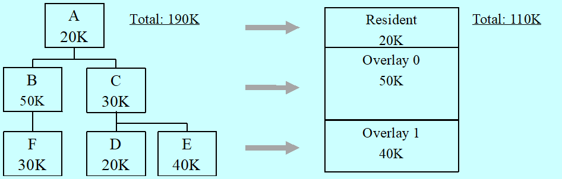

## 内存分区

需要了解的内存管理技术：

- 连续存储管理，即进程的地址空间在内存中占用的是一片连续的内存空间，不涉及虚存
  - Fixed Partitioning 固定分区
  - Dynamic Partitioning 动态分区
- 非连续存储管理
  - Simple Paging 简单分页
  - Simple Segmentation 简单分段
  - Virtual Memory Paging 虚拟分页
  - Virtual Memory Segmentation 虚拟分段

内存分区（包含固定分区和动态分区）技术是在虚拟存储技术之前使用的，现在几乎不用，虚拟内存技术来源于分区方法。

### 固定分区

固定分区就是对内存中操作系统之外的空间分区，形成若干**边界固定的区域**

#### 等大分区

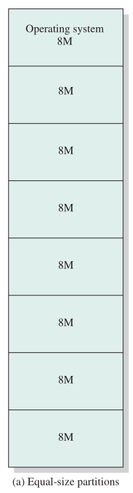

系统之外所有的剩余空间划分为若干等大的分区，进程可加载到大小满足的任意可用分区。当已有的分区全部被阻塞进程占满后操作系统可以换出进程。

问题：

1.  程序太大，不能整个放入内存，就必须要用覆盖技术（分模块，且子模块之间相互没有调用关系，即相互独立，且主模块+任一子模块相加不超过分区大小）
2.  内存利用率低，再小的程序都要独占整个内存分区，会导致**内碎片**（**分区内部**存在空间浪费）

#### 大小不等分区

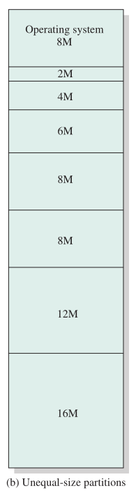

操作系统之外的所有剩余空间划分为若干不等大的分区，可以缓解固定分区的问题。

进程小于等于最大分区的就不需要使用覆盖技术（但也只能减少使用覆盖的可能，因为可能会有大于最大分区的进程出现，就必须使用覆盖，或者重启后重新分配内存分区）。

小程序可以放入小分区，减少内碎片。

#### 放置算法

等大分区随意放。

大小不等分区通常安排放入**可容纳进程的最小分区**，给每个分区一个队列，收容某一容量区间的进程（如上图中 8M 的分区只允许放入 6-8M 的进程，不可放入小于 6M 的进程），可将每个分区内的空间浪费降到最低。但这样也可能发生内存占用率低的情况（比如都是小进程，那么后面的大分区就不会被使用）。

改进：只设一个队列，将进程放入**空闲**且可容纳进程的最小分区，如上图中若一进程为 5M，而 6M 分区已满，则可放入 8M 分区。

如果所有的分区都已被占据，则必须进行交换。一般优先考虑换出能容纳新进程的最小分区中的进程，或考虑一些诸如优先级、是否被阻塞之类的其他因素。

#### 固定分区的问题

活动进程的数目受限于系统（预定义的分区数目），无论分区大小是否相等，大量小进程均无法有效利用空间。

### 动态分区

动态分区的分区长度和数量是可变的，进程可分配到所需大小的分区。

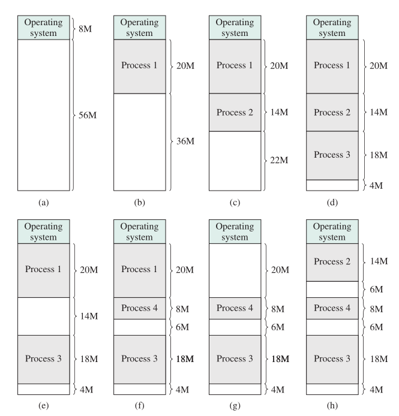

首先依次将进程连续装入分区，当新进程到来发现空闲分区不够用的时候，需要将某个进程对换出去，然后再装入新进程。

在不断的对换过程中，可能会出现很多小空洞（碎片）无法被利用，这种现象称为**外碎片**，这会导致**分区之外的内存越来越碎**。

克服外碎片需要使用**压缩技术**：操作系统不时地移动进程，使得进程占用的空间连续，并使所有空闲空间连成一片。但是压缩技术非常费时，且会浪费处理器时间。

#### 分区分配（放置）、回收（释放）算法

由于内存压缩非常费时，因而操作系统需要巧妙地把进程分配到内存中，以便盖住内存中的那些“空洞”。

分区分配（放置）算法：寻找某个空闲分区，其大小须大于或等于进程的要求，进行分割、分配。分配的先后次序通常是从内存低端到高端。

注意：这里的分割不一定要真的分割，比如某进程需要 399kb 空间，内存有一段 400kb 空间，若分割出 399kb，则剩下的 1kb 可能永远无法使用，一系列过程可能还会消耗处理器资源，所以可以设定一个阈值，若分割后剩余空间小于阈值，则不再分割，直接全部送给该进程。

分区回收（释放）算法（此处略）：需要将相邻的空闲分区合并成一个空闲分区。这时要解决的问题是：合并条件的判断和合并时机的选择。

##### 最佳适配算法

策略：**选择最接近请求大小的分区**：将空闲分区做一个递增链表，然后寻找最接近的分区（大于等于进程所需空间）

效率最差，分割后新分区可能要插入排序，合并后的新分区依然需要排序，需要很大开销。这个算法能保证产生的碎片尽可能小。但会使得内存中很快形成许多小到无法满足任何内存分配请求的小块。因此，它需要更频繁地进行内存压缩。

##### 首次适配算法

策略：**从头扫描内存选择第一个足够大的可用分区**

首次适配算法不仅是最简单的，而且通常也是最好和最快的。

大量进程加载到内存前端，分配时要反复搜索前端（可能会浪费时间）；后端可以保留大的空闲分区

##### 下次（循环首次）适配算法

首次适配算法的“改进”版

策略：**从上次放置位置开始扫描内存**

减少搜索空间分区所需要的时间，但这将会使程序经常在保留有大分区的后端分配，导致最大分区被分割、分配，因此当大进程请求时，会需要压缩以获得大分区

三种策略演示：

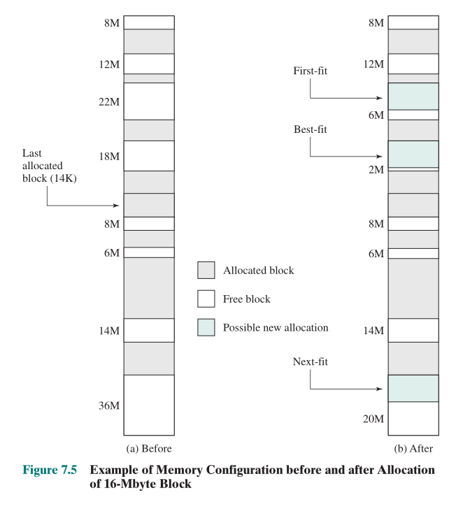

##### 其他适配算法

最坏适应算法(worst-fit)：找到最大的空闲分区

- 基本不留下小空闲分区，但较大的空闲分区不被保留。
- 若第一个（最大的）分区都不满足，就不用再往后寻找了，应该开始压缩。

快速适应算法(quick-fit)：为常用长度的空闲区建立单独的空闲区链表，维持一定数目的常用长度空闲区

- 可快速找到所需的空闲区
- 归还时合并复杂

### 伙伴系统

1.  将整个空间看作一个$2^U$大小的块
2.  如果请求的空间大小为$2^{U-1} < s <= 2^U$（即$\frac{1}{2}·2^U<s<2^U$，大于整块的 1/2 且小于等于整块的空间），则分配整块空间给它
3.  否则，将总空间$2^U$二等分（大小均为$2^{U-1}$），对其中的一块重复如上判断，直到出现一个合适的大小$2^{U-n}$满足$2^{U-n-1}<s<2^{U-n}$（即不断二等分，找到最小的且大于等于需求量的块），则将这一块分配给它
4.  释放空间时与附近的等大小的块尝试合并

```c
// 查找空位的递归实现
void get_hole(int i)
{
    if (i == (U + 1))
        <failure>;
    if (<i_list empty>)
    {
        get_hole(i + 1);
        <split hole into buddies>;
        <put buddies on i_list>;
    }
    <take first hole on i_list>;
}
```

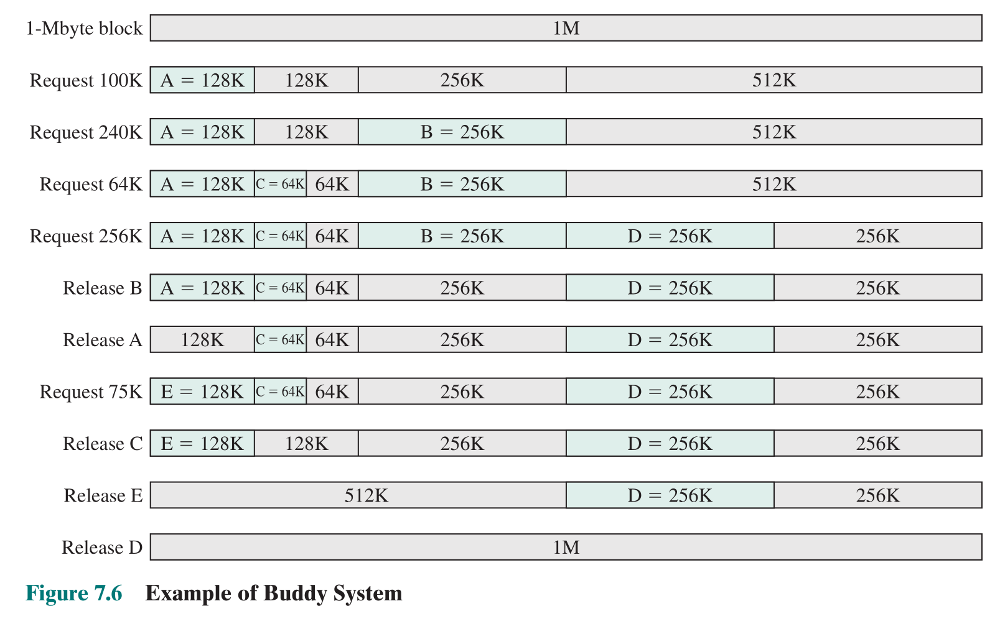

Release B 后的请求二叉树：叶节点表示内存中的当前分区，可以看到，若两个伙伴（兄弟节点）都是叶节点，则至少有一个是被分配出去的，不然将要合并。

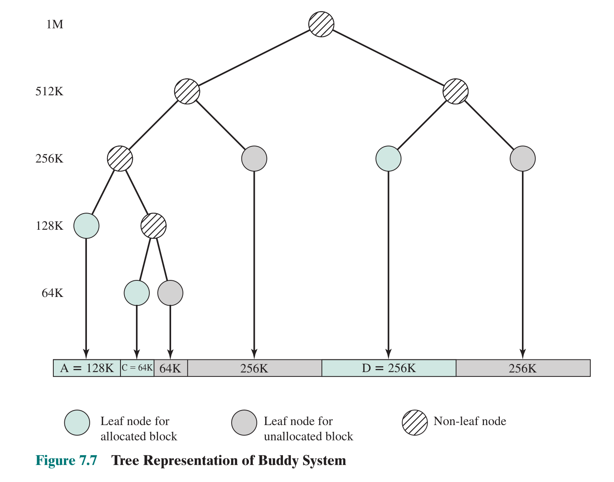

伙伴系统是较为合理的折中方案，它克服了固定分区和可变分区方案的缺陷。

当前的操作系统中，基于分页和分段机制的虚存更为先进。然而，伙伴系统在并行系统中有很多应用，它是为并行程序分配和释放内存的一种有效方法。UNIX 内核存储分配中使用了一种经过改进后的伙伴系统（Lazy Buddy System）。

### 重定位

程序加载时实际（物理）内存地址才能确定。

进程可能占据不同分区，即执行期间有不同物理内存地址（由于交换和压缩等）。因此进程访问的位置不是固定的。

**逻辑地址**（logical address）：与当前数据在内存中的物理分配地址无关的访问地址，在执行对内存的访问之前必须把它转换为物理地址。 ^4a3a7a

**相对地址**（relative address）：逻辑地址的一个特例，它是**相对于**某些已知点（通常是程序的开始处）的地址。

**物理地址**（physical address，又称绝对地址）：是数据在内存中的实际位置。 ^59dae7

**地址映射**：将用户程序中的逻辑地址转换为运行时由机器直接寻址的物理地址。

系统采用运行时**动态加载**的方式把使用相对地址的程序加载到内存。通常情况下，被加载进程中的所有内存访问都相对于程序的开始点。因此，在执行包括这类访问的指令时，需要有把相对地址转换为物理内存地址的硬件机制（地址映射）。

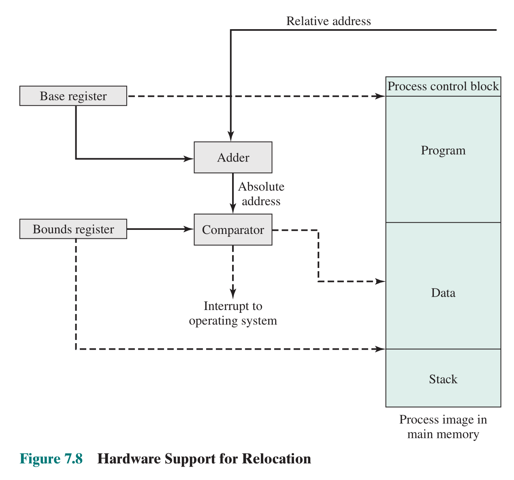

一个简单的典型的地址映射机制，拥有基址寄存器与界限寄存器（存可访问的内存地址的上限）。基址寄存器加上相对地址就是绝对地址，和界限寄存器进行比较，要是未越界则访问，否则发生错误，中断并通知操作系统（实现 [保护](#保护) ）。

## 分页

分页是将**内存**划分成较小的、大小固定的、等大的块（称为**页框**、物理页面、页帧），把**进程**也划分成同样大小的块（称为**页**），以后可能会将两者都称为页。

空闲页分配与简单的页表的示例：

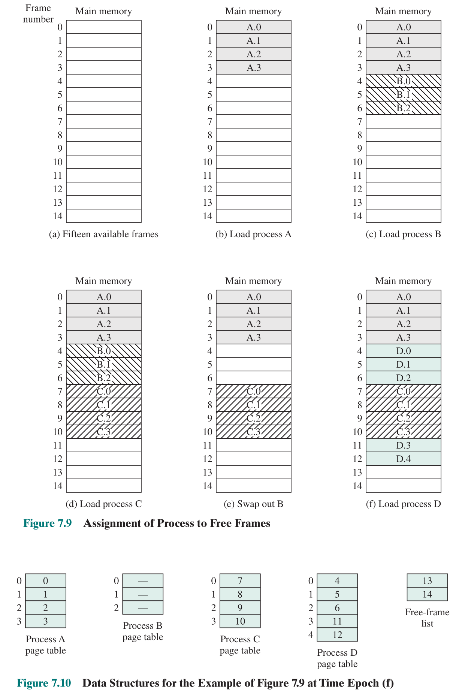

分区、分页与分段的寻址示例：

其中在分页系统中，进程的某逻辑地址的

- 页号 = 逻辑地址 / 页面大小
- 偏移量 = 逻辑地址 % 页面大小

然后根据页号与页表得到页框号（页表起始地址+页表项大小*页号），页框号乘以页面大小（页框是不动的，从内存 0 地址开始分配）加上偏移量得物理地址。在计算机中，页面大小常为$2^n$B，所以可以直接将逻辑地址的低 n 位作为偏移量，其余位即为页号。

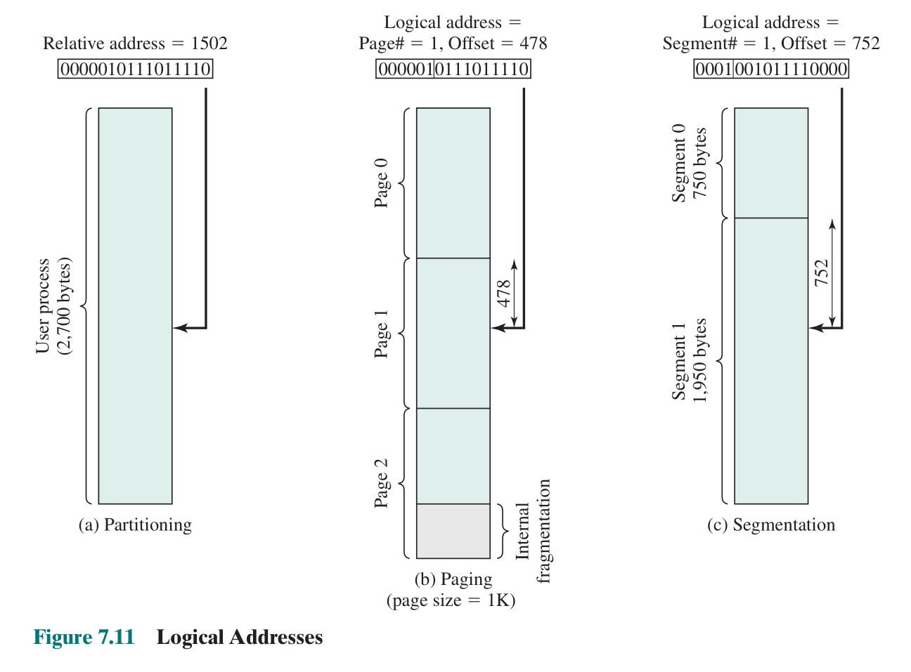

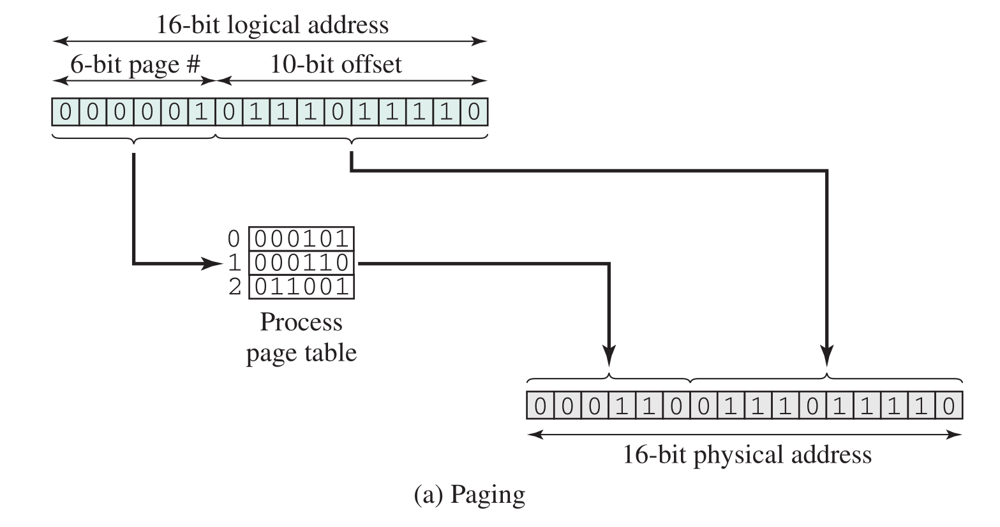

优劣：

- 没有外碎片，每个内碎片不超过页大小
- 一个程序不必连续存放（支持[虚拟存储](虚拟内存.md#分页)）
- 便于改变程序占用空间的大小
- 简单分页要求程序全部装入内存
- 不易实现共享（页的划分由系统处理，需要共享的和不可共享的可能会被分割到同一个页内）
- 不便于动态连接（原因同上）

### 页表

操作系统为**每个进程**维护**一张页表**：包含进程的每个页面所对应的页框位置(号)

物理页面(page frame)表：整个系统有一个物理页面表，描述物理内存空间的分配使用状况。（哪个页框是空闲的，哪个页框是被使用的。可采用的数据结构：位示图、空闲页面链表）

请求表：整个系统有一个请求表，描述系统内各个进程**页表的位置和大小**，可以结合到各进程的 PCB 里。

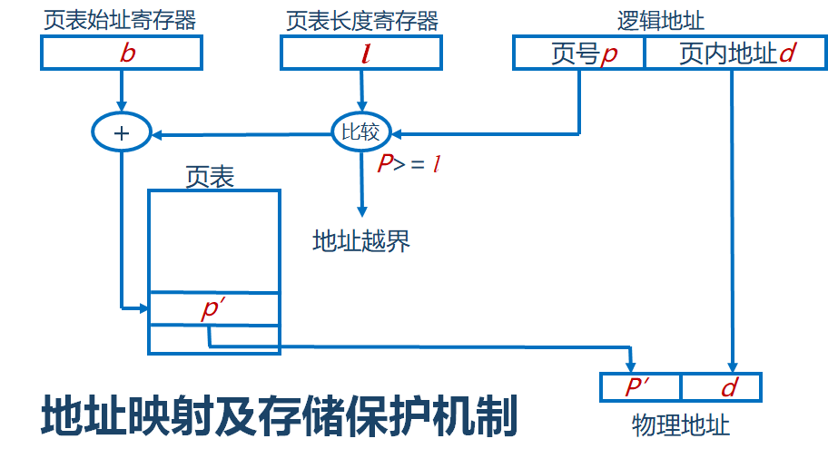

## 分段

一个程序可被分为多个段，其中段长可变但有最大段长限制

段式地址有两部分：段号、段内偏移量

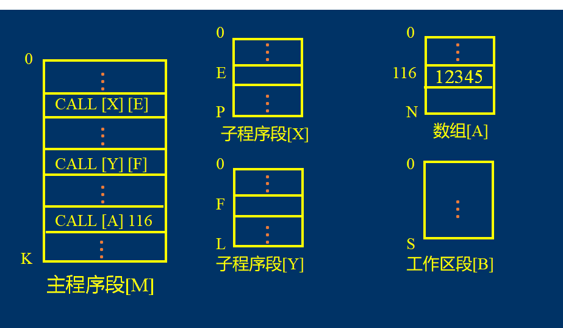

由于使用大小不等的段，分段类似于动态分区。在未采用覆盖方案或使用虚存的情况下，为执行一个程序，需要把它的所有段都装入内存。

**内存划分**：内存空间被动态的划分为若干个长度不相同的区域，这些区域被称为物理段，每个物理段由起始地址和长度确定

与动态分区不同的是，**内存分配**是以段为单位分配内存，每一个段在内存中占据连续空间，但各段之间可以不连续存放。消除了内部碎片，但是和动态分区一样，它会产生外部碎片。不过由于进程被分成多个小块，因此外部碎片也会很小。

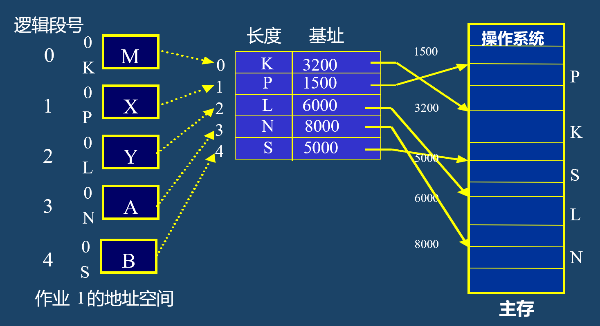

特点：

- 没有内碎片，外碎片可以通过内存压缩来消除
- 一个程序不必连续存放（支持[虚拟存储](虚拟内存.md#分段)）
- 便于改变进程占用空间的大小
- 便于存储保护、共享
- 简单分段要求进程全部装入内存

分页对程序员来说是透明的，而分段通常是可见的，并且作为组织程序和数据的一种方便手段提供给程序员。一般情况下，程序员或编译器会把程序和数据指定到不同的段。为了实现模块化程序设计的目的，程序或数据可能会进一步分成多个段。这种方法最不方便的地方是，程序员必须清楚段的最大长度限制。

### 简单段式管理的数据结构

类似于分页，在简单的分段方案中，**每个进程都有一个段表**，系统也会维护一个**内存中的空闲块列表**。当进程进入运行状态时，系统会把其段表的地址装载到一个寄存器中，由内存管理硬件来使用这个寄存器。

进程段表：描述组成进程地址空间的各段，可以是指向系统段表中表项的索引。每段有段基址(base address)和段长度(以确保不会使用无效地址)，如下逻辑物理地址转换图

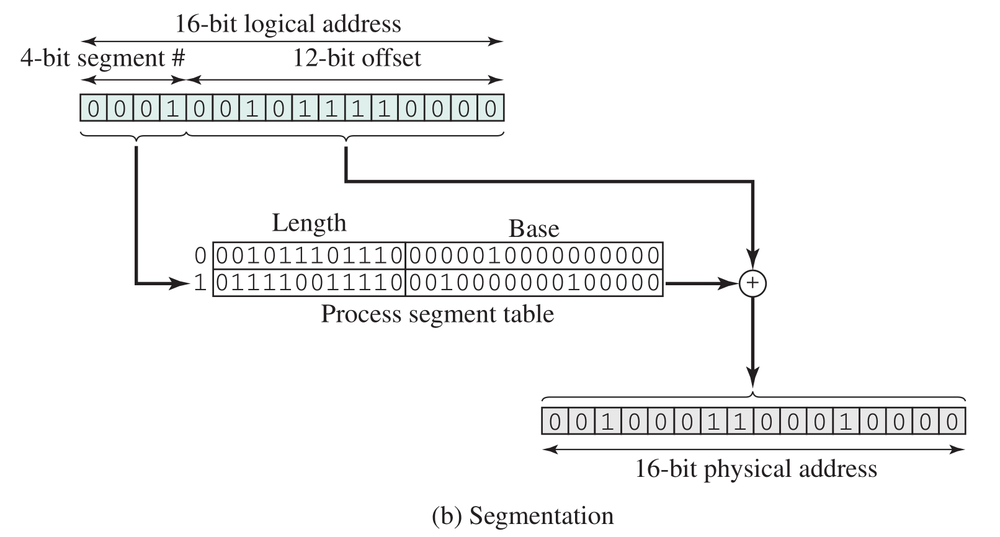

系统段表：系统内所有占用段，包含始值、段长等

空闲段表：内存中所有空闲段（空闲块），可以结合到系统段表中

内存的分配算法：首次适配；下次适配、最佳适配等

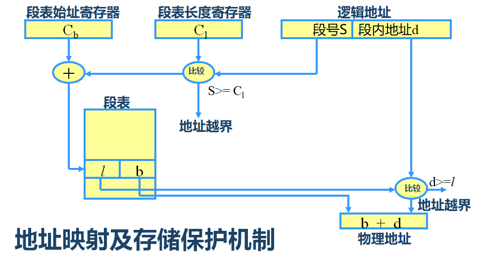

## 页式管理和段式管理的比较

分页是出于系统管理的需要，分段是出于用户应用的需要。这也导致了一条指令或一个操作数可能会跨越两个页的分界处，而不会跨越两个段的分界处。

页大小是系统固定的，而段大小则通常不固定。

逻辑地址表示：

- 分页是一维的，各个模块在链接时必须组织成同一个地址空间；
- 分段是二维的，各个模块在链接时可以每个段组织成一个地址空间。

通常段比页大，因而段表比页表短，可以缩短查找时间（考虑[虚存缺页](虚拟内存.md#缺页中断（Page%20Fault）)与[多级页表](虚拟内存.md#页表本身的存储问题)），提高访问速度。
