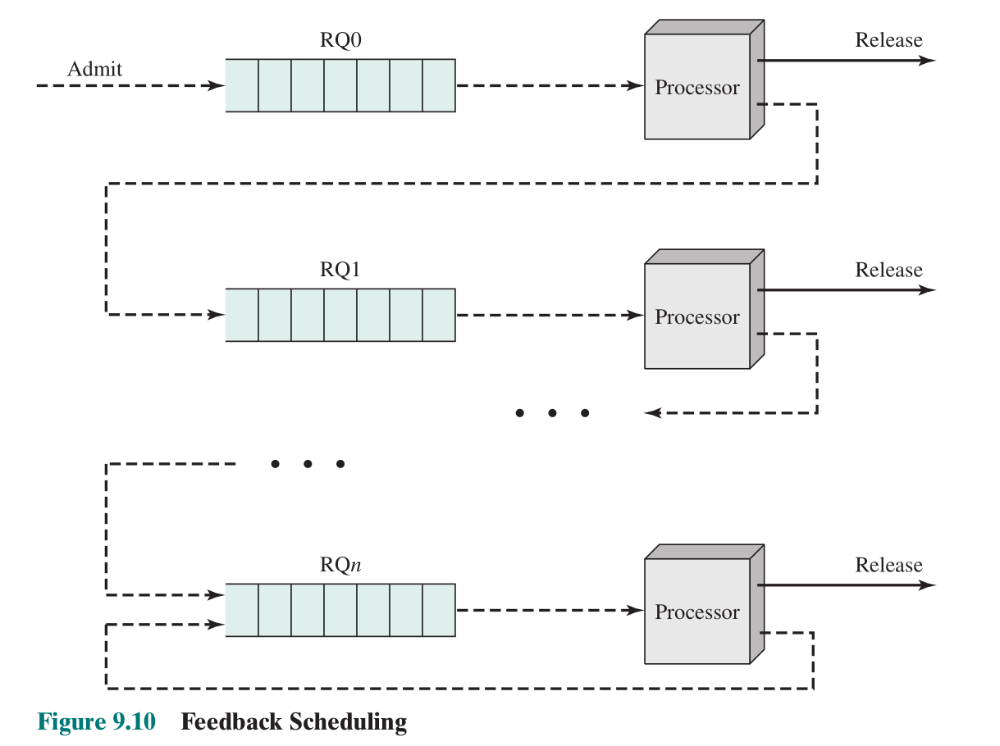

# 单处理器调度

## 调度

操作系统必须在几个相互竞争的进程之间分配资源，处理器提供的资源是时间，这就需要通过调度来分配。

处理器调度的目标是不断**安排进程**在处理器上执行以**满足系统目标**，如**响应时间、吞吐量、处理器效率**等

### 调度目标

- 公平
- 防止进程饥饿
- 有效使用处理器
- 开销低
- 必要时使某些进程优先

### 调度类型

- 长程调度
- 中程调度
- 短程调度
- 设备调度

### 长程调度

决定哪些程序被收容到系统以执行（新建进程），又称高级调度(high level scheduling)、作业调度、接纳调度。它控制了系统的并发度。

下次允许哪个作业进入的决策可基于 FCFS 原则，或基于优先级、期待执行时间和 I/O 需求等。

创建的进程越多，每个进程的执行时间百分比越小。

### 中程调度

中程调度是进程交换的一部分，又称平衡调度或中级调度，涉及内外存交换。

换入的决定取决于管理系统并发度的需求。考虑到存储管理需要，换入决策将考虑换出进程的存储需求。

### 短程调度

又称低级调度(low level scheduling)、进程调度，由分派器/程序实现，是执行最频繁，最重要的调度

当出现需要阻塞当前进程的事件时或需要被其他进程抢占时发生，如：

- 时钟中断
- I/O 中断
- 系统调用
- 信号

## （短程）调度算法

短程调度负责动态地把处理器分配给进程或内核级线程。

操作系统中实现短程调度的程序一般称为进程(线程)调度程序，或分派程序(Dispatcher)。

进程调度算法多数适用于线程调度。

### 短程调度准则

分配处理器时间以优化系统行为的某些方面，需要一些准则来评价调度策略。

评价准则分为面向用户的和面向系统的两方面：

- 面向用户
  - 与用户或进程感知的系统行为有关
  - 在几乎所有的操作系统上都很重要
- 面向系统
  - 关注处理器的有效性、高效性
  - 通常在单用户系统上不是很重要

从性能角度来看的准则通常是定量的，如**响应时间和吞吐量**

面向用户的性能相关调度准则：

- 周转时间：作业从提交到完成所经历的时间
  - 平均周转时间 T
  - 平均带权周转时间（带权周转时间 $T_W=\frac{T_r}{T_s}$, $T_s$为实际运行时间)
- 响应时间：用户输入一个请求到系统给出首次响应的时间
- 截止时间：截止时间是指某任务必须开始执行的最迟时间，或者必须完成的最迟时间。

面向用户的其他调度准则：

- 可预测性：不管系统负荷如何，同一作业在大致相同的时间、开销下完成

面向系统的相关调度准则：

- 吞吐量：单位时间内所完成的作业数
- 处理机利用率（对于大中型主机比较重要）

面向系统的其他调度准则：

- 公平性：不因作业或进程本身的特性而使上述指标过分恶化（如饥饿）。
- 优先级：可以使关键任务达到更好的指标。
- 各种设备的均衡利用：如 CPU 繁忙的作业和 I/O 繁忙（被调度的次数多，但每次时间很短就因 I/O 而要被阻塞）的作业搭配（对于大中型主机比较重要）

### 优先级

调度程序总是选择具有较高优先级的进程.

可以提供多个就绪队列分别代表每个优先级

#### 静态优先级

创建进程时就确定，直到进程终止前都不改变。通常是一个整数。

设定的依据：

- 进程类型
- 对资源的需求
- 用户要求

##### 饥饿

如果不断有高优先级进程到达，低优先级进程可能会饿死。

解决方法：允许一个进程随着时间或执行历史而改变它的优先级

#### 动态优先级

在创建进程时赋予的优先级，在进程运行过程中可以自动改变，以便获得更好的调度性能。如：

- 在就绪队列中，随着等待时间延长不断提高就绪进程的优先级
- 进程每执行一个时间片，就降低其优先级

### 调度方式

调度方式有两大类：非抢占式和抢占式。它规定了 选择函数 所执行的时刻

非抢占式调度：运行态进程一直执行直到终止或阻塞

抢占式调度：当前正在运行的进程可以被 OS 中断并移入就绪队列，常发生于新进程到达、发生中断或周期性时钟中断。

抢占原则：

- 优先权原则
- 短作业/进程优先原则
- 时间片原则

折衷方式：内核不允许抢占，其他可以抢占

### 调度方式的不同算法

#### FCFS 先来先服务

最简单的调度算法，是严格的队列方案。**非抢占式**。当前进程停止执行时，将选择“就绪”队列中**等待最长的进程**

有利于长作业/进程，而不利于短作业/进程（由于小进程等待一个大进程释放 CPU，就会产生护航效应）。有利于 CPU 繁忙型作业/进程，而不利于 I/O 繁忙型作业/进程

#### RR （时间片）轮转

基于时钟的抢占式调度，时钟中断定期产生，当时钟中断发生时，正在运行的进程将被放入就绪队列，下一就绪进程被选中

##### 时间片长短的影响

过长：对短的交互请求的响应时间变长；退化为 FCFS 算法

过短：导致过多的进程切换，降低了 CPU 效率；响应时间长

时间片长度的确定：

- 对响应时间的要求：
  - T(响应时间)=N(进程数目)*q(时间片)
- 时间片长度的影响因素：
  - 就绪进程的数目
  - 系统的处理能力

#### Virtual Round Robin 虚拟时间片轮转算法

时间片轮转算法对 I/O 型进程不公平（I/O 型进程跑不满一个时间片就被阻塞了）

虚拟时间片轮转算法添加一个辅助队列。一个进程因 I/O 而阻塞时，解除了 I/O 阻塞后的进程都会转移到个 FCFS 辅助队列中。进行调度决策时，**辅助队列中的进程优先**于就绪队列中的进程。

#### SPN 最短进程优先

非抢占式调度。选择预计执行时间最短的进程。

改善平均周转时间和平均带权周转时间，缩短作业的等待时间，提高系统的吞吐量

长进程的可预测性降低（指每次进程到达到结束执行的时间变化较大）

难以准确估计进程执行时间，影响调度性能

有利于短进程，对长进程非常不利，可能饥饿

#### SRT 最短剩余时间优先

**抢占式**，新进程加入时抢占。最短剩余时间是在 SPN 中增加了抢占机制的策略。在这种情况下，调度程序总是选择预期剩余时间最短的进程。一个新进程加入就绪队列时，与当前正运行的进程相比，它可能具有更短的剩余时间。因此，只要新进程就绪，调度程序就可抢占当前正在运行的进程。和 SPN 一样，调度程序在执行选择函数时，必须具有关于处理时间的估计，并具有长进程饥饿的风险。

SRT 不像轮转法那样会产生额外的中断，因此降低了开销。另方面，由于它必须记录过去的服务时间，因此增加了开销。从周转时间来看，SRT 的性能要好于 SPN，因为相对于一个正在运行的长作业而言，短作业可被立即选择并运行。

#### HRRN 最高响应比优先

**抢占式**，新进程加入时抢占。选响应比值最大的进程；是 FCFS 和 SPN 的折衷；需估计处理时间

$response\,ratio =\frac{time\,spent\,waiting\,+\,expected\,service\,time}{expected\,service\,time}=\frac{time\,spent\,waiting}{expected\,service\,time}+1$

不会饥饿

#### Feedback Scheduling(MLRQ) 多级反馈队列算法

抢占式，时间片结束后抢占。多级反馈队列算法是时间片轮转算法和优先级算法的综合和发展。

具体规则：

1.  优先级高的先执行
2.  优先级相等的采用 RR 算法
3.  进程进入系统时有最高优先级
4.  一旦进程时间片耗尽，将降低它的优先级（阻塞不降低优先级）
5.  一段时间后将所有进程重新设为最高优先级

优点：

- 为提高系统吞吐量和缩短平均周转时间而照顾短进程
- 为获得较好的 I/O 设备利用率和缩短响应时间而照顾 I/O 型进程（阻塞不降低优先级）
- 不必估计进程的执行时间，动态调节
