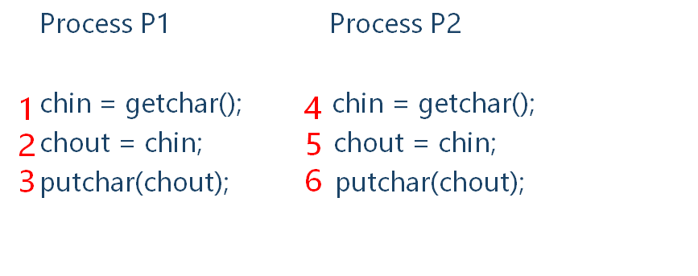

# 并发：互斥和同步

操作系统设计中的核心问题是进程和线程的管理：

- [多道程序设计技术](操作系统概述.md#多道批处理系统（Multiprogrammed%20Batch%20Systems）)：管理单处理器系统中的多个进程。
- [多处理器技术](计算机系统概述.md#对称多处理器（SMP）)：管理多处理器系统中的多个进程
- 分布式处理器技术：管理多台分布式计算机系统中多个进程的执行。

为简单起见，我们通常指“进程”的并发执行。实际上，如第 4 章所述，在某些系统中，并发的实体是[线程](线程.md)而非进程。

包含的主要设计问题：

- 进程间通信
- 资源的共享和竞争
- 多个进程活动的同步
- 处理器时间的分配

并发出现在：

- Multiple applications 多个应用程序
    - 多道程序设计技术允许在多个活动的应用程序间动态共享处理器时间
- Structured applications 结构化应用程序
    - 模块化设计、结构化程序设计的扩展
- Operating system structure 操作系统结构
    - 操作系统自身作为一组进、线程实现

## 并发的原理

并发执行：在一定时间内物理机器上有两个或两个以上的程序同处于开始运行但尚未结束的状态，并且次序不是事先确定的

并发执行的特征：

- 间断(异步)性
- 失去封闭性
- 失去可再现性

并发带来的困难：

- 全局资源的共享
    - 共享变量的修改冲突
    - 操作顺序冲突
- 资源分配的优化管理很困难
- 难以定位程序设计错误，源于结果的不确定和不可再现

对于多进程同时访问一个共享资源需要做严格控制，比如对资源的写入等。

### 一个例子

```c
void echo()
{
    chin = getchar();
    chout = chin;
    putchar(chout); 
}
```

上述程序中，chin 和 chout 都是多进程共享变量。多进程交替执行时每条语句的执行顺序不同会造成结果的不同



不做任何干预，可能的有 20 种执行顺序：123456 124356 124536 124563 142356 142536 142563 145236 145263 145623 412356 412536 412563 415236 415263 415623 451236 451263 451623 456123。其中正确输出的有 123456 124356 451623 456123。

为避免出现上述问题，有一个简单的方法：强制单个访问，即强制一次仅一个进程可以进入（调用）此函数。

1.  P1 & P2 并发执行
2.  P1 先调用 echo 函数
   1.  P2 试图进入被阻塞
3.  P1 完成执行
   1.  P2 恢复并进入 echo 函数

### 竞争条件

会发生在

- 多个进程或线程在读写数据项时
- 最终结果依赖多个进程执行的顺序

结果取决于最后完成者（竞争失败者）

### 操作系统关注的问题

操作系统必须：

- 跟踪掌握各个进程（使用 PCB）
- 为每个进程分配回收资源：CPU, memory, file, I/O device
- 保护数据、资源以避免其他进程的干扰
- 确保进程结果与执行速度无关

### 进程的交互

| 原子操作（原语） | 一个函数或动作由一个或多个指令的序列实现，对外是不可见的：即对外不可见且不可中断。要保证指令序列要么作为一个组来执行，要么都不执行，对系统状态没有可见的影响。原子性保证了并发进程的隔离。 |
| ---------------- | ------------------------------------------------------------ |
| 死锁             | 多个进程互不相让，都得不到足够的资源而无法运行               |
| 活锁             | 两个或两个以上的进程为响应其他进程中的变化而持续改变自己的状态但不做有用的工作的情形 |
| 互斥             | 多个进程不能同时访问同一个资源                               |
| 竞争条件         | 多个线程或进程在读写一个共享数据时，结果依赖于它们执行的相对时间的情形 |
| 饥饿             | 指一个进程一直得不到资源（其他进程可能轮流占用资源）         |

^9edb15

进程间交互关系：

| 感知程度                                   | 关系             | 一个进程对其他进程的影响                                     | 潜在的控制问题                           |
| ------------------------------------------ | ---------------- | ------------------------------------------------------------ | ---------------------------------------- |
| 相互不感知，不知对方的存在                 | 竞争             | 一个进程的结果与其他进程的行为无关；**进程执行的时间可能会受影响** | 互斥、死锁(可复用资源)、饥饿             |
| 间接感知双方（都与第三方交互，如共享资源） | 通过共享**合作** | 一个进程的结果依赖于从其他进程获得的信息；**进程执行的时间可能会受影响** | 互斥、死锁(可复用资源)、饥饿、数据一致性 |
| 直接感知(双方直接交互，如通信)             | 通过通信**合作** | 一个进程的结果依赖于从其他进程获得的信息；**进程执行的时间可能会受影响** | 死锁(可消耗资源)、饥饿                   |

间接感知不需要知道对方 ID，直接感知需要通过对方进程的 ID

#### 进程间资源竞争

当并发进程竞争使用同一资源时，它们之间会发生冲突。两个或更多的进程在它们的执行过程中需要访问一个资源，每个进程并不知道其他进程的存在，且每个进程也不受其他进程的影响。每个进程都不影响它所用资源的状态。

**临界资源**(Critical resource)：系统中某些资源**一次只允许一个进程使用**，称这样的资源为临界资源或互斥资源

**临界区**(critical section)：进程中访问临界资源的一段代码。

主要问题：互斥（临界资源、临界区）、死锁、饥饿。

对临界资源的访问需要实现互斥，会导致两个额外的控制问题：死锁、饥饿。

### 互斥的要求

- 任何时候只允许一个进程在临界区
- 在非临界区停止的进程不能干涉其他进程
- 没有死锁或饥饿
- 无进程在临界区时，请求进入者可以立即进入
- 对进程的执行速度和数目没有要求限制
- 停留在临界区的时间有限

## 互斥：硬件支持

软件方法开销大，易出错。

两个简单的硬件方法：

- 关中/禁用中断
- 专用机器指令

### 关中

单处理器只允许交替执行，进程被中断前将一直运行。

关中可以保证互斥。可使用启用和禁用中断的[原语](#^9edb15)实现。

标准使用结构：

```c
while(true){
    /*禁用中断*/;
    /*临界区*/;
    /*启用中断*/;
    /*其余部分*/;
}
```

伪代码：

```c
cli();    //关中断。
while(bh->b_block)    //如果缓冲区已被锁定，则睡眠，直到缓冲区解锁。
    sleep_on(&bh->b_wait);
bh->b_lock=1;    //立刻锁定该缓冲区
sti();    //开中断。
```

缺点：

- 执行效率明显下降
- 不能用于多处理器结构

### 专用机器指令

#### Compare&Swap 指令

伪代码定义：

```c
int compare_and_swap (int *word, int testval, int newval)
{
    int oldval;
    oldval = *word
    if (oldval == testval) *word = newval;//如果相等，更新值（如果开锁状态，上锁）
    return oldval;
}
```

互斥规程伪代码：

```c
/* program mutualexclusion */
const int n = /* number of processes */;
int bolt;   //所有进程的共享变量
void P(int i)
{
    while (true) {
        while (compare_and_swap(bolt, 0, 1) == 1)
            /* do nothing */;
        /* critical section */;
        bolt = 0;
        /* remainder */;
        }
}
void main()
{
    bolt = 0;
    parbegin (P(1), P(2), ... ,P(n));
}
```

注：`parbegin (P(1), P(2), ... ,P(n));` 指阻塞主程序，初始化并行过程 `P(1), P(2), ... ,P(n)` 过程全部终止之后，才恢复主程序

共享变量 bolt 被初始化为 0。唯一可以进入临界区的进程是发现 bolt 等于 0 的那个进程。（测试当前 bolt 是否为 0，若是，则 bolt 赋为 1，返回 0，循环结束继续执行，否则返回 1 再次检测。）

这个指令的另一个版本返回一个布尔值：交换发生时为真，否则为假。几乎所有处理器家族（x86、IA64、sparc 和 IBM z 系列等）都支持该指令的某个版本，且多数操作系统都利用该指令支持并发。

所有试图进入临界区的其他进程进入忙等待模式。一个进程离开临界区时，它把 bolt 重置为 0，此时只允许一个等待进程进入临界区。进程的选择取决于哪个进程正好执行紧接着的 compare&swap 指令。

忙等待（busy waiting）或自旋等待（spin waiting）：进程在得到临界区访问权之前，它只能继续执行测试变量的指令来得到访问权，除此之外不能做任何其他事情。

#### Exchange 指令

伪代码定义：

```c
void exchange (int *register, int *memory)
{
    int temp;
    temp = *memory;
    *memory = *register;
    *register = temp;
}
```

互斥规程伪代码：

```c
/* program mutualexclusion */
int const n = /* number of processes */;
int bolt;
void P(int i)
{
    while (true) {
        int keyi = 1;
        do exchange (&keyi, &bolt)
        while (keyi != 0);
        /* critical section */;
        bolt = 0;
        /* remainder */;
    }
}
void main()
{
    bolt = 0;
    parbegin (P(1), P(2), ..., P(n));
}
```

这个指令交换一个寄存器的内容和一个存储单元的内容。 Intel IA-32（Pentium）和 IA-64（Itanium）体系结构都含有 XCHG 指令。

共享变量 bolt 初始化为 0，每个进程都使用一个局部变量 key 且初始化为 1.唯一可以进入临界区的进程是发现 bolt 等于 0 的那个进程。它通过把 bolt 置为 1 来避免其他进程进入临界区。一个进程离开临界区时，它把 bolt 重置为 0。

若 bolt=0，则没有任何一个进程在它的临界区中；若 bolt=1，则只有一个进程在临界区中，即 key 的值等于 0 的那个进程。

#### 专用机器指令优缺点

优点：

- 适用于单处理器或共享内存多处理器中的多进程互斥
- 简单，易于验证
- 可支持多个临界区

缺点：

- 忙等，浪费处理器时间
- 当一个进程离开临界区且多个进程等待时，可能饥饿
- **可能死锁**

## 信号量

信号量是用于进程间传递信号的一个整数值。在信号量上只可进行三种操作，即初始化、递减(`semWait`, P 原语)和增加(`semSignal`, V 原语)，这三种操作都是原子操作。递减操作用于阻塞一个进程，递增操作用于解除一个进程的阻塞。(非二元)信号量又被称为计数信号量或一般信号量。 ^22d3b6

把信号量视为一个值为整数的变量，整数值上定义了三个操作**（先增减再检查）**：

1.  一个信号量可以初始化成非负数
2.  `semWait` 操作使信号量减 1。若值变成负数，则阻塞进程，否则进程继续执行。
3.  `semSignal` 操作使信号量加 1。若值小于等于零，则解除一个被 `semWait` 操作阻塞的进程阻塞。

除了这三个操作外，没有任何其他方法可以检查或操作信号量。

规范定义的伪代码：

```c
struct semaphore
{
    int count;
    queueType queue;
};
void semWait(semaphore s)
{
    s.count--;
    if (s.count < 0)
    {
        /* place this process in s.queue */;
        /* block this process */;
    }
}
void semSignal(semaphore s)
{
    s.count++;
    if (s.count <= 0)
    {
        /* remove a process P from s.queue */;
        /* place process P on ready list */;
    }
}
```

信号量说明：semaphore s=N;

初始化指定一个非负整数值 N，表示空闲资源总数（N=1 称为互斥信号量；N>1 时又称为“资源信号量”）

信号量取值：

- 若为非负值表示当前的空闲资源数（可供几个进程同时使用）
- 若为负值其绝对值表示当前等待资源（临界区）的进程数

二元信号量定义伪代码：

```c
struct binary_semaphore
{
    enum{zero,one} value;
    queueType queue;
};
void semWaitB(binary_semaphore s)
{
    if (s.value == one)
        s.value = zero;
    else
    {
        /* place this process in s.queue */;
        /* block this process */;
    }
}
void semSignalB(semaphore s)
{
    if (s.queue is empty())
        s.value = one;
    else
    {
        /* remove a process P from s.queue */;
        /* place process P on ready list */;
    }
}
```

**先检查后变值**

1.  二元信号量可以初始化为 0 或 1.
2.  `semWaitB` 检查信号的值。若值为 0，则受阻。若值为 1，则将值改为 0，并继续执行该进程。
3.  `semSignalB ` 检查是否有任何进程在该信号上受阻。若有受阻，一个受阻的进程会被唤醒；若没有进程受阻，则值设置为 1

理论上，二元信号量更易于实现，且可以证明它和普通信号具有同样的表达能力。

**强弱信号量**：信号量机制需要使用一个队列收容等待信号量的进程，**强信号量**使用先进先出队列（可保证不会饥饿，是操作系统提供的典型信号量形式），**弱信号量**则不指定移出队列的顺序（可能会饥饿）

### 用信号量解决互斥

规程伪代码：

```c
/* program mutualexclusion */
const int n = /* number of processes */;
semaphore s = 1;
void P(int i)
{
    while (true)
    {
        semWait(s);
        /* critical section */;
        semSignal(s);
        /* remainder */;
    }
}
void main()
{
    parbegin(P(1), P(2),…, P(n));
}
```

每个进程进入临界区前执行 `semWait(s)` ，若 s 的值为负，则进程被阻塞：若值为 1，则 s 被减为 0，进程立即进入临界区，由于 s 不再为正，因而其他任何进程都不能进入临界区。

信号量一般初始化为 1，这样第一个执行 `semWait(s)` 的进程可立即进入临界区，并把 s 的值置为 0。接着任何试图进入临界区的其他进程，都会被阻塞。可以有任意数量的进程试图进入，每个不成功的尝试都会使 s 的值减 1，当最初进入临界区的进程离开时，s 增 1，一个被阻塞的进程（如果有的话）被移出等待队列，置于就绪态。

使用方法（参考规程）：

- 为临界资源设置一个互斥信号量 mutex，初值为 1
- 在每个进程中将临界区代码置于 `semWait(mutex)` 和 `semSignal(mutex)` 之间
- 互斥问题中必须**成对**使用 `semWait` 和 `semSignal` 原语
  - 遗漏 `semWait` 则不能保证互斥访问
  - 遗漏 `semSignal` 则不能在使用临界资源之后将其释放
  - `semWait`, `semSignal` 不能次序错误、重复（先 P 后 V）

### 利用信号量实现同步

进程的**同步**：指系统中多个进程相互合作，这些进程中发生的一些事件需要满足某种时序关系，从而共同完成一项任务。

进程的**互斥**：由于各进程要求共享资源，而有些资源需要互斥使用，因此各进程间竞争使用这些资源，进程的这种关系为进程的互斥。

同步举例：有 3 个进程：get, copy 和 put，它们对 4 个存储区域 f、s、t 和 g 进行操作。


#### 利用信号量来描述前趋关系

**前趋关系**：并发进程 P1 和 P2 中，分别有代码段 C1 和 C2，要求 C1 在 C2 开始前完成

为每个前趋关系设置一个信号量 S，其初值为 0


#### 单缓冲区问题


同步问题：

- 生产进程 P 不能往“满”的缓冲区中放产品，须设置信号量 empty
- 消费进程 C 不能从“空”的缓冲区中取产品，须设置信号量 full

解决规程：


### 用信号量解决生产者与消费者问题

生产者与消费者问题的通常情景：

- 一个或多个生产者产生数据并放入缓冲区
- 一个消费者每次从缓冲区取一个数据
- 任何时候仅有一个进程访问缓冲区

问题：生产者不能在满的缓冲区中添加数据，消费者不能从空的缓冲区取出数据

#### 有限（循环）缓冲区

规程：

```c
semaphore mutex = 1, empty = n, full = 0;    // empty 表示当前空位个数; full 表示当前产品的个数（实现同步）; mutex 保护缓冲区和下标变量（实现互斥）
int in = 0, out = 0;    //初始化循环队列的头尾下标
Pi：
while (true)
{
    生产产品;
    semWait(empty);
    semWait(mutex);
    往Buffer[in] 放产品;
    in = (in + 1) % n;
    semSignal(mutex);
    semSignal(full);
};
Cj： 
while (true)
{
    semWait(full);
    semWait(mutex);
    从Buffer[out] 取产品;
    out = (out + 1) % n;
    semSignal(mutex);
    semSignal(empty);
    消费产品;
};
```

#### 无限缓冲区

定义生产者和消费者如下：

```c
producer : 
while (true)
{
    /* produce item v */;
    b[in] = v;
    in++;
}
consumer : 
while (true)
{
    while (in <= out)
        /* do nothing */;
    w = b[out];
    out++;
    /* consume item w */;
}
```


使用[一般信号量](#^22d3b6)解决无限缓冲区的读者/写者问题的规程（清晰易懂）：

```c
/* program producerconsumer */
semaphore n = 0, s = 1;    // s用于互斥，n用于同步
void producer()
{
    while (true)
    {
        produce();
        semWait(s);
        append();
        semSignal(s);
        semSignal(n);
    }
}
void consumer()
{
    while (true)
    {
        semWait(n);
        semWait(s);
        take();
        semSignal(s);
        consume();
    }
}
void main()
{
    parbegin(producer, consumer);
}
```

### 使用总结

**初始化为 1 时表示互斥，初始化为 0 表示前趋关系，初始化大于 1 表示有多个资源可用。**

`semWait`, `semSignal` 操作必须成对出现，一一对应。

- 当为互斥操作时，它们同处于同一进程
- 当为同步操作时，则不在同一进程中出现

如果 semWait(S1)和 semWait(S2)两个操作在一起，那么 semWait 操作的顺序至关重要。

一个同步 `semWait` 操作与一个互斥 `semWait` 操作在一起时，**同步 `semWait` 操作在互斥 `semWait` 操作前（先检查资源数目，再检查是否互斥）**。如果被颠倒，缓冲区为空（`n.count=0`）时消费者进入临界区，那么任何一个生产者都不能继续向缓冲区中添加数据项，系统发生死锁。`semSignal` 操作顺序无关紧要。

信号量的物理含义：

- S>0 表示有 S 个资源可用
- S=0 表示无资源可用
- S<0 则|S|表示 S 等待队列中的进程个数
- `semWait(S)` 表示*申请一个资源*
- `semSignal(S)` 表示*释放一个资源*。
- 信号量的初值应该大于等于 0

### 信号量的实现

`semWait` 和 `semSignal` 操作必须作为原子原语实现。

- 硬件直接支持
- 纯软件方案，问题的本质是互斥：任何时候只有一个进程可用 `semWait` 或 `semSignal` 操作控制一个信号量。(Dekker 算法或 Peterson 算法)
- 硬件支持的软件方案。可能涉及忙等待，但是 `semWait` 和 `semSignal` 都很短，所以忙等待时间量很小。
- 单处理器时关中

举例：使用 compare & swap 实现的伪代码，增加了一个 `s.flag` 变量：

```c
semWait(s)
{
    while (compare_and_swap(s.flag, 0, 1) == 1)
        /* do nothing */;
    s.count--;
    if (s.count < 0)
    {
        /* place this process in s.queue*/;
        /* block this process (must also set s.flag to 0) */
        ;
    }
    s.flag = 0;
}
semSignal(s)
{
    while (compare_and_swap(s.flag, 0, 1) == 1)
        /* do nothing */;
    s.count++;
    if (s.count <= 0)
    {
        /* remove a process P from s.queue */;
        /* place process P on ready list */;
    }
    s.flag = 0;
}
```

## 管程

管程是一种程序设计语言结构，它在一个抽象数据类型中封装了变量、访问过程和初始化代码。管程的变量只能由管程自身的访问过程访问，每次只能有一个进程在其中执行。访问过程即临界区。管程可以有一个等待进程队列它提供的功能与信号量相同，但更易于控制。

管程结构在很多程序设计语言中都得以实现，包括并发 Pascal、 Pascal-Plus、 Modula-2、Modula-3 和 Java，它还被作为一个程序库实现。这就允许我们用管程锁定任何对象，对类似于链表之类的对象，可以用一个锁锁住整个链表，也可每个表用一个锁，还可为表中的每个元素用一个锁。

### 使用信号的管程

管程是由一个或多个过程、一个初始化序列和局部数据组成的软件模块

特征：

1.  局部数据变量只能被管程的过程（函数）访问，任何外部过程都不能访问
2.  一个进程通过调用管程的一个过程进入管程
3.  **任何时候只有一个进程在管程中执行**，调用管程的任何其他进程都被阻塞，以等待管程可用。

前两个特点让人联想到面向对象软件中对象的特点。的确，面向对象操作系统或程序设计语言很容易把管程作为一种具有特殊特征的对象来实现。

通过给进程强加规定，管程可以提供一种互斥机制：管程中的数据变量每次只能被一个进程访问。因此，可以把一个共享数据结构放在管程中，从而对它进行保护。如果管程中的数据代表某些资源，那么管程为访问这些资源提供了互斥机制。

同步：

**条件变量**是一种数据类型，用于阻塞进程或线程，直到特定的条件为真。

管程通过使用条件变量（condition variable）来支持同步，**条件变量可以看作一个阻塞队列**。这些条件变量包含在管程中，并且只有在管程中才能被访问。有两个函数可以操作条件变量：

- `cwait(c)`：在条件变量 c 上阻塞调用进程，管程现在可被另一个进程使用。
- `csignal(c)`：释放条件变量 c 上某个阻塞进程。若有多个这样的进程，选择其中一个；若没有这样的进程，do nothing。

注意，管程的 wait 和 signal 操作与信号量不同。如果管程中的一个进程发信号，但没有在这个条件变量上等待的任务，则丢弃这个信号。

尽管一个进程可以通过调用管程的任何一个过程进入管程，但我们仍可视管程有一个入口点，保证一次只有一个进程可以进入。其他试图进入管程的进程被阻塞并加入等待管程可用的进程队列中。当一个进程在管程中时，它可能会通过发送 `cwait(x)` 把自己暂时阻塞在条件 x 上，随后它被放入进程队列中以等待条件改变时重新进入管程，从 `cwait(x)` 后的下一条指令开始恢复执行。

若在管程中执行的一个进程发现条件变量 x 发生了变化，则它发送 `csignal(x)`，通知相应的条件队列条件已改变。


为给出一个使用管程的例子，我们再次考虑有界缓冲区的生产者消费者问题。下面给出了使用管程的一种解决方案。管程模块 `boundedbuffer` 控制缓冲区，管程中有两个条件变量（使用结构 `cond` 声明）：缓冲区中至少有增加一个字符的空间时，`notfull` 为真；缓冲区中至少有一个字符时，`notempty` 为真。

管程使用：

```c
/* program producerconsumer */
monitor boundedbuffer;
char buffer[N];         /* space for N items */
int nextin, nextout;    /* buffer pointers */
int count;              /* number of items in buffer */
cond notfull, notempty; /* condition variables for synchronization */

void append(char x)
{
    if (count == N)
        cwait(notfull); /* buffer is full; avoid overflow */
    buffer[nextin] = x;
    nextin = (nextin + 1) % N;
    count++;
    /* one more item in buffer */
    csignal(notempty); /*resume any waiting consumer */
}

void take(char x)
{
    if (count == 0)
        cwait(notempty); /* buffer is empty; avoid underflow */
    x = buffer[nextout];
    nextout = (nextout + 1) % N;
    count--;          /* one fewer item in buffer */
    csignal(notfull); /* resume any waiting producer */
}
{ /* monitor body */
    nextin = 0;
    nextout = 0;
    count = 0; /* buffer initially empty */
}
```

主程序：

```c
void producer()
{
    char x;
    while (true)
    {
        produce(x);
        append(x);
    }
}
void consumer()
{
    char x;
    while (true)
    {
        take(x);
        consume(x);
    }
}
void main()
{
    parbegin(producer, consumer);
}
```

分析：生产者可以通过管程中的过程 `append` 向缓冲区中增加字符，它不能直接访问 `buffer`.该过程首先检查条件 `notfull`，以确定缓冲区是否还有可用空间。如果没有，执行管程的进程在这个条件上被阻塞。其他的某个进程（生产者或消费者）现在可以进入管程。此后，当缓冲区不再满时，被阻塞进程可以从队列中移出，重新激活并恢复处理。向缓冲区中放置一个字符后，该进程发送 `notempty` 条件信号。对消费者函数也可以进行类似的描述。

这个例子表明，与信号量相比较，管程担负的责任不同。对于管程，它构造了自己的互斥机制：生产者和消费者不可能同时访问缓冲区：但是，程序员必须把适当的 `cwait` 和 `csignal` 原语放在管程中，以防止进程向一个满缓冲区中存放数据项，或从一个空缓冲区中取数据项。而在使用信号量的情况下，执行互斥和同步都是程序员负责。

注意，进程执行 `csignal` 函数后立即退出管程，如果 `csignal` 不是在过程的最后一步， Hoare 建议发送该信号的进程被阻塞，从而使管程被释放出来，并放入队列中直到管程空闲。此时，一种选择是把阻塞进程放到入口队列中，这样它就必须与其他还未进入管程的进程竞争。但是，由于它（即因 `csignal` 不在最后执行而被阻塞的进程）已在管程中执行了部分任务，因此使它们优先于新进入的进程是很有意义的，这可通过建立一条独立的紧急队列（Urgent queue）来实现。并发 Pascal 可以使用管程，但它要求 `csignal` 只能作为管程过程中执行的最后一个操作出现。

### 使用通知和广播的管程（略）

## 消息传递

进程交互时，必须满足两个基本要求：同步（用于实施互斥）和通信（用于交换信息）。

消息传递能满足这两个要求，且能用于分布式系统、共享内存的多处理器系统和单处理器系统中。

进程间通信(IPC)的类型：

- 低级通信：只能传递状态和整数值（控制信息），包括进程互斥和同步所采用的信号量和管程机制。优点是速度快。缺点是传送信息量小、编程复杂
- 高级通信：能够传送任意数量的数据
  - 共享存储区(shared memory)
  - 管道(pipe)
  - 消息(message)

进程间的数据交换以格式化的消息为单位。系统为进程提供了两个消息传递原语：

`send(destination,message)`

`receive(source,message)`

### 同步

通信要求同步：发送者必须在接收者接收前发送出去。

进程调用发送、接收原语后会发生什么：发送方、接收方**可能阻塞**（发送方阻塞直到信息被收到，接收方阻塞直到收到消息），**可能不阻塞**（发送方不考虑是否被接收，接收方放弃等待）

因此，发送者和接收者都可阻塞或不阻塞。通常有三种组合，但任何一个特定系统通常只实现一种或两种组合：

- 阻塞 send，阻塞 receive：发送者和接收者都被阻塞，直到消息交付。这种情况有时也称为汇合（rendezvous），进程间的强同步。
- 不阻塞 send，阻塞 receive：发送者继续，接收者会被阻塞直到请求的消息到达。
  - 在并发编程中更自然。
  - 这可能是最有用的一种组合，它允许一个进程给各个目标进程尽快地发送一条或多条消息。
  - 增加了程序员的负担，由于必须确定消息是否收到，因而进程必须使用应答消息，以证实收到了消息。
  - 若消息丢失（在分布式系统中很可能发生这种情况），或者某个发送进程在发送预期的消息之前失败，则接收进程会无限期地阻塞。
- 不阻塞 send，不阻塞 receive：不要求任何一方等待。
  - 若消息在匹配的接收进程 receive 之后发送，则该消息将被丢失。

其他可能的方法是允许一个进程在发出 receive 之前检测是否有消息正在等待，或允许进程在 receive 原语中确定多个源进程。若一个进程正在等待从多个源进程发来的消息，且只要有一个消息到达就可以继续下去时，则后一种方法非常有用。

### 寻址

发送方须指明接收消息的进程：

- 直接通信：消息直接传递给接收方。
- 间接通信：借助于收发双方进程之外的共享数据结构作为通信中转。

直接寻址：

- 发送原语中含有目标进程的明确 ID
- 接收原语有两种方式
  - 显式寻址：事先知道接收哪个进程的消息，适用于并发进程的合作
  - 隐式寻址：如打印服务进程。当接收完成，接收原语可使用 source 参数来返回一个值

间接寻址：

- 消息发送到由队列构成的共享数据结构
- 这一队列称为信箱
- 一进程发送消息到信箱，另一进程从信箱读取消息


多对一时的信箱常被称为端口

进程和信箱的关联既可以是静态的，也可以是动态的。端口常常静态地关联到一个特定的进程上，也就是说，端口被永久地创建并指定到该进程。一对一关系就是典型的静态和永久性关系。当有很多发送者时，发送者和信箱间的关联可以是动态的，基于这一目的可使用诸如 connect 和 disconnect 之类的原语。

信箱的所有权问题：对于端口来说，信箱的所有者通常是接收进程，并由接收进程创建。因此，撤销一个进程时，其端口也会随之销毁。对于通用的信箱，操作系统可提供创建信箱的服务，这样信箱就可视为由创建它的进程所有，它们同该进程一起终止；或视为由操作系统所有，销毁信箱需要一个显式命令。

### 消息格式

*消息的格式取决于消息机制的目标，以及该机制是运行在一台计算机上还是运行在分布式系统中。对某些操作系统而言，设计者会优先选用定长的短消息来减小处理和存储的开销。需要传递大量数据时，可将数据放到一个文件中，然后让消息引用该文件。更为灵活的一种方法是使用变长消息。* **(略)**

以下是操作系统支持的变长消息的典型格式。该消息分为两部分：消息头（相关信息）和消息体（实际内容）。消息头包含消息源和目标的标识符、长度域及判定各种消息类型的类型域，还可能含有些额外的控制信息，例如创建消息链表的指针域、记录源和目标之间所传递消息的数量、顺序和序号，以及一个优先级域。


### 三种排队原则

- 先进先出（若有紧急消息，仅有这一原则不够）
- 允许指定消息的优先级，（根据消息的类型来指定或由发送者指定）
- 允许接收者检查消息队列并选择下一次接收哪个消息。

### 用消息机制解决互斥

可以参考信号量机制，receive 对应 P 原语，send 对应 V 原语。函数中需要定义一个 message 变量用于存放消息，semaphore 变量对应 mailbox，变量值对应 mailbox 里的信件数。

#### 常规互斥

规程：

```c
/* program mutualexclusion */
const int n = /* number of process */;
void P(int i)
{
    message msg;
    while (true)
    {
        receive(box, msg);
        /* critical section */;
        send(box, msg);
        /* remainder */;
    }
}
void main()
{
    create mailbox(box);
    send(box, null);
    parbegin(P(1), P(2),…, P(n));
```

**阻塞 receive，不阻塞 send**，一组并发进程共享一个信箱 box，可供所有进程在发送和接收，里面初始化一个无内容的消息（即信箱里有了一条消息，这条消息的内容不重要，可以设为空，这条消息类似于一把钥匙，信箱的消息数类似临界区用于计数的变量）。

希望进入临界区的进程首先试图接收一条消息，若信箱为空，则阻塞；一旦进程获得消息，就执行临界区，然后把该消息放回信箱。因此，消息函数可视为在进程之间传递的一个令牌。

上面的解决方案假设有多个进程并发地执行接收操作，则：

- 若有一条消息，则它仅传递给一个进程，而其他进程被阻塞。
- 若消息队列为空，则所有进程被阻塞；一条消息可用时，仅激活一个阻塞进程活，并得到这条消息。

#### 生产者与消费者问题

规程：

```c
const int
    capacity = /* buffering capacity */;
    null = /* empty message */;
int i;
void producer()
{
    message pmsg;
    while (true)
    {
        receive(mayproduce, pmsg);
        pmsg = produce();
        send(mayconsume, pmsg);
    }
}
void consumer()
{
    message cmsg;
    while (true)
    {
        receive(mayconsume, cmsg);
        consume(cmsg);
        send(mayproduce, null);
    }
}
void main()
{
    create_mailbox(mayproduce);
    create_mailbox(mayconsume);
    for (int i = 1; i <= capacity; i++)
        send(mayproduce, null);
    parbegin(producer, consumer);
}
```

利用了消息传递的能力，除了传递信号之外，它还传递数据。它使用了两个信箱，并且使用 `mayconsume` 作为缓冲区（即无需额外缓冲区），缓冲区中的数据被组织成消息队列，缓冲区的大小由全局变量 capacity 确定。当生产者产生数据后，数据将作为消息发送到信箱 `mayconsume`，只要该信箱中有一条消息，消费者就可开始消费。信箱 `mayproduce` 最初填满空消息，空消息的数量等于信箱的容量，每次生产使得 `mayproduce ` 中的消息数减少，每次消费使得 `mayproduce ` 中的消息数增多。

## 读者/写者问题

读者/写者问题定义如下：存在一个多个进程共享的数据区，有些进程（reader）只读取这个数据区中的数据，有些进程（writer）只往数据区中写数据。此外，还必须满足以下条件：

- 任意数量的读进程可同时读这个文件。
- 一次只有一个写进程可以写文件。
- 若一个写进程正在写文件，则禁止任何读进程读文件。

### 读者优先

规程：

```c
/* program readersandwriters */
int readcount;    //正在读的进程数
semaphore x = 1, wsem = 1;    // wsem 允许写, x保护readcount
void reader()
{
    while (true)
    {
        semWait(x);
        readcount++;
        if (readcount == 1)    //第一个来的读者竞争访问权
            semWait(wsem);
        /* 或者上面三行替换成
        if (Rcount == 0)
            semWait(Wsem);
        ++Rcount;
        */
        semSignal(x);
        READUNIT();
        semWait(x);
        readcount--;
        if (readcount == 0)
            semSignal(wsem);
        semSignal(x);
    }
}
void writer()
{
    while (true)
    {
        semWait(wsem);
        WRITEUNIT();
        semSignal(wsem);
    }
}
void main()
{
    readcount = 0;
    parbegin(reader, writer);
}
```

只要有一个读者存在，此时有个写者进入，阻塞，在写者之后的读者都可以插队直接阅读，写者必须等所有读者走光才能写。

### 写者优先(略)

信号量机制和消息机制解决太复杂，略
