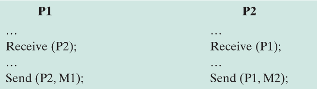
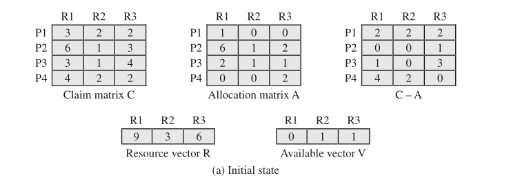
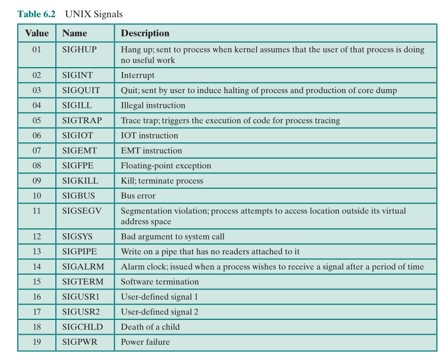

# 并发：死锁和饥饿

## 死锁原理

死锁定义为一组相互竞争系统资源或进行通信的进程间的“永久”阻塞。一组进程是死锁的，如果其中每个进程因等待事件而阻塞，且所等待的事件只能被这组进程中的另一阻塞进程激发。

因为没有事件能够被触发，故死锁是永久性的。

无有效解决办法


### 死锁发生原因

- 并发进程对资源的竞争：
  - 资源数目不足
  - 资源分配策略，如动态分配
  - 进程对资源的使用要求，如互斥
- 并发进程执行的顺序

有如下两个进程，每个进程都需要互斥地访问资源 A、B 一段时间：

```
Process P    Process Q
Get A         Get B
Get B         Get A
Release A     Release B
Release B     Release A
```

有如下联合进程图：


上图中 X、Y 轴分别代表 P 和 Q 的执行进展，黑实线表示可能的不同进展路线。

水平路径表示 P 正在执行而 Q 在等待，垂直路径表示 Q 正在执行而 P 在等待。

一旦进入到灰色区域，死锁将不可避免。

假设 P 不会同时需要资源 A 和 B：

```
Process P     Process Q

Get A         Get B
Release A     Get A
Get B         Release B
Release B     Release A
```

联合进程图：


没有重叠的阴影部分，无论执行到哪一步都有办法绕开阴影区域，不会出现能进去却出不来的区域（前一种情况图中的灰色区域），就不会出现死锁。

### 资源分类

#### 可重用资源

一次可被一个进程使用，用后不会消耗

如处理器、I/O 通道、内存和外存、设备，以及诸如文件、数据库和信号量之类的数据结构

如果每个进程拥有一个资源而请求另一个资源，则会发生死锁

例如 200K 的内存空间，做如下分配：


则当两进程先后都完成了第一次资源请求，做第二次请求的时候就会出现死锁：没有一个进程能完成任务释放内存，又没有一个进程能取得足够的资源来完成任务。

#### 可消耗资源

可以创造（生产）并销毁（消费）。某种类型可消耗资源的数量通常没有限制，无阻塞生产进程可以创建任意数量的这类资源。消费进程得到一个资源时，该资源就不再存在。

如中断、信号、消息和 I/O 缓冲区中的信息。

如果接收消息阻塞，可能死锁。比如这个例子，两进程被设计为均需接受到对方发出的消息才能继续，但需要继续才能发送消息：



不存在解决所有类型死锁的有效策略。

### 资源分配图

表征进程资源分配的有效工具是 Holt 引入的资源分配图，它是描述资源和进程系统状态的有向图，圆表示进程，矩形表示资源，矩形中的黑点个数表示资源的个数。

进程指向资源的箭头表示进程**请求**资源但还未获得，资源指向进程的箭头表示这一资源**分配**给了进程


下图左是死锁时的资源分配图，右图则不会发生死锁：


即使右图也有循环的箭头，但当请求的资源被满足后就不再是循环的箭头了。

下图是十字路口死锁的车辆的资源分配图，可以看到循环的箭头：


### 死锁的条件

必要条件：

- 互斥
  - 任一时刻只允许一个进程使用资源 ^f4602f
- 保持和请求（请求时保持资源的拥有）
  - 进程在请求其余资源时，不主动释放已经占用的资源 ^850283
- 不可剥夺
  - 进程已经占用的资源，不会被强制剥夺 ^2e1e19

前三个加上以下一个形成充分条件：

- 循环等待
  - 存在一个进程的封闭环路，其中每个进程占有环路中下一进程所需的至少一个资源

第四个条件实际上是前三个条件的潜在结果，即假设前三个条件存在，那么可能发生的一系列事件会导致不可解的循环等待。这个不可解的循环等待实际上就是死锁的定义。条件 4 中列出的循环等待之所以不可解，是因为有前面三个条件的存在。因此，这四个条件一起构成了死锁的充分必要条件。

**死锁的解决**有三种方法：死锁的预防、死锁的避免、死锁的检测

## 死锁的预防

采用一些策略消除充要条件中的任意一项

### 间接预防

间接预防是防止三个必要条件之一的发生

消除 [互斥](#^f4602f) ：互斥是操作系统必须支持的

消除 [保持和请求](#^850283) ：可以通过**要求一个进程一次请求所需的全部资源**来解决，但有如下缺点：

- 进程阻塞时间长
- 降低了对资源的利用率，降低进程的并发程度（分配给一个进程的资源可能会在相当长的一段时间不会被该进程使用，且不能被其他进程使用）；
- 有可能无法预先知道所需资源；

消除 [不可剥夺](#^2e1e19) 的两种方法（适用于资源的使用状态可以保存并恢复）：

- 如果拥有资源的进程新的资源请求无法得到满足，进程必须释放已有资源，重新再申请
- 操作系统可以剥夺另一个进程，要求它释放资源（要求任意两个进程优先级都不同）

### 直接预防

直接预防是防止循环等待

可以定义一个资源类型线性序，进程在申请资源时必须严格按资源线性序**递增次序**进行。

若一个进程已分配了 R 类型的资源，则其接下来请求的资源只能是那些排在 R 类型之后的资源。为证明这种策略的正确性，我们给每种资源类型指定一个下标。当 i<j 时，资源 Ri 排在资源 Rj 前面。现在假设两个进程 A 和 B，A 获得 Ri 并请求 Rj，而 B 获得 Rj 它就不能请求 Ri（因为 i<j，资源只能从小到大请求），就不会死锁了。举例见[用于解决哲学家就餐问题的实例](#^d78995)。

效率不高，减缓了进程的推进，可能会导致不必要地拒绝资源访问。

## 死锁的避免

**动态作出决定：如果当前资源分配请求满足，是否会导致死锁**

在死锁预防中，约束资源请求至少可破坏四个死锁条件中的一个条件，但都会导致低效的资源使用和低效的进程执行。死锁避免则相反，它允许三个必要条件，但通过明智地选择，可确保永远不会到达死锁点，因此死锁避免与死锁预防相比，可允许更多的并发。在死锁避免中，是否允许当前的资源分配请求是通过判断该请求是否可能导致死锁来决定的。

**条件：需要知道一个进程未来的资源请求**

两种死锁避免方法：

- 若一个进程的请求会导致死锁，则不启动该进程。
- 若一个进程新增的资源请求会导致死锁，则拒绝进程的增量资源请求。

### 拒绝进程启动

考虑有 n 个进程和 m 种不同资源的系统，有以下向量和矩阵：


其中第 i 种资源共有$R_i$个资源，现在其中仍可用的有$V_i$个。

声明矩阵 C 有 n 行 i 列，$C_{ij}$表示第 i 个进程总共需要第 j 种资源$C_{ij}$个

已分配矩阵 A 有 n 行 i 列，$A_{ij}$表示第 i 个进程已得到第 j 种资源$A_{ij}$个

可得以下关系：

1.  $R_j=V_j+\sum_{i=1}^{N}A_{ij}$，即对每一种资源，总数等于剩余可用的加上已分配的
2.  $C_{ij}\leq R_i$，即任一进程对任一资源的请求都不能超过系统中该资源的总量
3.  $A_{ij}\leq C_{ij}$，即不会多分配给进程超过其请求数的资源（要避免进程开始时少报所需资源，后期超量请求，具体见 [拒绝分配资源](#拒绝分配资源) 策略的算法）

则可定义一个避免死锁的策略：若新进程请求的资源**不满足**$R_j\geq C_{(n+1)j}+\sum_{i=1}^{n}C_{ij}$，则拒绝其启动。

也就是说，只有满足所有当前进程的最大请求量及新的进程请求时，才会启动该进程。

这个策略不是最优的，因为它假设了最坏的情况：所有进程会同时发出它们的最大请求（因为通常一个进程并不会同时都使用未来要请求的资源）。

### 拒绝分配资源

资源分配拒绝策略，又称为**银行家算法**。

首先需要定义状态和安全状态的概念。

考虑一个系统，它有固定数量的进程和固定数量的资源，任何时候一个进程可能分配到零个或多个资源。**系统的状态是当前给进程分配的资源情况**，因此状态包含前面定义的两个向量 Resource 和 Available 及两个矩阵 Claim 和 Allocation，C-A 表示资源的剩余需求（即未被满足的请求）.

**安全状态（safe state）指至少有一个资源分配序列不会导致死锁**（即所有进程都能运行直到结束），不安全状态（unsafe state）指非安全的一个状态。

#### 安全状态举例

考虑如下初始状态：



每次在 C-A 矩阵中从 P1 到 P4（方便起见依次）寻找一个可以被全部满足的进程（即那一行所有数小于向量 V 中对应的数），然后将资源分配给它。

这里找到 P2 可被满足，先满足它的请求，然后等待 P2 结束，归还所有资源（即向量 V 三项分别加上矩阵 A 中 P2 的对应行 6，1，2）。以此类推，可以得到一个不会导致死锁的资源分配序列 P2、P1、P3、P4，所以当前状态安全。注：序列不唯一，与上述查找满足条件的进程的顺序有关。

具体过程见下图：


#### 不安全状态/请求的举例

现有如下初始状态：


若此时 P2 请求 1 个 R1 和 1 个 R3，若满足这个请求，则回到刚刚的安全状态，那么操作系统可以同意这一请求。

但此时要是 P1 请求 1 个 R1 和 1 个 R3，若满足这个请求，则会出现如下状态：


现在每个进程都至少需要一个 R1 才能完成工作，但是可用资源里已经没有 R1 了，无法找到一个不会导致死锁的资源分配序列，因此是不安全状态，为避免死锁，操作系统应拒绝 P1 的这次请求并将其阻塞。

注：以上**不安全状态未必会发生死锁**，例如假如 A 继续运行时重新释放了 R1 和 R3 资源，那么就可以回到初始状态，若此时 P2 请求 1 个 R1 和 1 个 R3，则又回到安全状态。因此，死锁避免策略并不能确切地预测死锁，它仅是预判死锁发生的可能与否并确保永远不要达到可能发生死锁的状态（即防患于未然，即使可能不会发生死锁，但系统无法预料之后究竟会发生什么，不能寄希望于程序会主动释放，避免此例中程序不释放资源又要请求更多 R1 的情况）。

我们获得以下**死锁的避免策略**：

**当进程请求资源时，假定请求满足，依次更新系统状态，然后检测结果是否是安全状态。若是，则同意分配，否则，阻塞进程直到分配后安全。**

算法的伪代码描述：

```c
/** 全局数据结构 */
struct state
{
    int resource[m];
    int available[m];
    int claim[n][m];
    int alloc[n][m];
}

/** 资源分配算法的主体 */
if (alloc[i, *] + request[*] > claim[i, *]) /* 检测已分配数+请求数是否超过最初的声明，即检测是否超量请求资源 */
    <error>; /* total request > claim*/
else if (request[*] > available[*]) /* 检测能否实现请求（可用资源是否足够） */
    <suspend process>;
else{ /* 模拟分配，确定是否安全 */
    < define newstate by : 
    alloc[i, *] = alloc[i, *] + request[*]; /*request[*]是一个向量，定义了进程i的资源请求*/
    available[*] = available[*] - request[*] > ;
}
if (safe(newstate)) /* 分配后仍安全，实现该分配 */
    <carry out allocation>;
else    /* 分配后不安全，回滚并阻塞 */
{
    <restore original state>;
    <suspend process>;
}

/** 检测状态是否安全的算法 (银行家算法) */
boolean safe(state S)
{
    int currentavail[m];
    process rest[<number of processes>];
    currentavail = available;
    rest = {all processes};
    possible = true;
    while (possible)
    {
        < find a process Pk in rest such that
                claim[k, *] – alloc[k, *] <= currentavail;
        if (found)
        { /* simulate execution of Pk */
            currentavail = currentavail + alloc[k, *];
            rest = rest - {Pk};
        }
        else
            possible = false;
    }
    return (rest == null);
}
```

死锁避免的优点：

- 不需要如 [死锁的检测](#死锁的检测) 一样抢占、回滚进程
- 同 [死锁的预防](#死锁的预防) 相比，资源分配限制少

缺点（自身限制）：

- 必须提前声明最大资源请求
- 涉及进程必须独立且无同步需要
- 必须有数目固定的资源用于分配
- 当拥有资源时，进程不会退出

## 死锁的检测

死锁预防策略非常保守，它们通过限制访问资源和在进程上强加约束来解决死锁问题，资源访问受限、进程受限。

死锁检测策略则完全相反，它不限制资源访问或约束进程行为。对于死锁检测（deadlock detection）来说，只要有可能，就会给进程分配其所请求的资源。操作系统定期检查死锁。

死锁检测可以频繁地在每次资源请求发生时进行，也可进行得少一些，具体取决于发生死锁的可能性。

在每次请求资源时检査死锁有两个优点：可以尽早地检测死锁情况、算法相对比较简单。缺点是这种频繁的检测会耗费相当多的处理器时间。

### 死锁检测算法

需要用到死锁避免算法（见上节）中的已分配矩阵（A）、可用向量（V），还需要引入一个请求矩阵 Q，其中$Q_{ij}$表示进程 $i$ **当前**请求的 $j$ 类资源的数量。与死锁避免策略不同的是**不需要声明矩阵 C**

这个算法主要是一个依次标记不处于死锁状态的进程的过程。最初，所有进程都是未标记的，然后执行下列步骤：

1.  标记已分配矩阵 A 中对应行全为 0 的进程
2.  初始化向量 W，赋值为可用向量 V
3.  找未标记进程 $i$ 满足:
   1.  对于所有满足$1\leq k\leq m$（m 是资源种数）的 k，都有$Q_{ik}\leq W_{k}$
   2.  如果找不到则终止算法
4.  如果找到，标记进程 $i$，将 W 加上$A_{i}$（$i$ 进程在已分配矩阵中的对应行），回到步骤 3

简单来说就是银行家算法检查当前状态是否为安全状态（将 Q 看作 C-A），如果是，则未死锁，否则则认为已死锁。

为什么这边和[死锁的避免](#拒绝分配资源)不同，一定死锁了呢？因为死锁的避免中 C-A 只代表将来可能会要请求这些资源，但在请求前可能会先释放，这里则不是，Q 中非零的进程都已经在同时请求需要的资源，不满足就无法继续执行，也就无法释放资源了。

这里更多强调的是多个进程同时请求导致了死锁发生或请求之后资源不够用了，进程又无法进行而释放资源导致死锁的发生。

算法执行的结论：**死锁存在** 当且仅当 **存在未标记进程**。此时所有**未标记进程是死锁的**

### 恢复策略

1.  中止所有死锁进程
2.  死锁进程回退到某个预定义的检查点，重新启动所有进程（**可能**会再次死锁）
3.  依次中止死锁进程并检查，直到死锁不再存在
4.  依次剥夺资源并检查，直到死锁不再存在

对于 3、4，需要有一个优先被剥夺或者中止的策略，通常采用如下策略：

1.  到目前使用处理器时间最少（认为是还没做什么有效工作的）
2.  到目前产生输出最少（理由同上）
3.  估计剩余时间最长（先让快结束的进程赶紧干完结束然后释放资源，较难判定）
4.  到目前已分配资源最少（理由同 1）
5.  进程优先级最低

### 三种死锁解决策略的比较


## 综合死锁策略

资源归类：将各种资源归入若干个不同的资源类(resource group)中：

- 可交换空间：交换所用的外存中的存储块（即指定的硬盘空间）
- 进程资源：可分配给进程的资源，如文件
- 主存空间：以页或段分配
- 内部资源：如 I/O 通道

资源排序：在不同资源类之间规定次序，对不同资源类中的资源采用线性按序申请的方法（如就按上面分类来排序，就规定必须先申请可交换空间，最后才能申请内部资源）

针对性优化：对同一资源类中的资源，采用适当的方法。如：

- 可交换空间：一次性分配所需所有资源来预防（通常可知最大存储需求）
- 进程资源：死锁避免策略或基于资源排序的预防
- 主存空间：基于剥夺的预防（如基于优先级进行[换入换出](进程描述与控制.md#进程挂起)）
- 内部资源：基于资源排序的预防

## 哲学家就餐问题


五位哲学家不定时来吃面，每人吃面都需要左右手两把叉子。如何分配叉子使他们不会因等叉子被饿死？

可以提取的条件：

1.  两位哲学家不能同时使用一把叉子（叉子互斥）
2.  哲学家不能被饿死（避免死锁和饥饿）

### 使用信号量解决

```c
/* program diningphilosophers */
semaphore fork[5] = {1};    /* 所有信号量初始化都为1 */
int i;
void philosopher(int i)
{
    while (true)
    {
        think();
        wait(fork[i]);
        wait(fork[(i + 1) mod 5]);
        eat();
        signal(fork[(i + 1) mod 5]);
        signal(fork[i]);
    }
}
void main()
{
    parbegin(philosopher(0), philosopher(1),
             philosopher(2), philosopher(3),
             philosopher(4));
}
```

上述代码只解决了互斥，没有解决死锁，假设五人同时坐下，同时拿起左手叉子，则造成了死锁。

解决方案 1：可以规定资源请求顺序必须**采用线性按序申请的方法**。设 P0 左手边是 0 号叉，右手边是 1 号叉，以此类推，规定哲学家只能**先拿低号叉再拿高号叉**，则 P4（第五位哲学家）需要先拿右手叉，又因为需要实现互斥，他需要等待 P0 先吃完才能拿起左手叉，避免了五人同时拿起左手叉导致死锁。在上述代码中，只需要为 P4 另写一个函数，把其中的 `wait(fork[i]);` 与 `wait(fork[(i + 1) mod 5]);` 两行对调即可。 ^d78995

解决方法 2：**破坏保持等待**。使用 and 信号量，即一个信号量同时申请多个资源。哲学家们必须同时拿起左右两把叉子，当拿不了的时候就必须等待（阻塞）。

解决方法 3：减少同时就餐的哲学家（减少竞争资源的进程数）。限制同时能进入餐厅的哲学家最多四位。**将餐厅也作为资源来处理。**这样至少有一位哲学家能吃面而不会造成死锁（循环等待）。见下面代码：

```c
/* program diningphilosophers */
semaphore fork[5] = {1};
semaphore room = {4};
int i;
void philosopher(int i)
{
    while (true)
    {
        think();
        wait(room);
        wait(fork[i]);
        wait(fork[(i + 1) mod 5]);
        eat();
        signal(fork[(i + 1) mod 5]);
        signal(fork[i]);
        signal(room);
    }
}
void main()
{
    parbegin(philosopher(0), philosopher(1),
             philosopher(2), philosopher(3),
             philosopher(4));
}
```

### 使用管程解决

管程自带一种“不能满足条件就阻塞”的特点，且**管程内部同时只有一个进程能进入**，保证不会出现五人同时拿起左手的问题，可以一次设置多个条件（比如依次拿两把叉子），若不能满足则阻塞到（不能满足的叉子的）队列上。（和用一个信号量同时申请多个资源有相似之处）。

```c
monitor dining_controller;
cond ForkReady[5];        /* condition variable for synchronization */
boolean fork[5] = {true}; /* availability status of each fork */
void get_forks(int pid)   /* pid is the philosopher id number */
{
    int left = pid;
    int right = (++pid) % 5;
    /*grant the left fork*/
    if (!fork[left])
        cwait(ForkReady[left]); /* queue on condition variable */
    fork(left) = false;
    /*grant the right fork*/
    if (!fork[right])
        cwait(ForkReady[right]); /* queue on condition variable */
    fork[right] = false:
}
void release_forks(int pid)
{
    int left = pid;
    int right = (++pid) % 5;
    /* 释放左右手叉子时判断是否有人阻塞在某把叉子上，若有，将其唤醒（转交叉子），否则释放叉子 */
    /*release the left fork*/
    if (empty(ForkReady[left]) /*no one is waiting for this fork */
        fork[left] = true;
    else /* awaken a process waiting on this fork */
        csignal(ForkReady[left]);
    /*release the right fork*/
    if (empty(ForkReady[right]) /*no one is waiting for this fork */
        fork[right] = true;
    else /* awaken a process waiting on this fork */
        csignal(ForkReady[right]);
}
void philosopher[k = 0 to 4] /* the five philosopher clients */
{
    while (true)
    {
        <think>;
        get_forks(k); /* client requests two forks via monitor */
        <eat spaghetti>;
        release_forks(k); /* client releases forks via the monitor */
    }
}
```

## Unix、Linux 与 Windows 中并发机制的实现

### Unix

Unix 为进程间的通信和同步提供了各种机制，重要的有：管道、消息、共享内存、信号量、信号。

管道、消息和共享内存提供了进程间传递数据的方法，而信号量和信号则用于触发其他进程的行为。

#### 管道

也称共享文件方式，基于文件系统，利用一个打开的共享文件连接两个相互通信的进程，文件作为缓冲传输介质。

以字符流方式写入读出，**先进先出**顺序


协调功能：

- 互斥：操作系统强制实施互斥，即一次只能有一个进程可以访问管道。
- 同步：写进程写入数据后进入睡眠状态，直到读进程取走数据后将其唤醒。无数据时，读进程睡眠，直到写进程写入数据后将其唤醒。
- 确定双方存在

实现：

通过 pipe 系统调用创建**无名管道**，得到两个文件描述符，分别用于写和读。

- `int pipe(int fildes[2]);`
- 文件描述符 `fildes[0]` 为读端，`fildes[1]` 为写端；
- 通过系统调用 `write` 和 `read` 进行管道的写和读；
- 进程间双向通信，通常需要两个管道；
- 只适用于 父子进程之间 或 父进程安排的各个子进程之间

UNIX 中的**命名管道**，可通过 `mknod` 系统调用建立

- `int mknod(const char *path, mode_t mode, dev_t dev);`
- 又称 FIFO（是的没错，FIFO 是命名管道的一个名称），克服只能用于具有亲缘关系的进程之间通信的限制。
- FIFO 提供一个与路径名的关联，以 FIFO 的文件形式存在于文件系统中，通过 FIFO 不相关的进程也能交换数据。

Linux 可用 `mkfifo` 创建命名管道: `int mkfifo(const char * pathname, mode_t mode)`

参考：

1.  [Unix/Linux 进程间通信（二）：匿名管道、有名管道 pipe()、mkfifo()](https://www.cnblogs.com/52php/p/5878029.html)

#### 消息

消息队列(message queue)：消息是有类型的一段文本。每个 message 不定长，由类型(type)和正文(text)组成

UNIX 消息队列 API：

- `msgget` 依据用户给出的整数值 key，创建新消息队列或打开现有消息队列，返回一个消息队列 ID；
- `msgsnd` 发送消息；
- `msgrcv` 接收消息，可以指定消息类型；没有消息时，返回-1；
- `msgctl ` 对消息队列进行控制，如删除消息队列；

消息发送者指定每个发送的消息的类型，类型可被接收者用做选择的依据。通过指定多种消息类型，可以在一个消息队列中建立多个虚拟信道。

接收者可按先进先出的顺序接收信息，或按类型接收信息。当进程试图给一个满队列发送信息时，它会被阻塞；当进程试图从一个空队列读取消息时也会被阻塞：若一个进程试图读取某一特定类型的消息，但由于现在还没有这种类型的消息而失败时，则该进程不会被阻塞。

注意：消息队列不随创建它的进程的终止而自动撤销，必须用 `msgctl(msgqid, IPC_RMID, 0)`。另外，`msgget` 获得消息队列 ID 之后，`fork` 创建子进程，在子进程中能继承该消息队列 ID 而不必再一次 `msgget`。

参考：

1.  [进程间通信之 System V 消息队列(一)-msgget,msgctl](https://dulishu.top/systemv-msgget/)
2.  [进程间通信之 System V 消息队列(二)-msgsnd,msgrcv](https://dulishu.top/linux-msgsnd/)
3.  [Linux 进程间通信（七）：消息队列 msgget()、msgsend()、msgrcv()、msgctl()](https://www.cnblogs.com/52php/p/5862114.html)

#### 共享存储区

相互通信的进程间设有公共内存，一组进程向该公共内存中写，另一组进程从公共内存中读，通过这种方式实现两组进程间的信息交换

需要进程互斥和同步的辅助来确保数据一致性（互斥约束不属于共享内存机制的一部分，但必须由使用共享内存的进程提供）。

- 基于共享数据结构：低效、数据量小
- 基于共享存储区：高效、数据量大

UNIX 的共享存储区：

- 创建或打开共享存储区(`shmget`)：依据用户给出的整数值 key 创建新区或打开现有区，返回共享存储区 ID。
- 连接共享存储区(`shmat`)：连接共享存储区到本进程的地址空间，返回共享存储区首地址。父进程已连接的共享存储区可被 `fork` 创建的子进程继承。
- 拆除共享存储区连接(`shmdt`)：拆除共享存储区与本进程地址空间的连接。
- 共享存储区控制(`shmctl`)：对共享存储区进行控制。

参考：

1.  [进程间通信之 System V 共享内存-shmget,shmat,shmdt,shmctl](https://dulishu.top/systemv-shared-memory/)
2.  [Linux 进程间通信（六）：共享内存 shmget()、shmat()、shmdt()、shmctl()](https://www.cnblogs.com/52php/p/5861372.html)

#### 信号量

UNIX System V 中的信号量系统调用是对第 5 章中定义的 `semWait` 和 `semSignal` 原语的推广，在这些原语之上可同时进行多个操作，且增量和减量操作的值可以大于 1。内核自动完成所有需要的操作，在所有操作完成前，任何其他进程都不能访问该信号量。

信号量由如下元素组成：

- 信号量的当前值。
- 在信号量上操作的最后一个进程的进程 ID
- 等待该信号量的值大于当前值的进程数。
- 等待该信号量的值为零的进程数。

与信号量相关联的是阻塞在该信号量上的进程队列。

参考：

1.  [进程间通信之 System V 信号量(一)-semget,semctl,semop](https://dulishu.top/systemv-semget/)
2.  [进程间通信之 System V 信号量(二)-示例](https://dulishu.top/systemv-mutex/)
3.  [Linux 进程间通信（五）：信号量 semget()、semop()、semctl()](https://www.cnblogs.com/52php/p/5851570.html)

#### 信号

信号相当于给进程的“软件”中断；通过发送一个指定信号通知进程某个异常事件发生。它是单向和异步的。

进程可发送信号，指定信号处理例程。

用户、内核和进程都能生成信号请求：

- 用户-用户能通过输入 ctrl+c，或终端驱动程序分配给信号控制字符的其他任何键来请求内核产生信号。
- 内核-当进程执行出错时，内核检测到事件并给进程发送信号，例如，非法段存取、浮点数溢出、或非法操作码，内核也利用信号通知进程某种特定事件发生。
- 进程-进程可通过系统调用 kill 给另一个进程发送信号，一个进程可通过信号与另一个进程通信。

Unix 信号：

- 一个进程向另一个进程或进程组（或自己）发送（kill 系统调用、raise 系统调用）：发送者必须具有接收者同样的有效用户 ID，或者发送者是超级用户身份
- 某些键盘按键，如：中断字符（通常是 Ctrl+C 或 Del）、暂停字符（如 Ctrl+Z）
- 硬件条件，如：除数为零、浮点运算错、访问非法地址等异常条件
- 软件条件，如：Socket 中有加急数据到达



对信号的处理：

- 进程可以设置信号处理例程（signal 系统调用），在接收到信号时就被调用，称为"捕获"该信号。信号处理例程的参数是接收到信号的编号。
- 进程也可以忽略指定的信号(SIG_IGN)。
  - 只有 SIGKILL 信号（无条件终止进程）和 SIGSTOP（使进程暂停）不能被忽略。
- 进程创建后为信号设立了默认处理例程(SIG_DFL)

信号的检测与处理流程：


参考：

1.  [Linux 进程间通信（一）： 信号  signal()、sigaction()](https://www.cnblogs.com/52php/p/5813867.html)

### Linux（略）

Linux 包含了其他 UNIX 系统中出现的所有并发机制，包括管道、消息、共享内存和信号。 Linux 还支持一种特殊类型的信号—实时信号（RT signals）。除此之外还有一些其他的并发机制。

#### 原子操作

原子操作执行时不被中断、干扰。分为两种类型：**整型操作**（针对整数变量）、**位图操作**（针对位图中的某一位）

这些操作在 Linux 支持的任何计算机体系结构中都须实现。在某些体系结构中，这些原子操作具有对应的汇编指令。其他体系结构通过锁住内存总线的方式来保证操作的原子性。

对于原子整数操作，定义了一个特殊的数据类型 atomic_t，原子整数操作仅能用在这个数据类型上，而其他操作不允许用在这个数据类型上。这样严格限制的好处：

1.  在某些情况下不受竞争条件保护的变量，不能使用原子操作
2.  这种数据类型的变量能够避免被不恰当的非原子操作使用。
3.  编译器不能错误地优化对该值的访问（如使用别名而不使用正确的内存地址）
4.  这种数据类型的实现隐藏了与计算机体系结构相关的差异

原子位图操作操作由指针变量指定的任意一块内存区域的位序列中的某一位，因此没有和原子整数操作中的 atomic_t 等同的数据类型。

原子操作是内核同步方法中最简单的。在原子操作的基础上，可构建更复杂的锁机制。

参考：

1.  [Linux 原子操作 (Linux atomic operations)](https://blog.csdn.net/colddown/article/details/37992135)

#### 自旋锁

在 Linux 中保护临界区的常用技术是自旋锁，任何时候只一个线程可获得自旋锁，其他线程会一直进行测试(自旋)，等待锁重新可用。

本质上，自旋锁建立在内存区中的一个整数上，任何线程进入临界区前都必须检查该整数。若该值为 0，则线程将该值设置为 1，然后进入临界区。若该值非 0，则该线程继续检查该值，直到它为 0。自旋锁很容易实现，但有一个缺点，即锁外面的线程会以忙等待的方式继续执行。因此，自旋锁在获得锁所需的等待时间较短时，即等待时间少于两次上下文切换时间时，会很高效。

参考：

1.  [Linux 内核的自旋锁](http://www.wowotech.net/kernel_synchronization/460.html)

#### 信号量

Linux 在用户级提供了和 UNIX SVR4 对应的信号量接口。在内核内部，Linux 提供了供自身使用的信号量的具体实现，即内核中的代码能够调用内核信号量。内核的信号量不能通过系统调用直接被用户程序访问。内核信号量是作为内核内部函数实现的，因此比用户可见的信号量更加高效。

Linux 在**内核中**提供三种信号量：

1.  二元信号量（binary semaphores）
2.  计数信号量（counting semaphores）
3.  读写信号量（reader-writer semaphores）

参考：

1.  [进程间通信之-信号量 semaphore--linux 内核剖析（十）](https://blog.csdn.net/gatieme/article/details/50994533)

#### 屏障（Barriers）

在有些体系结构中，编译器或处理器硬件为了优化性能，可能会对源代码中的内存访问重新排序。重新排序的目的是优化对处理器指令流水线的使用。重新排序的算法包含相应的检查，以便保证不违反数据依赖性。

即使如此，在某些情况下，读操作和写操作以指定的顺序执行也相当重要，因为这些信息会被其他线程或硬件设备使用。为保证指令执行的顺序， Linux 提供了内存屏障（memory barrier）设施。

`rmb()` 操作保证代码中 `rmb()` 之前的代码没有任何读操作会穿过屏障，`rmb()` 之后的代码中读操作也没有任何机会穿过屏障。类似地，`wmb()` 操作保证代码 `wmb()` 之前的代码没有任何写操作会穿过屏障。`mb()` 操作提供了装载和存储屏障。`barrier()` 操作是 `mb()` 操作的一个轻量级版本，它仅控制编译器的行为。知道处理器不会执行不良的重新排序时，这个操作相当有用，比如 Intel 的 x86 处理器就不会对写操作重新排序。

参考：

1.  [聊聊原子变量、锁、内存屏障那点事](http://www.0xffffff.org/2017/02/21/40-atomic-variable-mutex-and-memory-barrier/)
2.  [Linux 内核中的内存屏障](https://blog.csdn.net/jasonchen_gbd/article/details/80151265)
3.  [优化屏障与内存屏障 (barrier，rmb)](https://www.cnblogs.com/mull/archive/2013/06/04/4477811.html)

### Windows（略）

Windows 提供了线程间的同步，并把它作为对象结构中的一部分。最重要的同步方法包括执行体分派器对象(Executive dispatcher objects (利用 Wait functions))、用户模式临界区(user-mode critical sections)、轻量级读写锁(slim reader-writer locks)、条件变量(condition variables)和锁无关操作(lock-free operations)。

##### Windows 同步对象

###### Mutex 对象

互斥对象，相当于互斥信号量，在一个时刻只能被一个线程使用。

有关的 API：

- `CreateMutex` 创建一个互斥对象，返回对象句柄；
- `OpenMutex ` 返回一个已存在的互斥对象的句柄，用于后续访问；
- `ReleaseMutex ` 释放对互斥对象的占用，使之成为可用；

###### Semaphore 对象

相当于资源信号量，取值在 0 到指定最大值之间，用于限制并发访问的线程数。

有关的 API：

- `CreateSemaphore` 创建一个信号量对象，指定最大值和初值，返回对象句柄；
- `OpenSemaphore` 返回一个已存在的信号量对象的句柄，用于后续访问；
- `ReleaseSemaphore` 释放对信号量对象的占用；

###### Event 对象

事件对象，相当于"触发器"，可通知一个或多个线程某事件的出现。

有关的 API：

- `CreateEvent` 创建一个事件对象，返回对象句柄；
- `OpenEvent` 返回一个已存在的事件对象的句柄，用于后续访问；
- `SetEvent` 和 `PulseEvent` 设置指定事件对象为可用状态；其中，`PulseEvent` 在唤醒等待线程后会把事件对象再变为不可用状态。
- `ResetEvent` 设置指定事件对象为不可用状态

##### 同步对象等待

`WaitForSingleObject` 在指定的时间内等待指定对象为可用状态(signaled state)；

```c
DWORD WaitForSingleObject(
                        HANDLE hHandle, // handle of object to wait for 
                        DWORD dwMilliseconds    // time-out interval in milliseconds
                        ); 
```

`WaitForMultipleObjects` 在指定的时间内等待多个对象为可用状态；

```c
DWORD WaitForMultipleObjects(
                    DWORD nCount,    //对象句柄数组中的句柄数；
                     CONST HANDLE *lpHandles, // 指向对象句柄数组的指针，数组中可包括多种对象句柄；
                     BOOL bWaitAll, // 等待标志：TRUE表示所有对象同时可用，FALSE表示至少一个对象可用；
                     DWORD dwMilliseconds // 等待超时时限；
                     ); 
```

##### 其他同步方法

Critical Section 对象：只能在同一进程内使用的临界区，同一进程内各线程对它的访问是互斥进行的。把变量说明为 `CRITICAL_SECTION` 类型，就可作为临界区使用。

有关的 API：

- `InitializeCriticalSection` 对临界区对象初始化
- `EnterCriticalSection` 等待占用临界区的使用权，得到使用权时返回；
- `TryEnterCriticalSection` 非等待方式申请临界区的使用权；申请失败时，返回 0；
- `LeaveCriticalSection` 释放临界区的使用权；
- `DeleteCriticalSection` 释放与临界区对象相关的所有系统资源；

互锁变量访问：相当于硬件指令，对一个整数（进程内的变量或进程间的共享变量）进行操作。其目的是避免线程间切换的影响。

有关的 API：

- `InterlockedExchange` 进行 32 位数据的先读后写原子操作；
- `InterlockedCompareExchange` 依据比较结果进行赋值的原子操作；
- `InterlockedExchangeAdd` 先加后存结果的原子操作；
- `InterlockedDecrement` 先减 1 后存结果的原子操作；
- `InterlockedIncrement` 先加 1 后存结果的原子操作；
