# 操作系统概述

## 操作系统的目标和功能

操作系统是控制应用程序执行的程序，是应用程序和计算机硬件间的接口。它有三个目标：

- 方便：操作系统使计算机更易于使用。
- 有效：操作系统允许以更有效的方式使用计算机系统资源。
- 扩展能力：在构造操作系统时，应允许在不妨碍服务的前提下，有效地开发、测试和引入新的系统功能

### 作为用户/计算机接口的操作系统

为用户提供应用的软硬件可视为一种层次结构

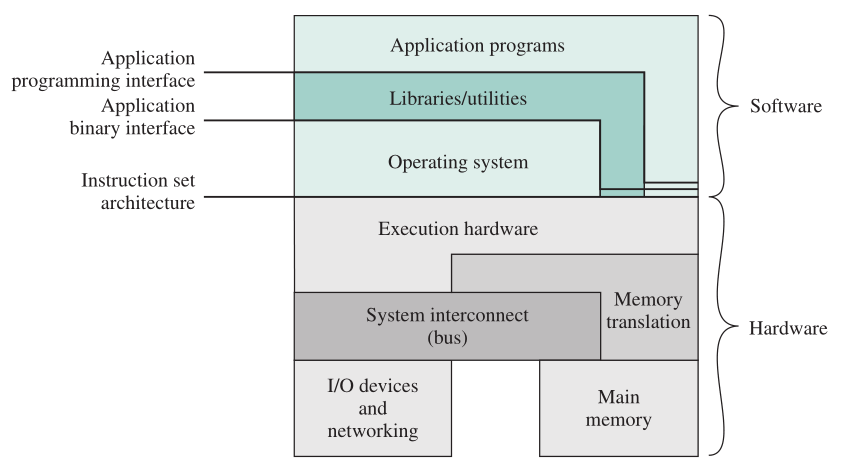

上图显示了典型计算机系统中的三种重要接口：

- 指令系统体系结构（ISA）：定义了机器语言指令系统，是硬件和软件的分界线。注：应用程序和实用程序可直接使用指令系统的一个子集（用户级 ISA），系统可使用系统级 ISA。
- 应用程序二进制接口（ABI）：定义了操作系统的系统调用接口。ABI 可以保证编译后的程序在同一个系统（或者同一个 ABI）的情况下都能正常运行。ABI 规定了二进制文件的格式、内容、装载/卸载程序的要求等。ABI 实现兼容比 API 更加困难（如 Windows 下编译的程序无法在 Linux 下执行）
- 应用程序编程接口（API）：API 保证未编译的源代码在有同一个库的相同或不同的系统能被正常编译并执行

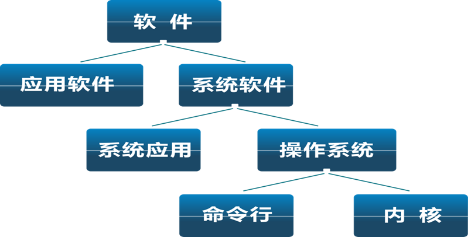

#### 操作系统提供的服务

##### 程序开发

- 编辑、调试（通常，这些服务以实用工具程序的形式出现，严格来说并不属于操作系统核心的一部分）
- 程序执行
- 执行程序所需的大量任务的安排

##### 访问 I/O 设备

每个 I/O 设备的操作都需要自身特有的指令集或控制信号，操作系统隐藏这些细节，并提供统一的接口，因此程序员可以使用简单的读/写操作来访问这些设备。

##### 文件的受限访问

- 为用户提供公共接口访问不同存储介质
- 为多路存取（多用户）系统提供保护

##### 系统访问

对系统及其资源的访问控制，如访问冲突、用户权限等

##### 错误检测和响应

- 内外硬件错（如设备失败或故障）
- 程序错（如算术溢出）
- 做出响应以清除错误：终止程序、重复操作、报错

##### 记账

- 收集资源使用统计数据
- 性能监控（如监控响应时间）

### 作为资源管理器的操作系统

计算机是资源集合，用于数据移动、存储、处理。

通过管理计算机资源，操作系统控制计算机的基本功能。

**操作系统的功能，从资源管理角度**：

- Processor management 处理机管理
- Memory management 存储管理
- Device management 设备管理
- File management 文件管理
- User interface 用户接口

通常，我们认为控制机制在被控制对象之外，或至少与被控制对象有一些差别和距离，但是操作系统不同：

- 操作系统与普通计算机软件的作用相同，即它是由处理器执行的一段程序或一组程序。
- 操作系统经常会释放控制，而且必须依赖处理器才能恢复控制。

操作系统实际上不过是一组计算机程序，它与其他计算机程序类似，也给处理器提供指令，主要区别在于程序的意图。操作系统控制处理器使用其他系统资源，并控制其他程序的执行时机。

但处理器要做任何一件这类事情时，都必须停止执行操作系统程序，而去执行其他程序。因此，这时操作系统会释放对处理器的控制，让处理器去做其他一些有用的工作，然后用足够长的时间**依赖处理器恢复控制权**，让处理器准备好做下一件工作。

操作系统所管理的主要资源：

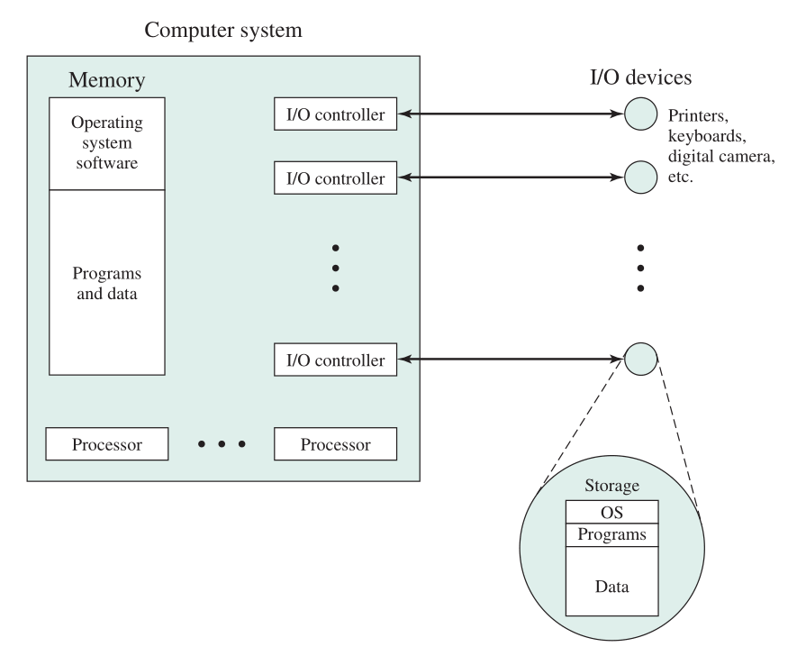

操作系统的一部分在内存中，包括内核程序和当前正在使用的其他操作系统程序，内核程序包含操作系统中最常使用的功能，**内核**是支持系统运行的基本功能和基本操作的一组程序模块，内核通常驻留在内核空间，运行于核心态。

内核分为单内核（如 Linux，大部分系统功能都放在内核）和微内核（如 Mach，仅将最基础功能放入内核），微内核将各个核心功能分开并模块化，各自独立运行，只有需要绝对特权的行程，才能在具特权的运行模式下运行，其余的行程则在用户空间运行。 微内核优点：实现简单、灵活性高、使分布式系统的构造更为方便。 ^f70ccc

内存的其余部分包含用户程序和数据，它的分配由操作系统和处理器中的存储管理硬件联合控制完成。操作系统决定在程序运行过程中何时使用 I/O 设备，并控制文件的访问和使用。处理器自身也是资源，操作系统必须决定在运行一个特定的用户程序时，可以分配多少处理器时间，且在多处理器系统中，这一决定要传达到所有处理器。

内核的功能：

- 中断处理
- 低级调度：线程、进程
- 原语管理：一段关键代码，执行期间作为一个整体，不可分割（不可被中断）

### 操作系统的可扩展性

操作系统需要不断发展，因为：

- 硬件升级或新的硬件出现
- 新服务
- 修改（纠正错误）

则 OS 的设计要求：模块化

## 操作系统的发展史

### 串行处理

无操作系统，系统程序员直接与硬件交互。从有显示灯、开关、输入设备、打印机的控制台运行，用户以串行方式访问计算机。

#### 主要问题

- 调度：预约机时，分配的机时过长（过早完成任务，闲置）或过短（还未完成任务被中止）都可能浪费处理器时间
- 准备时间：程序运行前准备工作需要花费大量时间

### 简单批处理系统

使用了**监控程序**（monitor），用户不再直接访问机器，把卡片或磁带中的作业提交给计算机操作员，操作员把若干个作业分类编成**作业执行序列**，放在输入设备上，供监控程序使用。**每个程序完成处理后返回到监控程序，同时监控程序自动加载下一个程序。**

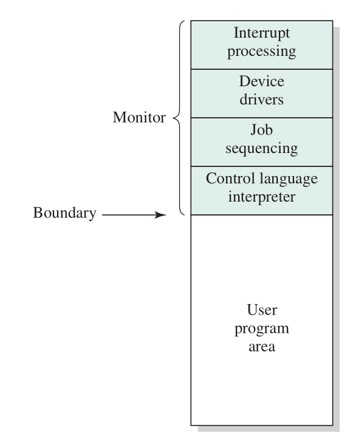

#### 监控程序角度

监控程序控制事件的顺序。

为做到这一点，**大部分监控程序常驻内存**中并且可以执行，这部分称为常驻监控程序。

其他部分包括一些实用程序和公用函数，它们作为用户程序的子程序，在需要用到它们的作业开始执行时才被载入。

监控程序每次从输入设备中**读入作业并赋予控制权**。

作业完成后，它将**控制权返回给监控程序**，监控程序立即读取下一个作业。

每个作业中的指令均以一种作业控制语言（JCL），这是一种特殊类型的程序设计语言，为监督程序提供指令，例如：使用什么编译器、处理什么数据

#### 处理器角度

处理器执行内存中存储的监控程序中的指令，这些指令读下一用户作业到内存，跳转到用户程序执行。

处理器继而执行用户程序中的指令，直到结束或出错，回到监督程序执行其指令。

#### 监督程序的作用

监控程序**完成调度功能**：一批作业排队等候，处理器尽可能迅速地执行作业，没有任何空闲时间。监控程序还**改善了作业的准备时间**。

因此单道批处理系统提高了处理器利用率

#### 需要的硬件功能（特征）

##### 内存保护

当用户程序正在运行时，不能改变包含监控程序的内存区域，否则将被处理器发现错误，转至监控程序，作业被取消。

##### 时钟

防止一个作业独占系统

##### 特权指令

某些机器指令被设计成特权指令，只能由监控程序执行。

例如 I/O 操作：用户程序希望执行 I/O 时，须请求监控程序为自己执行这一操作。

##### 中断

这个特征使得操作系统在让用户程序放弃控制权或从用户程序获得控制权时，具有更大的灵活性。

#### 运行模式

内存保护和特权指令引出了运行模式的概念。

##### 用户态（目态，user mode）

**用户程序**以用户态执行

此时有些内存区域是受保护的，特权指令也不允许执行。

##### 核心态（管态、内核态、系统态，Kernel Mode）

**监控程序**以系统态或核心态执行

此时不仅可以执行特权指令，而且可以访问受保护的内存区域。

#### 开销

对批处理操作系统来说，用户程序和监控程序交替执行。这样做有两个缺点：一部分内存交付给监控程序；监控程序消耗了一部分机器时间。所有这些都构成了系统开销。尽管存在系统开销，但简单的批处理系统还是提高了计算机的利用率

#### 特征

- 自动性：有专门的监督程序自动依次处理
- 顺序性：作业顺序进入内存，顺序完成
- 单道性：内存中仅有一道用户作业

### 多道批处理系统（Multiprogrammed Batch Systems）

单道中因为** I/O 设备太慢**，处理器需要等待 I/O 操作的完成，所以 CPU 仍然总是闲着。

在多道批处理系统中，在主存中同时有若干个作业，CPU 在其中多重切换，共享资源。一个作业等待 I/O，处理器可切换到另一作业。

优点：

- 资源利用率高：CPU、外设和内存
- 系统吞吐量大：单位时间内完成的工作总量大

缺点：

- 用户交互性差
- （单个）作业周转时间长

吞吐量（Throughput  rate）：单位时间内完成的作业数目

周转时间（Turnaround time）：作业进入系统到完成所经历的时间

特征：

- 多道：内存中同时存放几个作业，宏观上并行运行，微观上串行运行
- 无序性
- 调度性：两次调度（作业调度、进程调度）

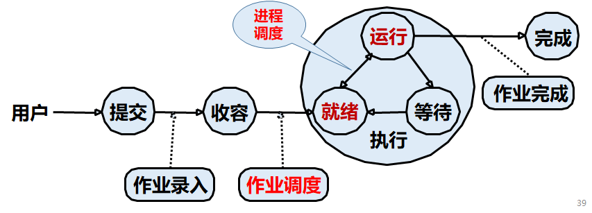

多道批处理系统上的技术：

- 调度：程序的现场保存和恢复
- 资源共享：资源的**竞争**和**同步**
- 内存使用：提高内存使用效率
- 内存保护：系统存储区和各应用程序存储区不可冲突
- 设备分配，系统提供 I/O 程序
- 文件非顺序存放、随机存取

依赖的硬件特性：支持 I/O 中断和直接存储器访问（Direct Memory Access，DMA）的硬件。

### 分时系统

使用多道程序设计，可使批处理变得更加有效。但对许多作业来说，需要提供一种**用户直接与计算机交互**的模式。

分时系统可以利用多道程序设计技术处理多个**交互作业**，多用户**共享处理器时间**，多用户通过终端**同时访问系统**。

在分时系统中，多个用户可以通过终端同时访问系统，**由操作系统控制每个用户程序在很短的时间内交替执行**。

把计算机的系统资源（尤其是 CPU 时间）进行时间上的分割，每个时间段称为一个**时间片**（time slice），每个用户依次轮流使用时间片。

**“分时”的含义**：分时是指多个程序分时共享硬件和软件资源(即：多任务)。多个用户分享使用同一台计算机(即：多用户) 。

|          | 批处理             | 分时系统       |
| -------- | ------------------ | -------------- |
| 主要目标 | 处理器利用率最大化 | 响应时间最小化 |
| 指令来源 | 作业控制语言指令   | 终端输入指令   |

#### 早期的分时系统

MIT 的 CTSS。**时间片技术**：当控制交给用户，用户程序、数据被加载到内存；时钟每 0.2 秒产生一次中断；每次中断 OS 先获得控制权，再将处理器赋予另一用户。

为便于以后恢复，它会保留老用户程序状态，在新用户程序和数据读入前，老用户程序和数据被写出到磁盘。随后在获得下一次机会时，老用户程序代码和数据被恢复到内存中。为减小磁盘开销，只有当新来的程序需要重写用户存储空间时，用户存储空间才被写出。

#### 分时系统的类型

单道分时（内存中只放一个程序）：调入-调出(Roll-in/Roll-out)，I/O 开销太大

前台后台分时：后台存放批处理作业；内存的划分是固定的，不灵活

多道分时：需要解决加载程序时地址空间重定位的问题

#### 问题

- **内存**多个作业需保护
- **文件系统**必须保护使得只有授权用户可以访问
- 解决**资源竞争**

#### 特征

- 同时性：多个用户同时工作。
- 独立性：各用户独立操作，互不干扰。
- 及时性：请求可在短时间内获得响应。
- 交互性：人机交互、联机工作

### 实时系统（不学）

主要用于过程控制、事务处理、信息查询等有实时要求的领域，其主要特征是实时性和可靠性。

实时系统的特征：

- 实时时钟管理
- 快速中断、调度
- 过载保护
- 高度可靠性和安全性

实时任务的类型:

- 周期性划分 periodicity
  - 周期性实时任务
  - 非周期性实时任务：截止时间，开始截止时间（最晚开始时间）和完成截止时间（最晚完成时间）
- 截止时间划分 deadline
  - 硬实时任务 Hard real-time
  - 软实时任务 Soft real-time

### 嵌入式操作系统（不学）

### 分布式操作系统（不学）

给运行在不同硬件上的程序/用户提供一种假象，使它们具有:

- 单个的内存空间
- 单个的辅存空间
- 统一的访问手段

### 个人计算机操作系统（不学）

## 主要成就

### [进程（详见第 3 章，此处只是简单概括，一切以第 3 章为准）](进程描述与控制.md)

进程是操作系统结构的基础

一个进程是：

- 正在执行的程序
- 正在运行的程序的一个实例
- 可以分派到处理器并执行的实体
- 由一个顺序执行线程、当前状态和相关系统资源集合描述的活动单元

多道批处理、分时、实时系统的出现引起了分时、同步方面的问题，导致了进程的发展

进程由三部分组成：

- 一段可执行的程序。
- 程序所需要的相关数据（变量、工作空间、缓冲区等）
- 程序的执行上下文。

最后一部分是根本。**执行上下文**（execution context）又称为**进程状态**（process state），是操作系统用来管理和控制进程所需的内部数据。这种内部信息和进程是分开的，因为操作系统信息不允许被进程直接访问。**上下文包括*操作系统管理进程*及*处理器正确执行进程*所需的所有信息**，包括各种处理器**寄存器**的内容，如程序计数器和数据寄存器。它还包括操作系统使用的信息，如进程**优先级**及进程是否在等待特定 **I/O 事件**的完成。

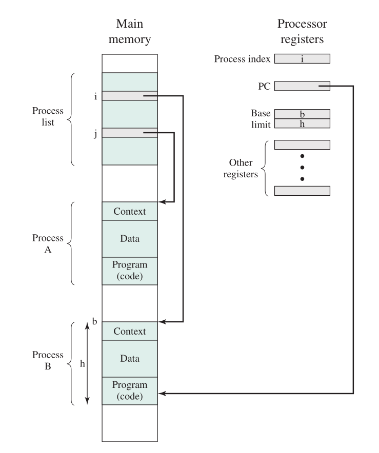

如图，给两个进程 A 和 B （包含程序、数据和上下文信息）分配了一块存储器区域，并且在**进程表**（由操作系统建立和维护）中进行了记录。进程表记录了每个进程，表项内容包括指向包含进程的存储块地址的指针和部分或全部执行上下文。（执行上下文的其余部分存放在别处，可能和进程本身保存在一起，通常还可能保存在内存中的一块独立区域。）

进程索引寄存器（process index register）包含当前正在控制处理器的进程在进程表中的索引。

程序计数器（program counter）指向该进程中下一条待执行的指令。

基址寄存器（base register）和界限寄存器（limit register）定义该进程所占据的存储器区域：基址寄存器中保存该存储器区域的开始地址，界限寄存器中保存该区域的大小（以字节或字为单位）。程序计数器和所有数据引用**相对于基址寄存器**来解释，且不能超过界限寄存器中的值，因此可以保护**内部进程间不会相互干涉**。

因此，进程被当作数据结构来实现。任何时候整个进程**状态**（state）都包含在其上下文环境中。在操作系统中可能会有一些新的功能（如优先级），这可通过扩展上下文环境实现。

### [内存管理](内存管理.md)

OS 的 5 个主要存储管理职责：

- 进程隔离
- 自动分配和管理：分配对程序员是透明的。操作系统可仅在需要时才给作业分配存储空间。
- 支持模块化程序设计
- 保护和访问控制
- 长期存储

典型情况下，操作系统使用**[虚拟内存](虚拟内存.md)和[文件系统](文件管理.md)**机制来满足这些要求。文件系统实现了长期存储，它在一个有名称的对象中保存信息，这个对象称为文件。

#### [虚拟内存（详见第 8 章）](虚拟内存.md)

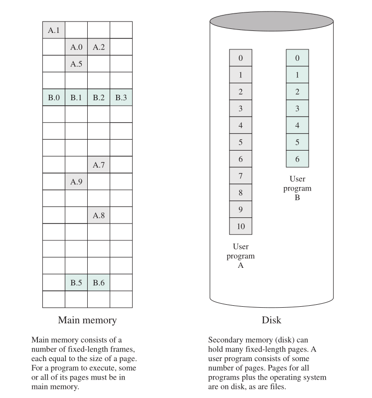

**虚存机制允许程序以逻辑方式访问存储器，而不考虑物理内存上可用的空间数量。**虚存的构想是为了满足有多个用户作业同时驻留在内存中的要求，因此在一个进程被写出到辅助存储器中且后续进程被读入时，连续的进程执行之间将不会脱节。

进程大小不同时，若处理器在很多进程间切换，则很难把它们紧密地压入内存，因此人们引入了[**分页系统**](虚拟内存.md#分页)。在分页系统中，进程由许多固定大小的块组成，这些块称为页。程序通过虚地址（virtual address）访问字，虚地址由页号和页中的偏移量组成。进程的每页都可置于内存中的任何地方，分页系统提供了程序中使用的虚地址和内存中的实地址（real address）或物理地址之间的动态映射。

#### [分页](虚拟内存.md#分页)

有了动态映射硬件后，下一个逻辑步骤就是消除一个进程的所有页同时驻留在内存中的要求。一个进程的所有页都保留在磁盘中，进程执行时，一部分页会调入内存中。若需要访问的某页不在内存中，存储管理硬件会在检测到它后，安排载入这个**缺页**（missing page）。这一配置称为**虚存**（virtual memory），如图所示。

处理器硬件和操作系统共同向用户提供“**虚拟处理器**”的概念，而“虚拟处理器”有对虚存的访问权。该存储器可以是一个线性地址空间，也可以是段的集合。不论哪种情况，程序设计语言的指令都可以访问虚存区域中的程序和数据。给每个进程唯一的不重叠虚存空间，可以实现**进程隔离**；使两个虚存空间的一部分重叠，可实现**内存共享**；文件可用于长期存储，文件或其一部分可以复制到虚存中供程序操作。

#### 寻址关系

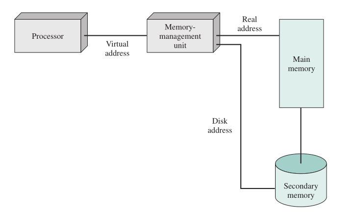

存储器由内存和低速辅助存储器组成，内存可直接访问（通过机器指令），外存可通过把块载入内存间接访问。地址转换硬件（映射器）位于处理器和内存之间。**程序使用虚地址访问，虚地址将映射成真实的内存地址。**如果访问的虚地址不在实际内存中，将进行换入换出。在换入换出过程中，产生该地址访问的进程须被**挂起**。操作系统设计者的任务是开发开销很少的地址转换机制，以及能减小各级存储器间通信量的存储分配策略。

### 信息保护和安全

对计算机系统和存储信息的控制访问

大多数安全和保护问题的分类：

- 可用性
- 机密性
- 数据完整性
- 可靠性

### 调度和资源管理

OS 的主要职责是管理资源，并调度各种活动进程来使用这些资源。

资源分配策略要考虑：

- 公平性
- **有差别的响应**：操作系统可能需要区分具有不同服务要求的不同作业类别。
- 有效性：希望获得最大的吞吐量和最小的响应时间，能够容纳尽可能多的用户。

## 现代操作系统的特征

人们对操作系统要求的变化，不仅要求设计人员修改和增强操作系统的现有体系结构，而且要求设计人员采用新的操作系统组织方法。 

不同的方法和设计要素：

- [微内核](操作系统概述.md#^f70ccc)：微内核只将少量基本功能（地址空间、进程间通信 IPC、基本调度）放在内核，其他在核外以用户模式运行。
- [多线程](线程.md)：进程分为可并发执行的线程，进程是多个线程的集合。线程是可分派的工作单位，线程顺序执行且可以中断。
- [对称多处理技术（SMP）](计算机系统概述.md#对称多处理器（SMP）)
- [分布式操作系统](#分布式操作系统（不学）)
- 面向对象设计：给小内核增加模块化扩展，使程序员可以定制操作系统而不破坏系统的完整性，使分布式工具和成熟的分布式操作系统的开发变得容易
- 虚拟机和虚拟化技术

[进程与线程的区别](线程.md#进程与线程)：

- [线程](线程.md#线程)（thread）：可分派的工作单元。它包括处理器上下文环境（包含程序计数器和栈指针）和栈中自身的数据区域（目的是启用子程序分支）。线程顺序执行且可以中断，因此处理器可以转到另一个线程。
- [进程](进程描述与控制.md#进程的定义)（process）：一个或多个线程和相关系统资源（如包含数据和代码的存储器空间、打开的文件和设备）的集合。它严格对应于一个正在执行的程序的概念。通过把一个应用程序分解成多个线程，程序员可以在很大程度上控制应用程序的模块性及相关事件的时间安排。

现代操作系统的特征：

- 并发
- 共享
- 异步性
- 虚拟（逻辑抽象）
- 持久（文件系统）

### 并发

并发(concurrency)：多个事件在同一时间间隔（时间段）内发生（即可以交替发生）。

并行(parallelism)：多个事件在同一时刻发生（即同时发生）。

在多道程序处理时，宏观上并发，微观上交替执行（在单处理器情况下）。程序的静态实体是可执行文件，而动态实体是进程（或称作任务），并发指的是进程。

### 共享

多个进程共享有限的计算机系统资源。

互斥共享：资源分配后到释放前，不能被其他进程所用。

同时访问（如可重入代码，磁盘文件）

资源分配难以达到最优化

### 异步性

也称不确定性、随机性，指进程的执行顺序和执行时间的不确定性

进程的运行速度不可预知：多个进程并发执行，"时走时停"，不可预知每个进程的运行推进快慢

判据：无论快慢，应该结果相同——通过[进程互斥和同步手段](并发：互斥和同步.md)来保证

难以重现系统在某个时刻的状态（包括重现运行中的错误）

性能保证：实时系统与分时系统相似，但通过资源预留以保证性能

### 虚拟

一个物理实体映射为若干个对应的逻辑实体（分时或分空间）

CPU ——每个用户（进程）的"虚处理机"

存储器——每个进程都占有的地址空间（指令+数据+堆栈）

显示设备——多窗口或虚拟终端(virtual terminal)

### 持久性

[文件系统](文件管理.md)可以长期存储信息

文件系统支持把数据方便地从磁盘等存储介质上存入和取出

## 操作系统提供的用户接口

给**应用程序（用于普通程序）**的接口：系统调用（程序接口）

给**操作命令（用于控制系统）**的接口：系统程序（作业接口）

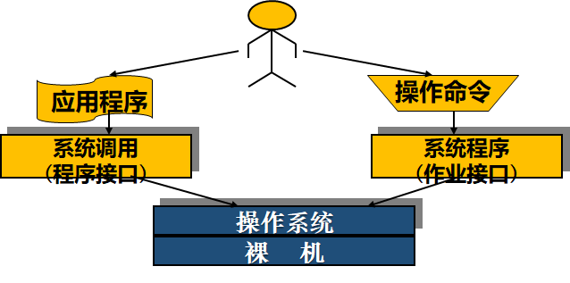

### 程序接口与系统调用(system call)

系统调用是 OS 提供给软件开发人员的唯一接口，可利用它使用系统功能。

OS 内核有一组实现系统功能的过程(函数)，系统调用就是对上述过程(函数)的调用。

系统调用把应用程序的请求传达给内核，内核调用对应的内核函数完成请求所需处理后，再将处理结果返回给应用程序。

应用程序、库函数、系统调用的调用关系：

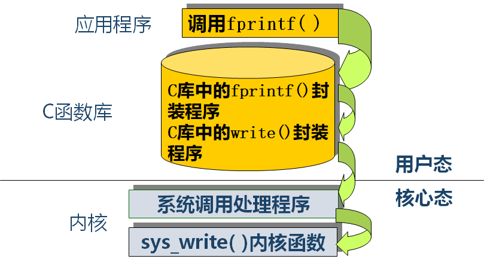

UNIX/Linux 系统程序、库函数、系统调用分层关系：

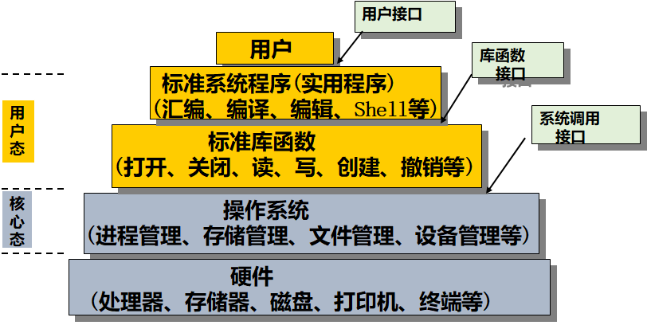

#### 系统调用的分类

- 设备管理：设备的读写和控制；
- 文件管理：文件读写和文件控制
- 进程控制：创建、中止、暂停等控制；
- 进程通信：消息队列、共享存储区、socket 等通信渠道的建立、使用和删除；
- 存储管理：内存的申请和释放；
- 系统管理：设置和读取时间、读取用户和主机标识等

#### 系统调用的实现过程

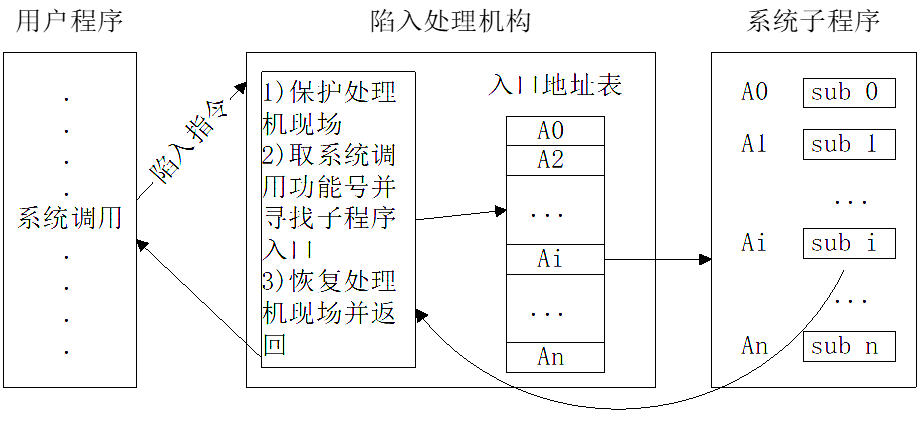

Linux 系统调用执行流程

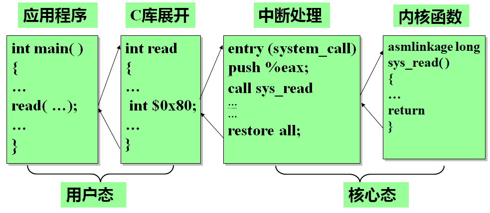

系统调用与函数调用的相同点：

- 改变指令流程
- 重复执行和公用
- 改变指令流程后需要返回原处

#### 系统调用与函数调用的不同点

- 系统调用是**动态调用**，而函数调用方式是**静态调用**
  - 系统调用是动态调用，程序中不包含被调用代码。
  - 系统调用的调用地址和返回地址都是不固定的。系统调用指令中不包含调用地址，只包含功能号。系统调用返回指令中不包括返回地址，通过栈保存和弹出返回地址。
  - 函数调用方式是静态调用，被调用代码与调用代码在同一程序之内。
  - 函数调用其调用地址是固定的，包含在调用语句中；
  - 返回地址是不固定的（同一子程序可能被不同处多次调用），在程序执行过程中通过栈的实现来保存和弹出返回地址。
- 执行状态不同
  - 调用和返回**经历了不同的系统状态**。通常 OS 核心和应用程序的代码分别运行在 CPU 的不同的状态下（核心态和用户态），所用地址空间也不同——核心的代码可以直接访问应用进程的地址空间，反之不然。
- 进入方式不同
  - 利用 int 或 trap 指令进行系统调用；利用 call 或 jmp 指令进入普通的过程调用
- 与进程调度的关系不同
  - 采用**抢占式调度**的系统，在系统调用返回时，要进行重新调度的检查——是否有更高优先级的任务就绪（创建或唤醒）。
- 嵌套或递归调用
  - 对系统调用，一般不允许在同一个进程中发生嵌套或递归（不同进程可以重入同一个系统调用）。

### 操作接口

操作接口又称作业级接口，是操作系统为用户操作控制计算机工作和提供服务的手段集合，通常可借助操作控制命令、图形操作界面(命令)、以及作业控制语言(命令)等来实现。

作业控制方式：

- 联机用户接口（操作控制命令）
- 脱机用户接口（作业控制语言）

操作系统中使用**命令解释程序**来解释执行用户的命令
