# 文件管理
注意：本章内容前后关联，若前面看不懂可以先略过，回头再看。

## 概述

文件的理想属性：

- 长期存在
- 可共享
- 结构

文件系统不但提供存储数据（组织为文件）的手段，而且提供一系列对文件进行操作的功能接口。

文件系统通常为文件维护一组属性，包括所有者、创建时间、最后修改时间和访问权限。

文件系统的典型的操作如下：

- 创建：在文件结构中定义并定位一个新文件。
- 删除：从文件结构中删除并销毁一个文件
- 打开：进程将一个已有文件声明为“打开”状态，以便允许该进程对这个文件进行操作。
- 关闭：相关进程关闭一个文件，以便不再能对该文件进行操作，直到该进程再次打开它。
- 读
- 写：进程更新文件（添加或修改）。

Linux 0.1x 进程打开文件：

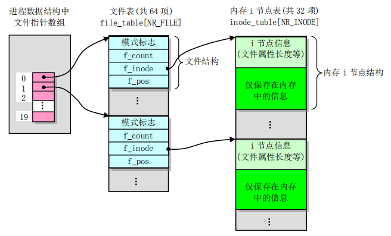

### 文件结构

域/字段：是数据组织中可以命名的最小逻辑数据单位，包含一个值

记录：一组相关数据项的集合，包含多个域

文件：具有文件名的相似记录集合

数据库：相关记录的集合

在 UNIX 或类 UNIX 系统上，文件的基本结构是字节流，与上述无关。例如，一个 C 语言程序以字节流的形式存储，而没有物理域、记录等。

### 文件管理系统

**目标：**

- 满足用户数据管理的需要
- 确保文件中数据的有效性
- 优化性能
- 提供对不同存储设备的 I/O 支持
- 减少或消除丢失或破坏数据的可能性
- 向用户进程提供标准 I/O 接口例程集
- 在多用户系统中为多个用户提供 I/O 支持

**对交互式通用系统的文件管理系统的基本需求：**

- 每个用户都应能创建、删除、读取和修改文件。
- 每个用户都应能受控地访问其他用户的文件。
- 每个用户都应能控制允许对用户文件进行哪种类型的访问。
- 每个用户都应能在文件间移动数据。
- 每个用户都应能备份用户文件，并在文件遭到破坏时恢复文件。
- 每个用户都应能通过名字而非数字标识符访问自己的文件。

#### 文件系统结构

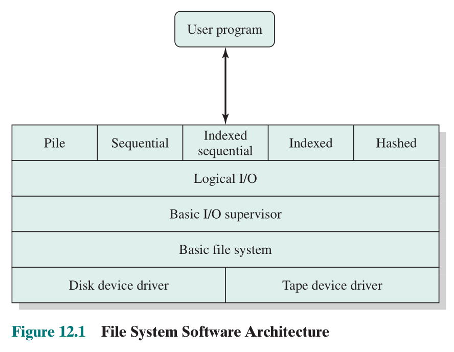

**设备驱动程序：**位于文件系统的最底层，直接与外围设备通信，负责启动一个设备上的 I/O 操作，继续处理 I/O 请求的完成，被认为是操作系统的一部分

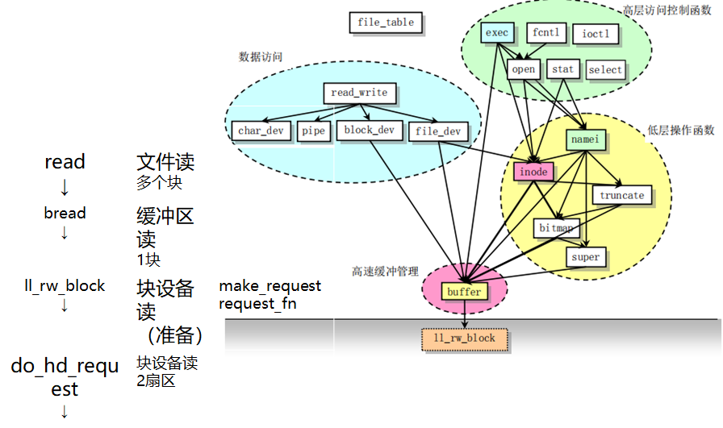

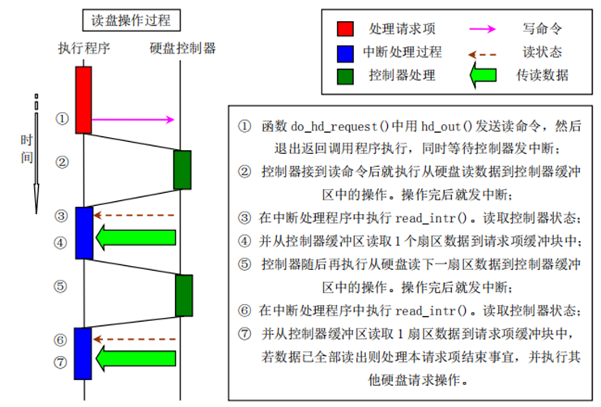

**基本文件系统(物理 I/O 层)：**这一层处理在磁盘间或磁带系统间交换的数据块，因此它关注的是这些块在辅存和内存缓冲区中的位置，而非数据的内容或所涉及的文件结构。基本文件系统通常是操作系统的一部分。

**基本 I/O 管理程序：**负责所有文件 I/O 的初始化和终止。在这一层，需要一定的控制结构来维护设备的输入/输出、调度和文件状态。基本 I/O 管理程序根据所选的文件来**选择执行文件 I/O 的设备**，为优化性能，它还参与访问的**调度**。 I/O 缓冲区的指定和辅存的分配，也是在这一层实现的。基本 I/O 管理程序是操作系统的一部分。

**逻辑 I/O：**使用户和应用程序能够访问**记录**。因此，基本文件系统处理的是数据块，而逻辑 I/O 模块处理的是文件记录。逻辑 I/O 提供一种通用的记录 I/O 能力，并维护关于文件的基本数据。

**访问方法层：**提供应用程序和文件系统以及设备间的**接口**，反映出不同的文件结构、存取和处理文件数据的不同方式

## 文件的组织和访问

文件的组织是由文件的访问方式决定的记录的逻辑结构，是指从用户观点出发讨论文件内部的逻辑结构或用户访问模式；它可以独立于在外存上的物理存储

### 文件组织原则

- 访问快速
- 易于修改
- 存储经济
- 维护简单
- 可靠

在不同的应用场景有不同的侧重，一些原则是相互冲突的

### 组织分类

#### 无结构文件

流式文件，文件体为字节流，不划分记录

顺序访问，每次读写访问可以指定任意数据长度

当前操作系统中**常用**的文件组织。

#### 有结构文件

##### 累积（堆）文件

数据按它们到达的顺序被收集，每条记录由一串数据组成

文件体为无结构的记录序列，通过特定分隔符来划分记录，各记录大小和组成可变；是最简单文件组织（如日志 log，或电子邮件的邮箱文件）

新记录总是添加到文件末尾，目的就是为了累积并存储一大堆的数据

检索必须从头开始，穷举搜索

##### 顺序文件

它由一个主文件和一个临时文件组成。记录格式固定，大小相同，所有域/字段相同

记录按某个关键域排序，存放在主文件(master file)中。新记录暂时保存在日志或事务文件(log file or transaction file)中，定期并入主文件恰当位置。

##### 索引顺序文件

在顺序文件(主文件 main file)的基础上，另外建立索引(index)和溢出文件(overflow file)。这样做的目的是加快顺序文件的检索速度。

在索引文件中，可将关键域的取值划分若干个区间（如 A~Z 可以划分为 A 到 Z 共 26 个区间），每个**区间**对应一个索引项，后者指向该区间的开头记录。

索引中含有关键域和指向主文件的指针，可有多级索引。

新记录暂时保存在溢出文件中，修改位于新记录之前的记录，在它的附加域添加指向新记录的指针，溢出文件定期归并入主文件。

##### 索引文件

记录大小不必相同，不必排序，存放在主文件(primary file)中

**针对不同的关键域建立多个索引。**索引项按记录中的某个关键域排序，通常较小，查找速度快，便于随机访问。

有新记录添加时必须更新索引。

主要用于对信息及时性要求严格的应用中，例如航空公司预订系统和库存控制系统。

##### 哈希文件或直接文件

根据已知地址可直接检索任意块。由主文件和溢出文件组成，检索时给出记录编号，通过哈希函数计算出该记录在文件中的相对位置。

通常用于：
- 需要非常快的访问速度
- 记录长度固定
- 总是一次访问一个记录

## 文件目录

目录是由**文件说明**组成的用于文件检索的特殊文件。文件目录的内容主要是文件访问的控制信息（不包括文件内容）

需要做到如下要求：

- 实现按名存取
- 提高目录检索速度
- 文件共享
- 解决文件重名问题

### 文件控制块（FCB）

文件控制块：文件控制块是操作系统为管理文件而设置的数据结构，存放了为管理文件所需的有关信息，如属性、位置、所有者，提供文件名与文件自身的映射。

文件控制块是文件存在的标志

**文件控制块构成文件目录**，目录自身也是个特殊文件。

### 目录的元素

- 基本信息
  - 文件名
  - 文件类型
  - 文件组织（针对支持不同文件组织的 OS)
- 地址信息
  - 卷
  - 起始地址
  - 已使用大小
  - 分配大小
- 访问控制信息
  - 所有者
  - 访问信息
  - 允许的操作（即访问权限）
- 使用信息
  - 创建日期
  - 创建者
  - 最后读取日期
  - 最后读取者
  - 最后修改日期
  - 最后修改者
  - 最后备份日期
  - 当前使用情况（活跃、锁定等）

### 对目录的操作

增删查改列

### 一级目录

一级目录是一个线性结构，在 FCB 中一个文件一个表项

这种结构可以表示以文件名为关键字的顺序文件，有重名问题需要解决（即不可重名）。

### 二级目录

有一个主目录，在主目录下每个用户对应一个目录项，提供地址和权限控制信息，每个用户目录是一个简单的列表，每个用户内的文件不能重名。

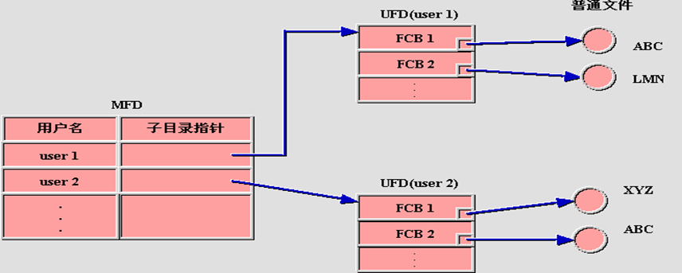

### 多级目录

有一个主目录，在主目录下每个用户对应一个目录项，每个用户目录下可以有子目录和文件。树状结构可以让用户通过路径找到文件。

所有文件按名存取，同目录下不重名即可，有不同的路径名的可以重名。

必须拼写出完整的路径名（使用绝对路径）仍比较困难。典型情况下，对交互用户或进程而言，总有一个当前路径与之相关联，通常称为工作目录。文件通常按相对于工作目录（相对路径）的方式访问。

### 改进的多级目录

关联内容： [基于索引结点 index node 的文件共享](#基于索引结点%20index%20node%20的文件共享)

为了提高目录检索速度，可把目录中的文件说明信息(即 FCB)分成两个部分：

- 符号文件目录：由**文件名和文件内部标识(Inode)号组成**的树状结构，按文件名排序；
- 基本文件目录（索引节点目录）：由详细文件说明信息**(Inode 具体内容)**组成的线性结构，按文件内部标识排序；

符号文件目录的层次结构：

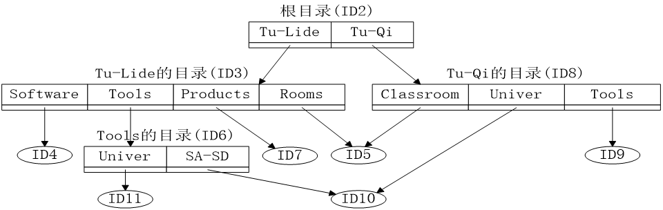

基本文件目录：

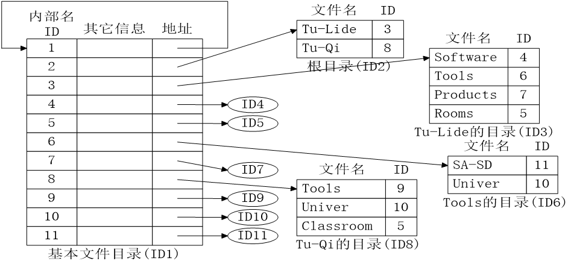

改进后减少了访问硬盘的次数，提高了检索速度

## 文件共享

文件共享的两个问题：访问权限和同时访问管理

同时访问共享语义
- 可以修改，随后可见
- 可以修改，立时可见
- 共享文件不允许修改

### 访问权限

不同操作系统有非常多的访问权限，通常拥有某种权限也就意味着有它的上一层权限

- 无，不可感知
- 感知，感知文件存在和文件所有者
- 可执行，可执行但不可复制
- 可读，用户可读可复制可执行
- 可附加，用户可以在文件尾添加数据但不可修改删除文件内容
- 可修改，用户可增删改文件数据
- 修改保护，用户可以修改文件权限以授权其他用户
- 可删除，用户可以删除文件

#### 用户访问权限层次

- 文件主，常有所有权限，并可授权给其他用户。
- 特定用户
- 特定用户组
- 所有用户

### 同时访问

访问文件之前，先打开文件：如果文件的目录内容不在内存，则将其从外存读入;否则，仍使用已在内存的目录内容

文件锁定(file lock)：可以协调对文件指定区域的互斥访问

- 修改时锁定整个文件
- 修改时锁定单个记录

利用进程间通信，协调对文件的访问（需要考虑进程间通信的互斥和死锁问题）

## 记录组块

记录是结构化文件访问的逻辑单元，而块是辅存 I/O 的单元，所以需要将记录组织成块。

三种常用方式：

- 固定组块
- 变长跨越组块
- 变长非跨越组块

### 固定组块

记录长度固定，几条记录保存在一个块中。

会有内碎片，顺序文件常用

### 变长跨越组块

记录长度可变，紧缩到块中，因此没有未使用空间，但某些记录可能跨越多个块，通过指针指向后继块。

存储效率高，实现难

### 变长非跨越组块

记录长度可变，但不跨越

大部分块有浪费空间，记录大小不能超过块

## 辅存管理

辅存管理涉及文件的物理结构或文件的存储结构，指**文件在文件存储空间中的存储组织形式**。与存储介质有关。

不同的外存分配方式，形成不同的文件物理结构

需要处理两个大问题：

- 将空间分配给文件
- 记录可用空间信息

### 文件分配问题

- 创建时，是否一次性分配最大空间？
- 分区（portion）是一组连续的块。分区的大小可以从一个块大小到整个文件大小。那么，在分配文件时，分区的大小应该是多少？
- 用什么数据结构记录文件分配到的分区

#### 预分配和动态分配

预先分配文件所需的所有空间。创建时，需知文件的最大尺寸（如虚拟磁盘的创建。通常难以估计文件可能的最大尺寸，且往往过高估计）。

动态分配：需要存储空间时才分配（创建时无法确定文件长度），如写入数据到文件。

#### 分区（portion，簇）大小

分区大小需要平衡单个文件和整个系统性能：

- 分区/簇较大：提高 I/O 访问性能，减小管理开销；但分区/簇内碎片浪费问题较严重；
- 分区/簇较小：分区/簇内的碎片浪费较小，特别是大量小文件时有利；但管理开销大，存在簇编号空间不够的问题（如 FAT12、16、32）；

分区/簇的分配方法：

- 分区/簇大小可变，其上限较大：I/O 访问性能较好，文件存储空间的**管理困难**（类似于动态分区存储管理）
- 分区/簇大小固定，且常设置较小：文件存储空间使用灵活，但**I/O 访问性能下降**，文件**管理所需空间开销较大**

文件巻容量与簇大小的关系：

- 文件卷容量越大，若簇的总数保持不变即簇编号所需位数保持不变，则簇越大。缺点：簇内碎片浪费越多
- 文件卷容量越大，若簇大小不变，则簇总数越多，相应簇编号所需位数越多。如簇编号长度为 12、16、32 二进制位，即构成 FAT12、FAT16、FAT32

#### 文件分配方法

##### 连续分配

创建时分配连续的一组磁盘块，使用可变大小的簇的预分配策略

文件分配表中一个文件只一个表项，记录文件的首块地址和文件长度

有外碎片，需要使用压缩技术

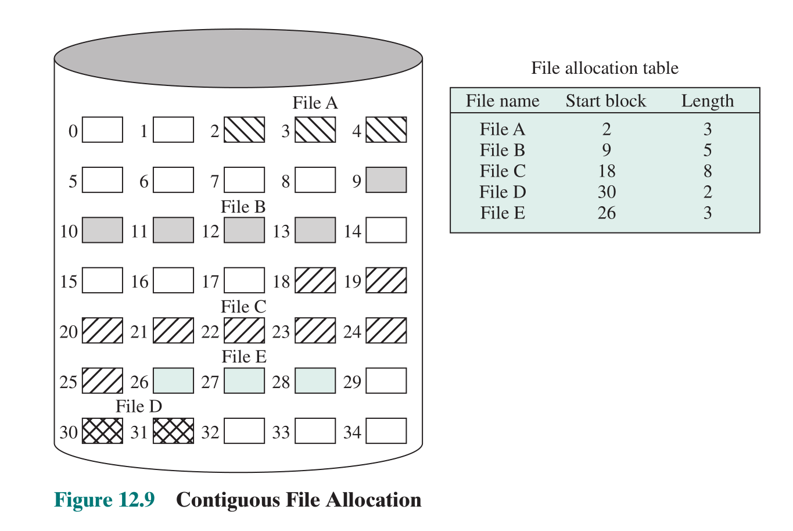

优点：

- 顺序访问容易且速度快，因为连续，磁盘寻道次数和时间最少
- 随机访问性能好

缺点：

- 要求连续存储空间，产生外碎片，空间利用率低
- 必须事先知道文件长度，文件不能动态增长，不利于文件插入和删除

##### 链接分配

单块分配，每块含指向下一块的指针，FCB 中需要记录文件的首块地址和文件长度

没有外碎片，最适合顺序文件

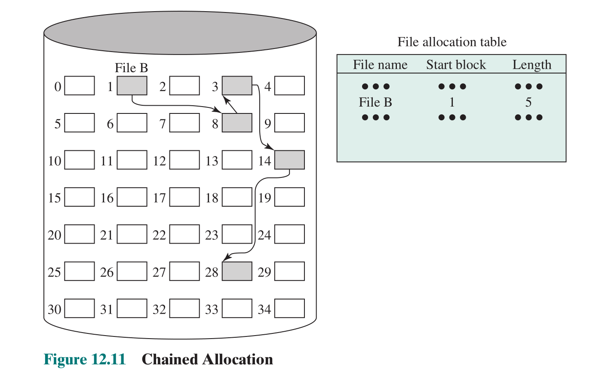

可以对链接分配进行合并来使局部性原理依然适用：

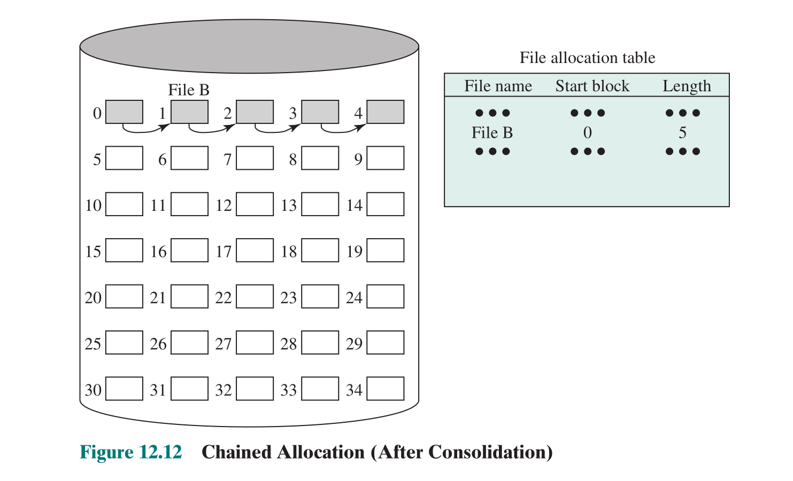

链接分配的两种形式：

隐式链接（即链接放在每块最后）：

- 只适宜于顺序访问，存取速度慢，可靠性低
- 一种改进是按簇分配（原始的是单块分配）

显式链接：把链接指针显式地放在一张表中，整个文件卷一张。

- 有一张文件分配表 FAT
- 检索速度快

##### 索引分配

文件分配表含有文件的一个单独的一级索引，分配给文件的每个分区又对应一个索引项，而文件分配表则包含索引表的块号。

大小固定的**块**和大小可变的**分区**都可使用

- 按块分配可消除外碎片
- 按大小可变分区可提高局部性

两种情况都需要偶尔合并（提高局部性）

按块：

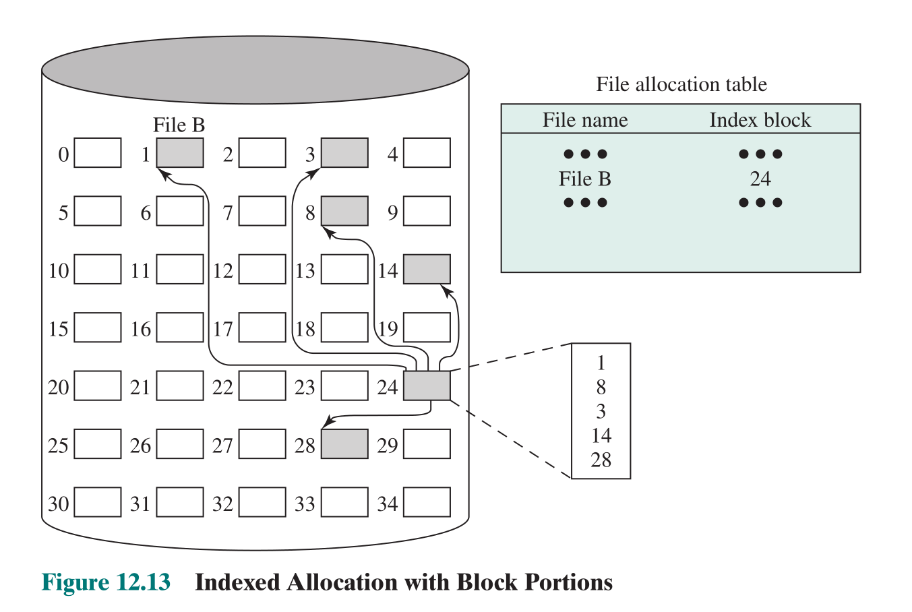

按可变分区：

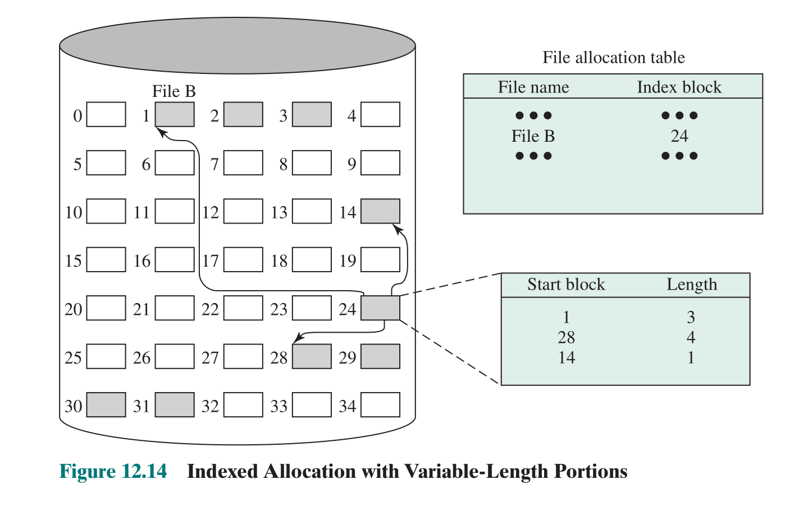

优点：

- 可以顺序存取，直接存取
- 无外碎片
- 文件修改方便

###### 索引表组织

链接模式:一个盘块一个索引表，多个索引表链接起来

多级索引:将一个大文件的所有索引表（二级索引）的地址放在另一个索引表（一级索引）中

综合模式: [UNIX 文件管理](#UNIX%20文件管理)

### 空闲空间管理

为了能实现空间分配，我们需要知道哪些块是空闲的。我们需要一张磁盘分配表（disk allocation table）

#### 位图

磁盘的一块对应一位(1 bit)，0 表示空闲，1 表示占用

优点：

- 适用于所有文件分配方法
- 占用空间少（仅需 $\frac{磁盘大小(字节数)}{块大小*8} Bytes$）
- 易于找到一个或一组连续的块

缺点：位表太大了，只能常驻内存，但还是很慢，进行穷举式搜索使文件系统性能降低，尤其当空闲块少时。

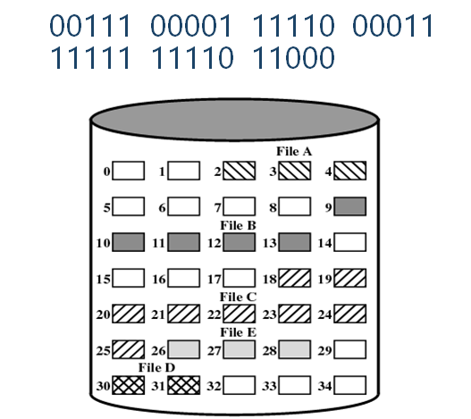

#### 空闲区链

每个空闲区有指针、长度，通过指针链接。

需要少量空间开销，适用于所有文件分配方法。

会产生碎片。每次分配一个块，需要读取下一空闲块指针等信息并修改头指针后才能写数据到此块。分配/回收多个块时，需多次指针修改。

#### 索引

将可用空间视为文件，并像分配文件一样使用索引表。所有文件分配方法适用。

为了提高效率，索引应基于**可变大小的分区**而不是块，每区一个表项。

#### 空闲块表

每个盘块分配一个顺序号，将所有空闲块的块号保存在磁盘的一个保留区中

根据磁盘的大小，将需要 24 或 32 bit 来存储单个块号，因此比位图大，只能放在磁盘。

有两种方式将**部分空闲块表**放在内存中，使其能非常令人满意

- 该列表可以视为[栈](#磁盘空闲块的分配和释放)，栈的前几千个元素保留在主内存中，只有前面在内存中的部分满了或空了才需要和硬盘交换数据。
- 该表可视为一个 FIFO 队列，队列头和队列尾的几千项在内存中。分配块时从队列头取，取消分配时加到队尾。只有内存中的头部分空了或内存中的尾部分满了时，才需在磁盘和内存之间传送数据。

### 文件卷

磁盘分区(partition)：

- 通常把一个物理磁盘的存储空间划分为几个相互独立的部分，称为“分区”。
- 一个分区的参数包括：磁盘参数（如每道扇区数和磁头数），分区的起始和结束柱面等。

文件卷(volume)：

- 称为"逻辑驱动器(logical drive)"。
- 在同一个文件卷中使用同一份管理数据进行文件分配和外存空闲空间管理，而在不同的文件卷中使用相互独立的管理数据。
- 一个文件不能分散存放在多个文件卷中，其最大长度不超过所在文件卷的容量。
- 通常一个文件卷只能存放在一个物理外设上（并不绝对），如一个磁盘分区或一盘磁带

格式化(format)：

- 在一个文件卷上建立文件系统.
- 建立并初始化用于进行文件分配和外存空闲空间管理的管理数据。
- 通常，进行格式化操作使得一个文件卷上原有的文件都被删除。

扩展文件卷集(extended volume set)：

- 一个文件卷由一个或几个磁盘上的多个磁盘分区依次连接组成。
- 可以容纳长度大于磁盘分区容量的文件。
- 实例：Windows NT 中的扩展文件卷集。

## 文件系统安全

通过成功登陆系统，用户身份被确认，然后操作系统可以执行安全规则。

操作系统需要一个规则集来执行。

### 访问矩阵

一个规则集是访问矩阵

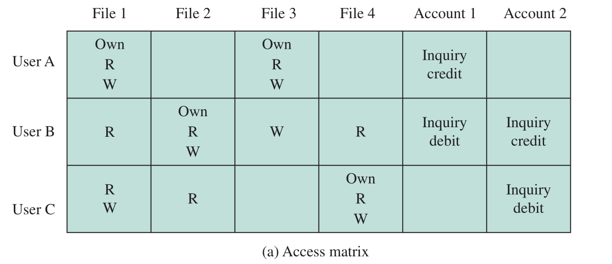

### 访问控制表

将访问矩阵按列分解。访问控制表提供**每个文件**的访问控制列表（ACL），列出用户及其允许的访问权限

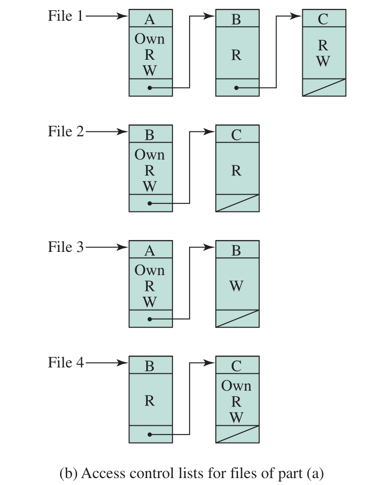

### 权限表

权限表则是将访问矩阵按行分解，为**每个用户**指定授权的对象和操作

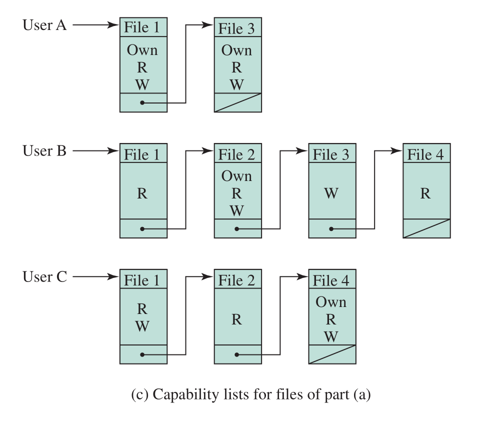

## UNIX 文件管理

Unix 有六种文件类型：常规文件，目录，特殊文件，命名管道，链接，符号链接

每个文件有一个 Inode (index node)，包含特定文件的关键信息的控制结构。一个 Inode 可能关联几个文件名，但指向的都是同一个文件，每个文件也仅与一个 Inode 关联。Inode 数量有限。 ^acae01

Unix 的文件分配是基于块进行的，采用动态分配，块之间不要求连续，使用索引分配，索引的一部分存储在文件 Inode 中（见下图）。Inode 内同时使用了直接索引、一次、二次和三次间接索引。

（实际上图中的 Direct(0)应该是不存在的，直接索引应该只有 12 个，但既然书上这么画了，老师也这么讲了，考试就按这样来吧）

假设盘块大小为 4KB，盘块号需 4 个字节，那么多级索引可以存储的文件大小如下：

- 直接地址： $4KB*13=52KB$
- 一级间接地址：$4KB*(4KB/4B)=4MB$
- 二级间接地址：$4KB* (4KB/4B)* (4KB/4B)=4GB$
- 三级间接地址：$4KB* (4KB/4B)* (4KB/4B)*(4KB/4B) =4TB$

Unix 的目录也是文件，文件内包含了文件名列表和指向对应 Inode 的指针

文件系统在卷中的结构按存放顺序分为：

- **引导块**：系统启动引导信息
- **超级块**：描述文件系统的状态和信息，包括磁盘空闲块栈等，将被部分读入内存
- **Inode 位图**：编号为 n 的 Inode 是否存在
- **逻辑块位图**：表明第 n 个逻辑磁盘块是否存有数据。
- **索引节点(Inode)区**：第 2～第 k+1 块，存放 Inode
- **数据区**：第 k+2～第 n 块为数据块，存放数据

文件权限控制分为三部分：所有者权限、所有者所在组权限、其他用户的权限

### 磁盘空闲块的分配和释放

磁盘空闲块的分配和释放采用**成组链接法**，把链接和索引相结合：

- 每一组 50 块，用索引表表示，索引表放在前一组的第一块中；各组间通过链表指针串在一起，构成链表。
- 链表的开头是超级块中的磁盘空闲块栈，在运行时被读入到内存中。
- 栈计数 count 是栈中的空闲块数目，栈中的元素是空闲块编号。链表中的每一块都存放一个类似的空闲块栈

分配过程:

1.  查看超级块中是否 count == 1；
2.  若不是，则弹出栈顶元素 N，--count；
3.  若是且 N≠0，则弹出栈顶元素 N，把空闲块 N 中的栈（包括栈计数）读入到超级块中覆盖；返回空闲块编号 N
4.  若是且 N == 0，磁盘中已没有空闲盘块

释放过程：

1.  被释放空闲块为编号 N。查看超级块中是否栈已满（如 count == 50）；
2.  若不是，则 N 入栈，++count；
3.  若是，则将超级块中的栈（包括栈计数）写入到空闲块 N，然后把 N 放入超级块中的栈顶并置 count 为 1。

### 文件共享

各用户通过唯一的共享文件的路径名访问共享文件。该方法的访问速度慢，适用于不经常访问的文件共享。

利用多个目录中的不同文件名来描述同一共享文件，即**文件别名**。该方法的访问速度快，但会影响文件系统的树状结构，适用于经常访问的文件共享，同时存在一定的限制。

文件别名的实现方法有两种：基于索引结点，基于符号链接

#### 基于索引结点(index node)的文件共享

也称为硬链接（hard link），基于 [改进的多级目录](#改进的多级目录) ——将目录内容分为两部分：文件名和索引结点。

通过多个文件名链接(link)到同一个索引结点，可建立同一个文件的多个彼此平等的别名。（这就是上面为什么说 [同一个 Inode 可以绑定多个文件名](#^acae01) ）

别名的数目记录在索引结点的链接计数中，若其减至 0，则文件被删除。

限制：不能跨越不同文件卷；通常不适用于目录（在 UNIX 中只对超级用户允许），否则目录结构由树状变为网状。

#### 基于符号链接(symbolic link, shortcut)的文件共享

符号链接是一种特殊类型的文件，其内容是到另一个目录或文件路径的链接。

建立符号链接文件，并不影响原文件，实际上它们各是一个文件。

可以建立任意的别名关系，甚至原文件是在其他计算机上。

缺点：空间和时间开销更大（符号链接文件要一个单独的 Inode）。如果设置不当，上下级目录关系可能会形成环状
