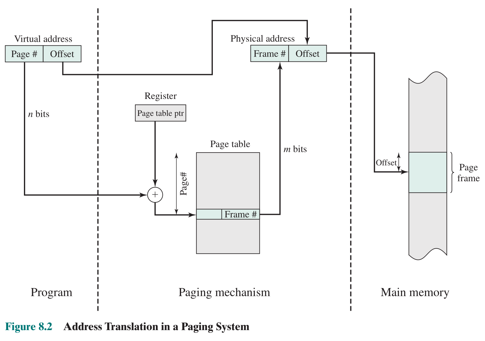

# 虚拟内存

## 硬件和控制结构

内存管理的两个基本特征：

1.  内存访问是 [逻辑地址](内存管理.md#^4a3a7a) ，运行时可动态映射为 [物理地址](内存管理.md#^59dae7) （意味着可以进行 [换入换出](进程描述与控制.md#进程挂起) ）
2.  进程可分为若干无需连续存放的块（ [页](内存管理.md#分页) 、 [段](内存管理.md#分段) ）

如果具备这两个特征，那么进程的页或段在执行时不必全部装入主存。只要下条指令、数据在内存，至少在一段时间内执行就可继续。

进程的执行：

- 操作系统将程序的一块或少量块装入内存
- 需要的地址不在内存，则产生中断
- 操作系统阻塞该进程
- 系统将包含访问地址的进程块（页或段）调入内存

其中在内存的进程部分称为**驻留集**。

调入内存时，由操作系统发起磁盘读请求，在 I/O 期间，调度另一进程，当磁盘 I/O 完成时，发起中断， [使得 OS 将相关进程置为就绪状态](进程描述与控制.md#三状态模型) 。

此策略的好处：

1.  内存可收容更多进程（因为每次只加载每个进程的部分页面、段），可实现任何时候都有就绪进程，提高处理器利用率
2.  进程可以比内存空间大（若没有这种策略，需要程序员自己设计出分块方法并使用 [覆盖](内存管理.md#^320293) 策略分别加载）

由于进程只能在内存中执行，因此这个存储器称为实存储器（real memory)，简称**实存**。但程序员或用户感觉到的是一个更大的内存，且通常分配在磁盘上，这称为虚拟内存（virtual memory)，简称**虚存**。虚存支持更有效的系统并发度，并能缓解对内存的严格使用限制。

以 CPU 时间和外存空间换取内存空间，这是操作系统中的**资源转换技术**

| 简单分页                                                 | 虚存分页                                                   | 简单分段                                                     | 虚存分段                                                 |
| -------------------------------------------------------- | ---------------------------------------------------------- | ------------------------------------------------------------ | -------------------------------------------------------- |
| 内存划分为大小固定的小块，称为页框                       | 同左                                                       | 内存未划分                                                   | 同左                                                     |
| 程序被编译器或内存管理系统划分为页                       | 同左                                                       | 由程序员给编译器指定程序段（即由程序员决定）                 | 同左                                                     |
| 页框中有内部碎片                                         | 同左                                                       | 无内部碎片                                                   | 同左                                                     |
| 无外部碎片                                               | 同左                                                       | 有外部碎片                                                   | 同左                                                     |
| 操作系统须为每个进程维护个页表，以说明每页对应的页框     | 同左                                                       | 操作系统须为每个进程维护个段表，以说明每段中的加载地址和长度 | 同左                                                     |
| 操作系统须维护一个空闲页框列表                           | 同左                                                       | 操作系统须维护一个内存中的空闲空洞列表                       | 同左                                                     |
| 处理器使用页号和偏移量来计算绝对地址                     | 同左                                                       | 处理器使用段号和偏移量来计算对地址                           | 同左                                                     |
| 进程运行时，它的所有页必须都在内存中，除非使用了覆盖技术 | 进程运行时，并非所有页都须在内存页框中。仅在需要时才读入页 | 进程运行时，其所有段都须在内存中，除非使用了覆盖技术         | 进程运行时，并非其所有段都须在内存中。仅在需要时才读入段 |
|                                                          | 把一页读入内存可能需要把另一页写出到磁盘                   |                                                              | 把一段读入内存可能需要把另外段或几段写出到磁盘           |

抖动（颠簸, Thrashing）：系统大部分时间被用在 [对换进程](进程描述与控制.md#进程挂起) 而非执行指令时的状态。为避免这种情况，操作系统须尝试根据最近的历史猜测在不久的将来最不可能使用的组件。 ^56d636

虚拟存储所需的支持：分页和分段的硬件支持、操作系统要包含管理页和段在主、辅存间对换的软件部分

### 分页

- 进程**划分**页面、物理内存划分页框
- 在进程开始运行之前，**装入少量页面**
- 根据进程运行的需要，**动态装入**其他页面
- 当内存空间已满而又需要装入新页面时，则**淘汰**某个页面，以便装入新的页面
- 在简单页式存储管理的基础上，增加**请求调页和页面置换**功能。

#### 页表

需要几个额外的位：

- 存在位(P)：表示该页是在内存还是在外存
- 修改位(M)：表示此页是否在内存中被修改过，若未改变，则在需要把该页换出时，无须用页框中的内容更新该页。
- 访问位：根据访问位（对该页的访问情况）来决定淘汰哪页（由不同的算法决定，如经历的时间等）
- 其他：如辅存地址等

实际系统中的上述信息可能是分几张表存放的。

逻辑-物理地址转换示意图，图中 n>m（即虚拟内存大于物理内存）

##### 页表本身的存储问题

采用虚存+分页产生的页表的**占用内存空间很大**且需要连续的内存空间。为克服这个问题，大多数虚拟内存方案都在虚存而非实存中保存页表。这意味着**页表和其他页一样都服从分页管理**。一个进程正在运行时，它的页表至少有一部分须在内存中，这一部分包括正在运行的页的页表项。若有必要，可以划分**多级页表**。

举例：32 位地址，按字节寻址，可寻址 4GB 空间，页尺寸为 4KB，则有$2^{20}$个页表项，若每个页表项占用 4B，则页表占用 4MB 的内存空间。这个页表太大了，放入虚存，则又可以划分页面，正好可以分成 1024 个页，为这 1024 个页再生成页表，则这个上级页表有 1024 项，共占 4KB，正好存入一个页，就不需要再划分。（若一个页存不下则需要再加一级页表）

在 Linux 0.11 中使用的就是二级页表，根页表称为页目录表，地址存于 CR3 寄存器

##### 反置（倒排）页表

前述页表设计的一个重要缺陷是，页表的大小与虚拟地址空间的大小成正比。

采用反置页表，整个系统一张，每个页框对应一个表项，这样反置页表只需**固定大小的实存**，无需考虑进程数（因为页框数即主存大小是固定的），虚拟地址的页号(+PID)映射到一个 Hash 值，Hash 值指向反置页表的一个页表项。

CPU 中的 内存管理单元(MMU)即采用反置页表来处理分页。

反置页表表项需要有的内容：

- 页号：虚拟地址的页号部分。
- 进程标志符(PID)：使用该页的进程。页号和进程标志符共同标志一个特定进程的虚拟地址空间的页（因为会有多个进程都有同一个页号）
- 控制位：该域包含一些标记，比如有效、访问和修改，以及保护和锁定信息。
- 链指针：若某项没有链项，则该域为空（或用一个单独的位来表示）。否则，该域包含链中下一项的索引值。（因为可能不同虚拟地址页号会映射到同一个散列表项中，需要[链接技术](../数据结构/数据检索.md#^709eaa)管理这种溢出）

先通过 Hash 函数找到页表项，通过 PID 和页号检查是不是对应的页，如果是的话就用页框号（反置页表项的索引号）生成物理地址，不是的话通过 Hash 链检查下一项，直到扫描到链尾。

##### TLB(Translation Lookaside Buffer)

一次虚拟内存访问会引起两次物理内存访问：

- 一次用于读取页表
- 一次用于读写数据

引入用于页表表项的高速缓存 Translation Lookaside Buffer (TLB)**快表**，快表内包含最近使用过的页表表项。

有了 TLB 后访问虚存的操作：

- 给出虚拟地址
- 处理器检查 TLB
  - 命中，获得页框号，形成物理地址
  - 没命中，以页号为索引查找页表
- 访问页是否在内存？
  - 不在内存，产生缺页中断（页故障）
  - 在内存，更新 TLB，使其包括最新的页表项

#### 缺页中断（Page Fault）

在地址映射过程中，所要访问的页不在内存，则产生缺页中断。操作系统接到中断信号后，就调出缺页中断处理程序，根据页表中给出的**外存地址**，将该页调入内存。若有空闲页框，将新调入页装入内存，并修改页表。否则要**淘汰某页**再调入新页。

缺页中断的特殊性：

- 缺页中断是异常，在指令执行期间产生和进行处理，而不是在一条指令执行完毕之后。
- 一条指令的执行可能产生多次缺页中断。

TLB 结合 Cache 的操作：

#### 页面大小的选择

较小的页面，内碎片小，但一个进程要更多页面，意味着更大的页表，导致页表大部分在虚存（辅存）

辅存可以有效地进行大块数据的传输，所以大的页面更好，页表短，管理开销小，交换时对外存 I/O 效率高。

页面小，进程在内存中的页面数目多。随着执行，内存页面包含进程最近访问的内容，缺页率低。大的页面不能体现最近访问，缺页率上升。

页面大小的选择还和物理内存、程序大小有关，物理内存增大，程序所使用的内存空间也在增大。现代编程技术可能导致进程局部性降低。

### 分段

分段允许程序员把内存视为由多个地址空间或段组成，段的大小不等，并且是动态的。内存访问以段号和偏移量的形式组成地址。

好处：

- 简化不断增长的数据结构的处理
- 允许程序独立修改和重新编译
- 有助于进程间[共享](内存管理.md#共享)
- 有助于[保护](内存管理.md#保护)

段表的组织：在简单分段的基础上有额外的位

- 标志位：存在位(present bit)，修改位(modified bit/dirty bit)
- 访问统计：如使用位(use bit)
- 存取权限：如读 R，写 W，执行 X

缺段中断：指令和操作数必定不会跨越在段边界上

检查内存中是否有足够的空闲空间

1.  若有，则装入该段，修改有关数据结构，中断返回
2.  若没有，检查内存中空闲区的总和是否满足要求，是则应采用压缩技术，转① ；否则，淘汰一（些）段，转①

### 段页式

分页内存利用率高，分段则支持动态增长、模块化以及共享和保护。

采用段页式管理，先将用户地址空间分为多个段，然后将每个段分成大小相同的页。

逻辑地址的组成：段号、页号、页内偏移地址

地址变换：先查段表，再查该段的页表。缺段中断和缺页中断都有。

### 存储保护与共享

分段有助于实现[保护](内存管理.md#保护)和[共享](内存管理.md#共享)机制

段表中的基址和长度可实现范围保护

多个进程访问同一段可以实现共享

存储保护类型：

- 界限保护（上界寄存器/下界寄存器或基址寄存器/限长寄存器）
- 访问方式保护
- 环保护：处理器状态分为多个环(ring)，分别具有不同的存储访问特权级别(privilege)，通常是级别高的在内环，编号小（如 0 环），级别高；可访问同环或更低级别环的数据；可调用同环或更高级别环的服务。

存储分配的安全性考虑：把一个页面分配给进程之前，先要清除页面中的数据（如全部填充为 0），以免该进程读取前一进程遗留在页面中的数据

存储共享方式：

通过引用计数(reference count)来描述存储区的共享，引用计数表示共享它的进程的数目

具体的存储共享方式有两种：

- 共享段：被连接或被释放一次则对引用计数加 1 或减 1，计数减至 0 则可将该共享段删除；目的在于进程间的信息交流。
- 共享页面：在物理页面表中有引用计数。只能共享不被修改的页面。这对用户应用是透明的，完全由操作系统控制，目的在于减少系统内的物理页面总数。
  - 可用于装入同一个程序而创建的几个进程，或是父进程通过 fork()创建子进程；
  - 写时复制(copy on write)：如果一个进程要改写共享页面，则先把该页面复制一份，让该进程访问复制后的页面，而让其他进程访问复制前的页面。

## 操作系统软件

操作系统的内存管理设计取决于三个基本的选择：

- 是否使用虚存技术
- 使用页、段还是段页式
- 为各种内存管理各个方面采用的算法、策略

关键设计元素：

- 调入策略
- 放置策略
- **置换策略**
- 驻留集管理
- 清除策略
- 负载控制

关键目标：性能

- 最少缺页
- 不会有明确的最好策略

### 调入策略

决定什么时候页面调入内存

主要的两种方式：请求调页、预调页

#### 请求调页

访问到某页的一个单元时才调页，进程初始会有大量缺页中断

优点：容易实现

缺点：对外存 I/O 次数多，开销较大

#### 预调页

在发生缺页需要调入某页时（或初始），一次调入该页以及相邻的几个页。读取磁盘上连续存放的多个页面更加有效。

优点：提高调页的 I/O 效率。

缺点：基于预测，若调入的页在以后很少被访问，则效率低

### 放置策略

决定进程块加载到内存什么位置

在分段系统中十分重要，但在分页或段页式系统中如何放置通常无关紧要，因为地址转换硬件和内存访问硬件能以相同的效率为任何页框组合执行相应的功能。

### 置换策略

当内存所有页框被占用且需要装入一个新页面时，置换策略决定内存哪个页面被置换。

#### 目标

移出的页面应当是最近的将来最不可能访问到的

- 可以根据 [局部性原理](计算机系统概述.md#局部性原理)
- 大部分策略都基于过去的行为来预测未来行为
- 置换策略设计得越精致、越复杂，实现它的软硬件开销就越大

#### 页框锁定

如果页框被锁定了，那么它将不能被置换出内存。每个页框有相关的**锁定位**。

- 内核
- 关键控制结构
- I/O 缓冲区

#### 基本置换算法

已知有一页访问序列 2 3 2 1 5 2 4 5 3 2 5 2，共有 3 个页框

下面给出使用下列算法得到的置换结果图

##### 最优 OPT

选择“未来不再使用的”或“最远的未来才访问的”页面被置换。

注：这只是一个理想算法，实际上无法做到这样的预测，只是用于评价其他算法的好坏。

##### LRU 最近最久未使用

选内存中最久未访问的页面置换（据 [局部性原理](计算机系统概述.md#局部性原理) ，此页面在最近的将来最不可能访问）

比较难以实现，因为需要标记自上次访问以来的时间，这需要大量开销。

LRU 算法和最优算法的性能基本相近（不考虑开销）

##### FIFO

置换在内存中最久的页面（虽然这些页面可能马上要被使用了）

分配给一个进程的页框看作是一个循环缓冲，以循环的方式移出页面。这是一个实现起来最简单的算法。

##### Clock 轮转

每页有一个使用标志位(use bit)

若该页**首次加载到内存**或**被访问**则 use bit 置 1

置换时操作系统扫描页面集合，为 1 的 use bit 置 0。第一个 use bit=0 的页面被置换

Clock 算法的性能在 FIFO 和 LRU 之间

##### 改进的 Clock 算法

访问位（R）， 修改位（M）

- 第 0 类：无访问，无修改(0,0)//可淘汰
- 第 1 类：无访问，有修改(0,1)//可淘汰，要写回磁盘
- 第 2 类：有访问，无修改(1,0) //不淘汰
- 第 3 类：有访问，有修改(1,1)//不淘汰

启动一个进程时，R、M 置 0；执行中根据访问置 1

发生缺页中断时，扫描内存页面，检查 R，M：

1.  第一次扫描（扫描时修改访问位），找第 0 类页面置换
2.  若找不到，进行第二次扫描（扫描时修改访问位），找第 1 类页面置换且将经过的页访问位清 0；扫描一圈后找不到，进入 3
3.  重复第 1 步，找不到符合条件的页就重复第 2 步

##### Page Buffering 页面缓冲算法

这是**对 FIFO 算法的发展**，通过对被置换页面的缓冲，有机会找回刚被置换的页面

方法：将已被替换出去的页加入以下两个列表之一：

- 如果页面未被修改，就将其归入到空闲页面链表的末尾，当作空闲页处理
- 否则将其归入到已修改页面链表

此方法需要时刻保持有少量页框是可用的。注意，该页在内存中并不会物理性移动，移动的只是该页所对应的页表项。

- 调入新的页面时，将新页面内容读入到空闲页面链表的第一项所指的物理页面，然后将第一项删除。
- 空闲页面和已修改页面仍**停留在内存中一段时间**，如果这些页面被再次访问，只需较小开销被访问页面可以返还作为进程的内存页。
- 当**已修改页面达到一定数目后，再将它们一起调出到外存**，然后将它们归入空闲页面链表

### 驻留集管理

系统决定进程的多少页面进内存：

- 每个进程分配越少内存，越多进程驻留内存
- 但只少量页面加载导致该进程缺页率增加
- 驻留集达到一定大小后，进一步内存分配不会影响缺页率

#### 缺页率

表示“缺页次数 / 内存访问次数”(比率)或“缺页的平均时间间隔的倒数”

缺页率的影响因素：

- 页面大小
  - 页面很小－> 每个进程的内存页较多，通过调页很快适应 [局部性原理](计算机系统概述.md#局部性原理) 的要求，**缺页率低**
  - 页面很大－> 进程使用的大部分地址空间都在内存，**缺页率低**
  - 页面中等大小－> 局部性区域只占每页的较小部分，**缺页率高**(不能很快适应，也不能大部分在内存)。
- 分配给进程的物理页面数目
  - 数目越多－> 缺页率越低
  - 页面数目的下限，应该是一条指令及其操作数可能涉及的页面数目的上限，以保证每条指令都能被执行。
- 程序的编制方法（如数组的使用方式）
- 页面淘汰算法

#### 分配策略

- 固定分配
  - 给进程固定数目页框。
  - 缺页时在内部置换
- 可变分配
  - 分配给进程的页框可变。性能较好，但增加算法的开销

#### 置换范围

置换策略的作用范围分为**全局和局部**两类。都是在**没有空闲页框**时**由一个缺页中断激活**的。

局部置换策略仅在产生这次缺页的进程的驻留页中选择

全局置换策略则把内存中所有未被锁定的页都作为置换的候选页，而不管它们属于哪个进程。

尽管局部转换策略更**易于分析**，但没有证据表明它一定优于全局置换策略，全局置换策略的优点是**实现简单、开销较小**

##### 固定分配，局部置换

进程开始前要决定分配多少页框。

分配过少会导致高缺页率。

分配过多，内存进程少

- 处理器闲置时间长
- 对换（swap）增加

##### 可变分配，全局置换

易于实施（已被众多操作系统所采用）

OS 维持一定数目的空闲页框，以快速分配

缺页时，空闲页框添加到进程驻留集。若无空闲页框，置换。较好的选择是页面缓冲算法。

##### 可变分配，局部置换

新进程装入时，根据类型、请求等分配一定数目页框

缺页时从该进程驻留集选择页面置换

不时评估分配情况，以增加或减少页框数

### 清除策略

确定修改过的页何时写回辅存。通常有两种策略：

- 请求清除（被选中置换时写回辅存）
  - I/O 效率低，缺页中断处理时间长
- 预清除（页框被占用前，成批写出多个页面）
  - 淘汰前可能再被修改，意味着需要再次写回

最好的方法是使用页面缓冲算法（Page Buffering，见上面的介绍）

### 负载控制

负载控制就是确定内存中驻留的进程数目（即进程并发水平/多道程序度）

- 太少进程，所有进程均阻塞的可能性大。
  - 会花大量时间在对换（swap）上来创建更多内存就绪进程。
- 太多进程会导致[抖动](#^56d636)
  - 每个进程的驻留集不断减小，缺页率不断上升，频繁调页使得调页开销增大。

OS 要选择一个适当的进程数目，以在并发水平和缺页率之间达到一个平衡。

#### 进程挂起

系统并发度减小时，一个或多个当前驻留进程须被挂起（换出）。进程挂起决定驻留内存的进程数目，在避免出现抖动的前题下，尽可能提高进程并发水平。

OS 不能完全控制进程的创建，但它可通过进程挂起来减少驻留内存的进程数目。

进程挂起策略：

- 最低优先级
- 缺页中断的进程
  - 该类进程的工作集不在主存中，所以无论如何都会被阻塞，不如直接挂起
- 最后激活的进程
  - 因为这个进程是刚被激活所以最不可能有自己的工作集在内存中
- 驻留集最小的进程
- 最大的进程
  - 这样能一次释放最多的页框
- 具有最大剩余执行窗口（时间）进程
