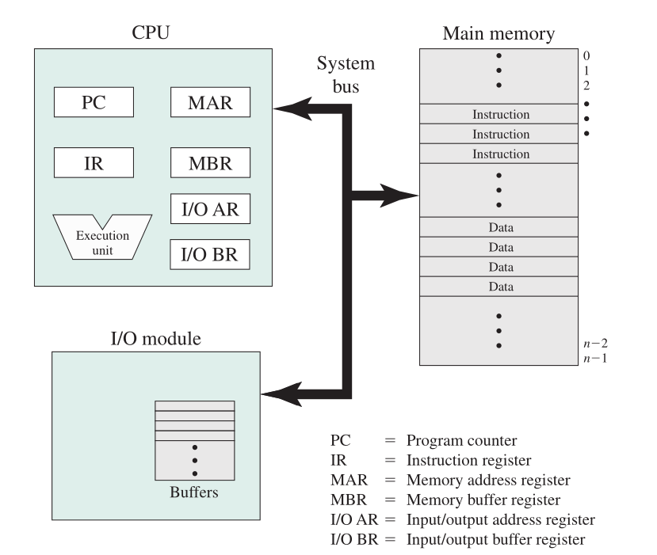
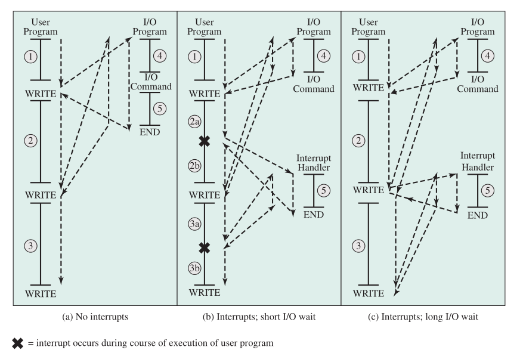
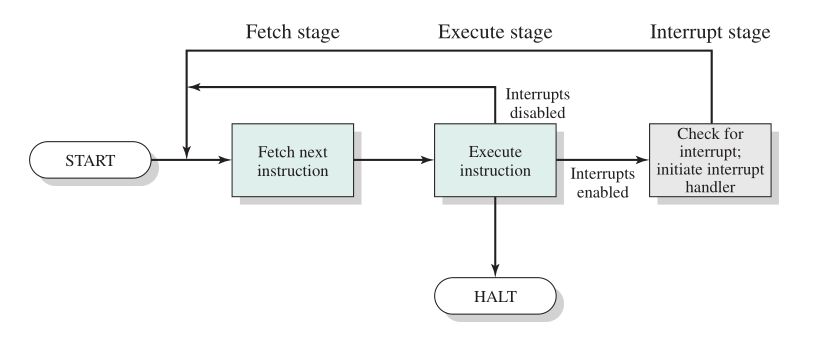
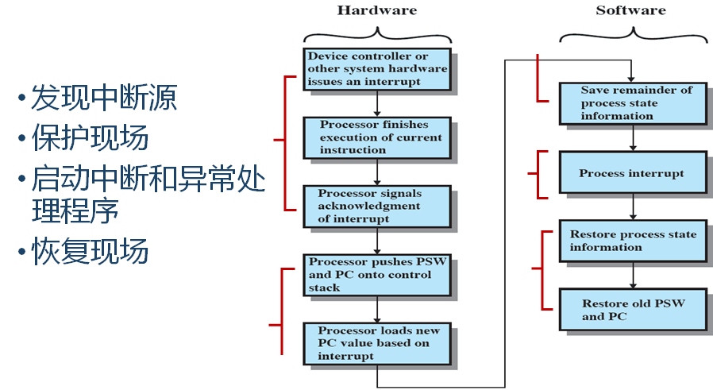
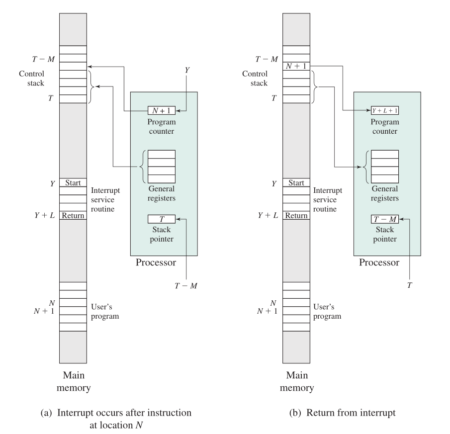
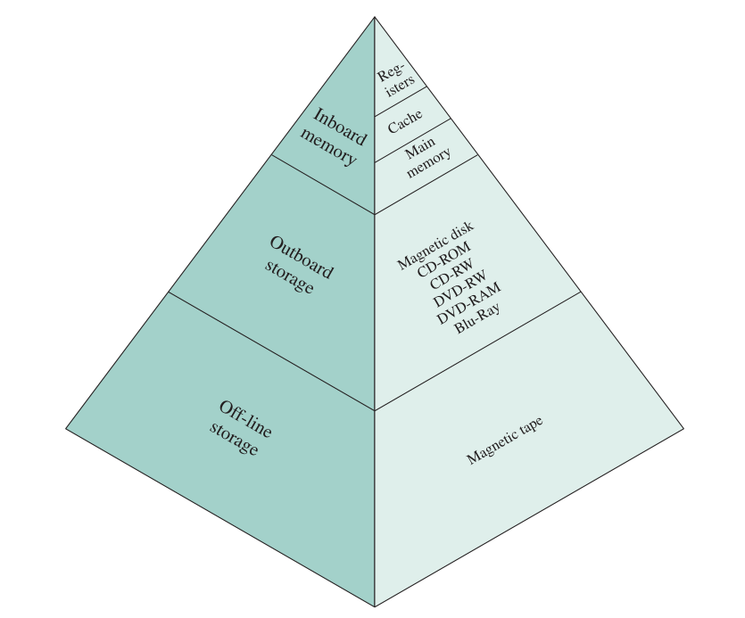
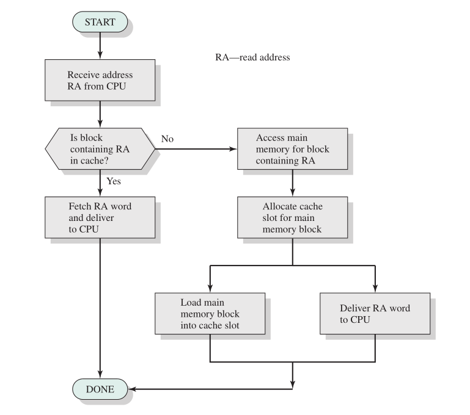
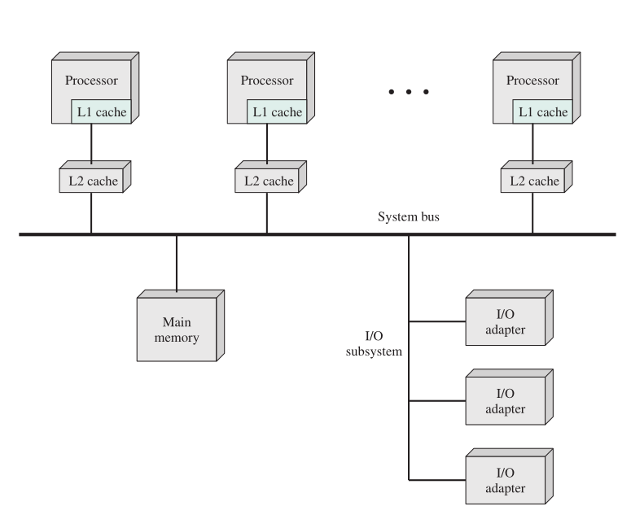

# 计算机系统概述

操作系统利用处理器硬件资源，为系统用户提供服务，为用户管理辅存、I/O 设备。

## 计算机基本组成

处理器、存储器、I/O 模块、系统总线

与存储器相关的部分寄存器：存储器地址寄存器（MAR），用于确定下一次读写的存储器地址；存储器缓冲寄存器（MBR），存放要写入存储器的数据或从存储器中读取的数据。

同理，I/O 模块也有输入/输出地址寄存器（I/O AR，用于确定一个特定的输入输出设备）和输入/输出缓冲寄存器（I/O BR，用于输入输出模块和处理器之间交换数据）

I/O 模块自身包含内存缓冲区，用于临时保存数据直到被发出去

## 处理器寄存器

### 用户可见寄存器 User-Visible Registers

- 数据寄存器 Data Register
  - 通用寄存器（也有限制）
- 地址寄存器 Address Register
  - 变址寄存器
  - 段指针
  - 栈指针
- 条件码寄存器 Condition code register

通过优化寄存器使用，可减少内存访问。

可通过机器语言来引用，所有程序可用。

### 控制&状态寄存器 Control and Status Registers

控制处理器的操作

具有特权的 OS 例程用来控制程序的执行

- 程序计数器 (Program counter, 下条要读取的指令地址)
- 指令寄存器 (Instruction register, 最近读取的指令)
- 程序状态字 (Program status word, 条件码、中断位等)

#### PSW 程序状态字（包含于控制&状态寄存器）

通常 OS 引入程序状态字 PSW 来区别处理器工作状态

PSW 用来控制指令执行顺序并保留和指示与程序有关的系统状态，实现程序状态的保护和恢复

每个程序都有一个与其执行相关的 PSW，每个处理器都设置一个 PSW 寄存器。程序占有处理器执行，它的 PSW 将占有 PSW 寄存器

**实际系统由一个或一组寄存器构成**。过去的大型机的 PSW 包括 PC（程序计数器）与 FLAGS，x86 中则相当于 EFLAGS（PC 则独立出来了）

##### PSW 包括的内容

程序基本状态

- 程序计数器
- 条件码
- 处理器状态位

中断码：保存程序执行时当前发生的中断事件

中断屏蔽位：指明程序执行中发生中断事件时，是否响应出现的中断事件。

##### 条件码（即 EFLAGS，包含于 PSW）

根据运算结果由硬件设置（只读，根据指令执行结果提供反馈）

## 指令执行

机器指令的集合称指令系统。

处理器执行的程序是由一组保存在存储器中的指令组成的。

处理器最简单的处理指令的步骤就是**取指执行**。

主要指令分类：处理器——存储器、处理器——I/O、数据处理、控制（指令顺序等）

特权指令与非特权指令：特权指令是指只能提供给操作系统的核心程序使用的指令，如启动 I/O 设备、设置时钟、控制中断屏蔽位、清内存、加载 PSW 等。

## 中断

中断是指程序执行过程中，当发生某个事件时，中止 CPU 上现行程序的运行，引出处理该事件的程序执行的过程。

引入中断可以提高处理器的利用率：多数 I/O 设备比处理器慢，引入中断可以使处理器不必暂停等设备

### 中断划分

常规分类：程序中断（如出错、非法）、时钟中断、I/O 中断、硬件失效中断（如掉电、奇偶校验出错等）

按中断事件的性质和激活手段分

- 强迫性中断
- 自愿性中断（Traps，即自陷、访管指令）

按照中断信号的来源和实现

- 外中断(中断)：来自处理器之外的中断
- 内中断(异常)：不能屏蔽

### 中断和异常的区别

中断

- 与现行指令无关的中断信号触发的(异步的)
- 在两条机器指令之间响应中断，可嵌套
- 中断处理程序提供的服务不是当前进程所需

异常

- 执行现行指令引起的，指令执行期间允许响应异常，不嵌套
- 异常处理程序提供的服务是当前进程所需的

### 控制流切换（控制权转移）

实现了 I/O 操作与用户程序中指令执行的并发。

在有中断的情况下，指令执行过程中需要加入中断处理：

这会有一定的开销，在中断处理程序中还需要执行额外指令以确定中断性质与合适的操作，但这远比简单等待 I/O 操作完成高效得多。

### 简单的中断处理程序

中断过程中内存与寄存器的变化

### 多个中断

即在中断处理过程中又发生中断

两种解决方法：

- 中断处理过程中关闭中断（处理中断时对其他中断**不予理睬**，其他中断保持挂起，当前中断处理**完成后再检查**是否有中断发生。实现简单，但未考虑优先级与时间限制要求，如通信线输入到达时可能需要快速接收来为更多的输入让出空间，若第二批输入到达时第一批输入仍未完成可能导致 I/O 设备的缓冲区装满或溢出而丢失数据）
- 定义中断优先级，允许高优先级中断打断低优先级中断。

## 存储器的层次结构

存储器层次结构是容量、速度、价格的相互权衡结果

若在快速存储器中找到了需要存取的字，称为命中，反之则称为未命中。

命中时处理器可直接存取数据，未命中则须把数据从第二级存储器转移到第一集存储器中，再由处理器存取。

计算时简单起见忽略处理器确定数据存放于第一级存储器还是第二级存储器中所需的时间。

命中率 H=对较快存储器的访问次数/对所有存储器的访问次数

$T_1$是访问第一级存储器的存取时间，$T_2$是访问第二级存储器的存取时间，则访问一个字节的平均存取时间为

$T_s=HT_1+(1-H)(T_1+T_2)=T_1+(1-H)T_2$

### 局部性原理

局部性原理(principle of locality)：程序在执行过程中的一个较短时期，所执行的指令地址和操作数地址，分别局限于一定区域（呈“簇”状）。

- 时间局部性：一条指令的多次执行，一个数据的多次访问都集中在一个较短时期内；
- 空间局部性：当前指令和邻近的几条指令，当前访问的数据和邻近的数据都集中在一个较小区域内。

局部性原理的具体体现

- 程序在执行时，大部分是顺序执行的指令，少部分是转移和过程调用指令。
- 程序中存在相当多的循环结构，它们由少量指令组成，而被多次执行。
- 过程调用的嵌套深度一般不超过 5，因此执行的范围不超过这组嵌套的过程。
- 程序中存在相当多对一定数据结构的操作，如数组操作，往往局限在较小范围内。
- 程序中有些部分彼此互斥，不是每次运行时都用到

局部性原理使利用层次结构加快访问成为可能

## 高速缓存（Cache Memory，略）

高速缓存对操作系统不可见

将内存分为 M 块，每块为 N 个字的大小，高速缓存中有 C 个存储槽（slots），每个槽也有 N 个字，槽的数量远小于存储器中块的数量（C<<M）。每个槽有一个标签，用于标识当前存储的块，通常是地址中的较高的若干位。

例如，假设有一个 6 位地址和 2 位标签。标签 01 是由下列地址单元组成的块：010000，010001，010010，010011，010100，010101，010110，010111，011000，011001，011010，011011，011100，011101，011110，011111.

需解决的设计问题：

- 高速缓存大小
- 置换算法（在映射函数的约束下，选择短期内访问可能性最小的块）
- 块大小（命中率随块大小增加先升高后降低）
- 写策略（若高速缓存中某个块的内容已被修改，则需要在它被换出高速缓存前，将其写回内存。写策略规定何时发生存储器写操作。）
- 映射函数（用以确定这个块占据哪个槽）
- 高速缓存的级数

##  I/O 操作技术

执行 I/O 操作的技术有三种：程序控制 I/O、中断驱动 I/O 和直接内存存取（DMA）。

当处理器正在执行程序并遇到一个与 I/O 相关的指令时，它会通过给相应的 I/O 模块发命令来执行这个指令。

### 程序控制 I/O（轮询）

I/O 模块执行请求的动作并设置 I/O 状态寄存器中相应的位，但它**并不告知处理器**，尤其是它**并不会中断处理器**。

因此**处理器**在执行 I/O 指令后，还要**定期检查 I/O 模块的状态**，以确定 I/O 操作是否已经完成。程序控制 I/O 的问题是，处理器通常必须等待很长的时间，以确定 I/O 模块是否做好了接收或发送更多数据的准备。处理器在等待期间必须不断地询问 I/O 模块的状态，因此会**严重降低整个系统的性能**。

### 中断驱动 I/O

由处理器给 I/O 模块发送 I/O 命令，然后处理器继续做其他一些有用的工作。当 I/O 模块**准备好**与处理器**交换数据时**，它将打断处理器的执行并请求服务。处理器和前面一样执行数据传送，然后恢复处理器以前的执行过程。

即 I/O 模块先准备，然后通知处理器，然后经处理器中转来传送数据（到内存），仅节省处理器等待 I/O 设备准备的时间。

处理器仍然需要主动干预在存储器和 I/O 模块之间的数据传送，并且**任何数据传送都必须完全通过处理器**。

程序控制 I/O 与中断驱动 I/O 的共同缺陷：

1.  I/O 传送速度受限于处理器测试设备和给设备提供服务的速度。
2.  处理器忙于管理 I/O 传送的工作，必须执行很多指令以完成 I/O 传送。

### 直接内存存取（DMA）

DMA 功能可以由系统总线中的一个独立模块完成，也可以并入一个 I/O 模块中。

需要访问 I/O 设备时，CPU 给 DMA 发送命令：

- 读/写
- 所涉及 I/O 设备的地址
- 读写的内存起始地址
- 读写的字节数

之后处理器继续其他工作。处理器把这个操作委托给 DMA 模块负责处理。DMA 模块直接与存储器交互，传送整个数据块，每次传送一个字。**这个过程不需要处理器参与。**传送完成后，DMA 模块向处理器发一个中断信号。因此，**只有在开始传送和传送结束时处理器才会参与。**

## 多处理器和多核计算机组织结构（略）

### 对称多处理器（SMP）

**多个性能相近的处理器共享内存和 I/O 设备**，并通过总线或其他内部连接方式互联，因此每个处理器的访存时间大体相同。所有处理器共享对 I/O 设备的访问。**所有处理器可执行相同的功能（对称）**。**SMP OS 可调度进程或线程到所有处理器**。

优点：高性能、高可用性、渐增式成长（可通过增加处理器数量来提高性能）、可伸缩性。

高速缓存一致性问题：由于每个本地高速缓存包含部分内存的映像，如果修改了高速缓存中的一个字，就会使得该字在其他高速缓存中变得无效。为避免出现这种情况，在发生更新时，必须告知其他处理器发生了更新。这个问题称为高速缓存一致性问题，通常用硬件而非用操作系统解决。

### 多核处理器

多核计算机是指将两个或多个处理器（称为“核”）组装在同一块硅（称为“片”）上的计算机，故又名芯片多处理器。每个核上通常会包含组成一个独立处理器的所有零部件，如寄存器、ALU、流水线硬件、控制单元，以及指令和数据高速缓存（有些处理器共享 L3 缓存）。

快速通道互连（Quick Path Interconnect，QPI）是一个点对点连接的电气互连规范。QPI 可以在相连的多个处理器芯片间实现高速通信。
