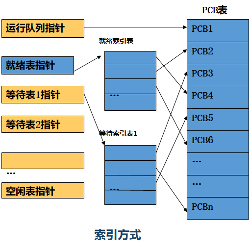

# 进程描述与控制

## 什么是进程

操作系统一个基础的任务就是进程管理

操作系统必须：

- 实现多进程交替执行
- 分配资源，保护进程资源
- 支持进程间通信、用户创建进程

开发 OS 是为了给应用程序提供使用资源所需的方便、丰富、安全、一致的接口。OS 提供了应用程序可请求、可访问资源的统一抽象的表示。

操作系统管理执行的应用程序：

- 使资源可被多个应用程序使用
- 处理器在多个应用程序间切换
- 处理器、I/O 设备可被有效利用

此时程序（Program）的概念就不够使用了，提出进程（Process）的概念。

### 进程的定义

一个进程是：

- 正在执行的程序
- 在计算机上运行的一个程序实例
- 能获得处理机并在其上执行的实体
- 具有如下特征的活动单元：一组指令序列的执行、一个当前状态和一组相关的系统资源

进程是对正在运行的程序过程的抽象

进程的**完整定义**：可并发执行的程序在某个数据集合的一次计算活动，是操作系统进行**资源分配和保护**的基本单位

引入多进程，提高了对硬件资源的**利用率**，但又带来额外的空间和时间**开销**，增加了 OS 的**复杂性**

进程有两个**必要元素**：程序代码、与代码相关的数据集合。执行中的两个元素的实体就是进程。

描述进程状态的属性（进程运行时能唯一刻画它的元素，存于[进程控制块（PCB）](#进程控制块（PCB）)）：

- 标识符（PID）：与进程相关的唯一标识符，用来区分其他进程。
- [状态](#进程状态)
- 优先级
- 程序计数器（PC）：程序中即将执行的下一条指令的地址。
- 内存指针
- **上下文数据**：进程执行时处理器的寄存器中的数据。
- I/O 状态信息：包括显式 I/O 请求、分配给进程的 I/O 设备和被进程使用的文件列表等
- [记账](操作系统概述.md#记账)信息

### 进程控制块（PCB）

PCB 是用于记录和刻画进程状态及有关信息的**数据结构**。

PCB 包含了充分的信息，使运行中的进程中断执行、再恢复执行成为可能。

PCB 由操作系统创建、管理。

PCB 是支持多进程的关键。

PCB 是每个进程在 OS 中的登记表项，OS 据此对进程进行控制和管理，是系统感知进程存在的**唯一标志**

通常不能由应用程序自身的代码来直接访问，而要通过系统调用。

进程与 PCB 是**一一对应**的

## 进程状态（**Process** States）

列出进程执行的指令序列，可描述单个进程的行为，这样的序列称为进程**轨迹**（trace）。给出各个进程轨迹的交替方式，就可描述处理器的行为。

分派器（Dispatcher，调度程序）是将处理器从一个进程切到另一个进程的程序

### 两状态进程模型

#### 状态列表

- 运行状态：占用处理机资源
- 未运行状态：等待进程调度分配处理机资源

#### 状态转换

- 进程创建(Enter)：系统创建进程，**形成 [PCB](#进程控制块（PCB）)**，分配所需资源，排入等待进程(Not running)队列(可以是一个队列)；
- 调度运行(Dispatch)：从等待进程(Not running)队列中选择一个进程(要求已完成 I/O 操作)，进入运行(Running)状态；
- 暂停运行(Pause)：**用完时间片或启动 I/O **操作后，放弃处理机，进入等待进程(Not running)队列
- 进程结束(Exit)：进程运行中止

进程由 OS 的分派程序分派到 CPU，然后回到队列，反复直到任务完成

#### 进程的创建和终止

进程创建原因：

| 事件                       | 说明                                                         |
| -------------------------- | ------------------------------------------------------------ |
| 新的批处理作业             | 磁带或磁盘中的批处理作业控制流通常会提供给操作系统。当操作系统准备接收新工作时将创建进程 |
| 交互登录                   | 终端用户登录到系统，创建登陆进程、shell 进程等                |
| 为提供服务而由操作系统创建 | 操作系统可以创建一个进程，代表用户程序执行一个功能，使用户无须等待（如控制打印的进程） |
| 由现有进程派生             | 基于模块化的考虑或开发并行性，用户程序可以指示创建多个进程   |

创建进程时，OS 将构建数据结构（PCB）管理进程

传统上，操作系统会以对用户或应用程序透明的方式来创建所有进程。

但是，允许一个进程引发另一个进程的创建很有用。当操作系统为另一个进程的显式请求创建一个进程时，这个动作就称为**进程派生**（process spawning）。当一个进程派生另一个进程时，前一个称为**父进程**（parent process），被派生的进程称为**子进程**（child process）。典型情况下，相关进程需要相互之间的通信和合作。

导致进程终止的原因：

- 进程正常结束（进程可以标示自己的中止，如利用终止指令（例如 halt），产生中断告知操作系统。）
- 父进程结束或父进程请求结束其子进程
- 出错
- 计算机操作员或操作系统干预

### 三状态模型

在两状态之上增加阻塞状态

### 五状态模型

在三状态模型之上增加**新建状态**与**退出状态**

#### 状态列表

- 新建状态(New)：进程刚创建但还不能运行
- 就绪态(Ready)：一个进程已经具备运行条件，但由于无 CPU 暂时不能运行的状态
- 运行态(Running)：进程占有 CPU 并在其上运行
- 阻塞/等待态(Blocked)：指进程因正在等待某事件的发生而暂时不能运行的状态
- 退出状态(Exit)：进程已结束运行，回收除 PCB 之外的其他资源，并让其他进程从 PCB 中收集有关信息

#### 状态转换

- →新建(Create) ：创建一个新进程，以运行一个程序
- 新建→就绪(Admit, 收容或提交)：收容一个新进程，进入就绪状态。
- 就绪→运行(Dispatch)：调度程序选择一个新的进程运行
- 运行→就绪 (Timeout/etc)：运行进程用完了时间片，运行进程被中断，或因为一**高优先级**进程处于就绪状态(抢占式调度系统)
- 运行→阻塞(Event Wait)：当一进程必须等待时
- 阻塞→就绪(Event Occurs)：当所等待的事件发生时
- 运行→退出(Release)：由于进程完成或失败而中止进程运行，进入退出状态；
- 就绪→退出：如父进程结束、操作系统干预等
- 阻塞→退出：如父进程结束、操作系统干预等

单阻塞队列：

多阻塞队列：在大型操作系统中，队列中可能有几百甚至几千个进程，此时拥有多个队列将会很有效，一个事件可以对应一个队列。因此，事件发生时，相应队列中的所有进程都将转换到就绪态。

最后一种改进是，如果按照**优先级方案**分派进程，那么维护**多个就绪队列**，每个优先级一个队列，将会带来很大的便利。操作系统很容易就可确定哪个就绪进程具有最高优先级且等待时间最长。

### 进程挂起

CPU 速度远快于 I/O，可能某一时刻所有进程都在等待 I/O

当内存中不存在就绪态的进程时，操作系统就把被阻塞的进程**换出**到磁盘中的**挂起队列**（suspend queue），即临时从内存中“踢出”的进程队列。操作系统此后要么从挂起队列中取出另一个进程，要么接受一个新进程的请求，将其放入内存运行。

如果进程被换出则成为**挂起状态**

单挂起状态：挂起后不分就绪和阻塞

两个挂起态：

- Blocked/Suspend 阻塞/挂起
- Ready/Suspend 就绪/挂起

如果被挂起的进程仍为阻塞，则唤醒它没有意义。将挂起状态一分为二就不必每次去查看被挂起的进程是就绪还是阻塞

#### 新增的状态转换

挂起（Suspend）：把一个进程从内存换出到外存；

- 阻塞→阻塞/挂起：没有进程处于就绪状态或就绪、运行进程要求更多内存资源时
- 就绪→就绪/挂起：通常，操作系统更倾向于挂起阻塞态进程而非就绪态进程，但由于空间需要、**高优先级阻塞进程**即将就绪，可挂起低优先级就绪进程
- 运行→就绪/挂起：对可抢占式系统，当有**高优先级阻塞/挂起进程**因事件发生而进入就绪/挂起时，会抢占 CPU，正在运行的进程就需要让出内存、CPU

激活（Activate）：把一个进程从外存换进内存；可能有以下几种情况：

- 就绪/挂起→就绪：当没有就绪进程或就绪/挂起进程优先级高于就绪进程
- 阻塞/挂起→阻塞：**很少见**。当一个进程释放足够内存，系统会把高优先级阻塞/挂起进程(高于所有就绪/挂起进程，且预计事件很快发生)激活

事件出现（Event Occurs）

- 阻塞→就绪
- 阻塞/挂起→就绪/挂起

收容（Admit）

- 新建→就绪
- 新建→就绪/挂起

释放（Release）

- 任意状态→退出

#### 挂起进程的特征

挂起进程不能立即执行

该进程可能在也可能不在等待一个事件。

为**阻止进程执行**，**代理**（进程本身、父进程、OS）可将其挂起

只有代理才能解除挂起

#### 挂起原因

- 进程均处于等待状态，需要把一些阻塞进程对换出去，腾出足够内存装入就绪进程运行。
- 进程竞争资源，导致系统资源不足，负荷过重，需要挂起部分进程以调整系统负荷，保证实时性或让系统正常运行。
- 定期执行的进程（如审计、监控、记账程序）可被周期性地执行，并在等待下一个时间间隔时挂起
- 用户要求挂起自己的进程，以便进行某些调试、检查和改正。
- 父进程要求挂起后代进程，以进行某些检查和改正，或协调各子进程。
- 操作系统需要挂起某些进程，检查运行中资源使用情况，以改善系统性能；或当系统出现故障或某些功能受到破坏时，需要挂起某些进程以排除故障。

## 进程描述

操作系统通过进程管理资源的使用

### 操作系统的控制结构

操作系统为了管理进程和资源，必须掌握每个进程和资源的当前状态。普遍采用的方法是，操作系统构造并维护其管理的**每个实体的信息表**。

操作系统维护 4 种不同类型的表：**内存、I/O、文件和进程**。所有操作系统维护的信息基本都可以分为这 4 类。

#### 内存表（详见 7、8 章）

内存表(memory table)用于跟踪主（实）存和辅（虚）存。内存的某些部分为操作系统保留。

内存表必须包含以下信息：

- 各进程主存空间的分配
- 各进程辅存空间的分配
- 主存或虚拟存储块的保护属性，如哪些进程可以访问某些共享内存区域。
- 管理**[虚拟内存](操作系统概述.md#虚拟内存（详见第%208%20章）%20虚拟内存%20md)**所需要的任何信息

#### I/O 表（详见 11 章）

操作系统使用 I/O 表管理计算机系统中的 I/O 设备和通道。在任意给定时刻，某个 I/O 设备要么可用，要么已分配给特定的进程。

正在进行 I/O 操作时，操作系统需要知道 I/O 操作的状态，以及传输用的内存地址（作为源或目标）。

#### 文件表（详见 12 章）

表内容：文件是否存在、文件在外存中的位置、当前状态、其他属性

有时大部分信息可能由**文件管理系统**维护和使用。

#### 进程表

操作系统必须维护进程表

内存、 I/O 和文件是代表进程而被管理的，因此进程表中必须有对这些资源的直接或间接引用。

这些表自身必须可被操作系统访问到，因此它们受制于内存管理。

### 进程控制结构

操作系统在管理和控制进程时，首先要知道进程的位置，其次要知道进程的属性

一个进程有如下内容：

- 至少应有足够的内存空间来保存其**程序**（待执行的程序）和**数据**（用户空间中的可修改部分，包括程序数据、用户栈区域和可修改的程序。如局部变量、全局变量等）。
- 每个进程有一个或多个后进先出（LIFO）**栈**，栈用于保存参数、过程调用地址和系统调用地址
- 与每个进程相关的属性，是操作系统控制进程所需的数据。属性集称为**[进程控制块](#进程控制块（PCB）)**（process control block, PCB）

进程位置（Process Location）：程序、数据、栈

进程属性（Process Attributes）：PCB

程序、数据、栈和属性(PCB)的集合称为**进程映像**（process image）

#### 三类 PCB 信息

##### 进程标识信息（Process identification）

进程有唯一的数字标识符 process identifiers（PID），OS 利用 PID 交叉访问各种表格

其他标识符：父进程 ID（PPID）、用户 ID（UID）

##### 处理器状态信息（Processor state information）

处理器寄存器：

- 用户可见寄存器
- 控制和状态寄存器（PC+PSW（EFLAGS））：PC、条件码（最近运算的结果如符号、进位、溢出等）、状态信息（中断允许/禁用标志、执行模式）
- 栈指针

##### 进程控制信息（Process control information）

操作系统控制、协调各个活动进程所需的额外信息

- 调度和状态信息：进程状态、优先级、调度相关信息、（阻塞时等待的）事件
- 数据结构：用于系统管理的数据结构的各种链表指针
- 进程间通信：标志、信号、消息等
- 进程特权：根据访问的内存和执行的指令类型赋予特权
- 存储管理：指向存储描述符的指针
- 资源所有权和使用信息

虚存中的进程映像：

### 进程队列

PCB 是操作系统中**最重要**的数据结构，因此需要对其进行保护，可引入一个处理程序例程来保护 PCB，且是读写 PCB 的唯一仲裁程序。

处于**同一状态**的进程 PCB 链接在一起的数据结构称为**进程队列**(Process Queues)。

队列的组织方式：线性、链接、索引

### 进程的性质

- 结构性：代码、数据、栈、PCB
- 动态性：执行过程、有生命周期
- 独立性：进程是资源分配、保护的独立单位
- 并发性：可并发执行
- 异步性：每个进程都以其相对独立的、不可预知的速度向前推进

## 进程控制

进程的控制包括创建、阻塞、唤醒、终止进程等

进程控制程序运行在特权模式下，访问操作系统的特定结构、变量（如[PCB](#进程控制块（PCB）)）

### 执行模式

大多数处理器至少支持两种执行模式——用户模式和系统模式（内核模式、控制模式）。

使用两种模式的原因是**保护操作系统和重要的操作系统表**（如进程控制块）不受用户程序的干扰。在内核模式下，软件会完全控制处理器及其所有指令、寄存器和内存。为安全起见，这种级别的控制对用户程序而言没有必要。

判断和切换：程序状态字中通常存在一个指示执行模式的位，该位会因事件的改变而变化。

操作系统内核的典型功能：

进程管理：

- 进程的创建和终止
- 进程的调度和分派
- 进程切换
- 进程同步和进程间通信的支持
- 管理进程控制块

内存管理：

- 为进程分配地址空间
- 页和段管理

I/O 管理：

- 缓冲区管理
- 为进程分配 I/O 通道和设备

支持功能：

- 中断处理
- 监视

### 进程创建

创建过程：

- 分配唯一 ID（进程表中创建表项）
- 给进程映像**分配空间**
- 初始化 PCB
- 设置恰当链接
- 创建扩充其他数据结构

父进程创建子进程，如此轮流创建进程下去，构成一个进程树

资源共享问题：可以设定（共享、共享子集、无共享）

执行顺序问题：父子进程并发（Linux 默认）、父进程等子进程

地址空间问题：复制、新程序覆盖

### 进程终止

终止过程：

- 根据撤销进程的标识符，从相应队列中找到并移出它
- 释放资源：释放内外存空间、关闭所有打开文件、释放共享内存段和各种锁
- 撤销它的所有子进程（取决于系统不同而不同）
- 处于退出状态
- `sys_exit()`

### 进程阻塞和唤醒

阻塞过程：

- 放弃处理机，保存现场信息到 PCB
- 进程加到阻塞队列的链表中
- 状态：运行->阻塞
- 重新调度（进入阻塞状态立刻停止执行）

唤醒过程：

- 进程移出阻塞队列插入就绪队列的链表中
- 状态：阻塞->就绪
- 重新设置调度标志（阻塞唤醒不会立刻被执行）

### 进程切换

进程切换是在 OS 从当前运行进程处获得控制权时发生的

处于运行态的进程中断运行，让出处理器，这时要做一次**进程上下文**切换，即保存老进程状态而装入被保存了的新进程的状态，以便新进程运行

| Mechanism 机制           | Cause 原因              | Use 用途                    |
| ----------------------- | ---------------------- | -------------------------- |
| Interrupt 中断           | 来自当前执行指令的外部 | 对异步外部事件的反应       |
| Trap 陷阱（异常）        | 与当前执行指令相关     | 处理一个错误或一个异常条件 |
| Supervisor call 系统调用 | 显式请求               | 调用操作系统函数           |

普通中断（Interrupt）：如时钟中断、I/O 中断、内存失效（指虚存中需要的部分不在内存中）。控制权首先转给中断处理器，中断处理器完成一些基本的辅助工作后，再将控制权转给与已发生的特定中断相关的操作系统例程

陷阱（trap）：如页错误、操作系统确定错误是否致命。致命时，当前正运行进程置为退出态，并切换进程；不致命时，操作系统的动作将取决于错误的性质和操作系统的设计

系统调用（supervisor call）：例如请求 I/O 操作。系统调用会转移到作为操作系统代码一部分的一个例程。使用系统调用时会将用户进程置为阻塞态。

#### 模式切换

当中断发生时，暂时打断正在执行的用户进程，将程序计数器置为中断处理程序的开始地址，把进程(处理器)从用户态切换到内核态，去执行操作系统例程以获得服务，这就是一次**模式切换**；中断返回时再通过一次**模式切换**由内核态返回用户态。

内核在被中断了的进程的上下文中对这个中断事件作处理，即使该中断可能不是此进程引起的。会改变当前进程的上下文，因此必须将被中断进程的**上下文保存**到它自己的 PCB 中，包括中断处理程序可能改变的与恢复被中断程序时所需要的所有信息。（即：模式切换需要保存上下文）

模式切换不同于进程切换，它并不引起**进程状态**变化，也不一定引起**进程的切换**，在完成了中断处理之后，完全可以再通过一次逆向的模式切换来继续执行用户进程。

#### 进程状态的变化（进程切换）

完成进程切换的步骤：

1.  保存处理器上下文，包括 PC 及其他寄存器
2.  修改当前运行态进程的 PCB(进程状态与其他相关信息)
3.  将 PCB 移到合适的队列：就绪、阻塞于事件 i 处、就绪/挂起
4.  选择另一个进程运行
5.  修改选中进程的 PCB（状态）
6.  更新内存管理数据结构
7.  恢复选中进程的上下文

## 操作系统的执行

操作系统与普通计算机软件以同样的方式运行，即它也是由处理器执行的一个程序。
操作系统会频繁地释放控制权，并依赖于处理器来恢复控制权。

### 无进程内核

在所有进程外执行内核

进程概念仅用于用户程序

OS 在特权模式下作为单独实体运行

### 在用户进程内运行

在用户进程的上下文中执行所有操作系统软件。此时，操作系统是用户调用的一组例程，它在用户进程的环境内执行并实现各种功能。

发生中断、陷阱或系统调用时，处理器置于内核模式，控制权转交给操作系统。要把控制权从用户程序转交给操作系统，需要保存模式上下文并切换模式，再切换到一个操作系统例程，但此时仍然是在当前的用户进程内继续执行，**不需要切换进程，只是在同一进程中切换模式。**

操作系统完成操作后，需要继续运行当前的进程，则会切换模式以在当前进程内恢复已中断的程序。这种方法的关键优点是：中断、恢复用户程序，**不会导致两次进程切换**。

然而，若确认将出现进程切换而非返回到先前正执行的程序，则控制权会传递给一个进程切换例程，进程切换例程是否在当前进程中执行，则取决于系统的设计。然而，在某些特殊情况下，当前进程必须置于非运行态，而另一个进程则指定为正运行进程。此时，将进程切换例程的执行视为发生在所有进程外部逻辑上最为方便。

这种情况的进程映像：

### 基于进程的 OS

操作系统实现为一组系统进程

与在用户进程内运行相同，此时存在一些在任何进程之外执行的进行切换代码。

优点（略）：

1.  利用了程序设计准则，鼓励使用模块化 OS，可使模块间的接口最少且简洁。
2.  非关键操作系统功能可简单地用独立的进程来实现，这种程序不向任何活动进程提供特殊的服务，因此只能被操作系统调用。作为一个进程，这一功能可以以任何指定的优先级在分派器的控制下与其他进程交替执行。
3.  把操作系统作为一组进程来实现时，在多处理器或多机环境中很有用，有些操作系统服务可传送到专用的处理上执行，从而提高性能。

## Unix SVR4 进程管理

UNIX 采用了上节中的**在用户进程内执行操作系统例程**模型，在该模型中操作系统的大部分都在用户进程环境内执行。UNIX 使用了两类进程，即系统进程和用户进程。

系统进程在内核模式下运行，执行操作系统代码来实现管理功能和内部处理，如内存空间的分配和进程交换。

用户进程则在用户模式下运行并执行用户程序和实用程序，在内核模式下运行并执行属于内核的指令。

当产生异常（错误）、发生中断或用户进程发出系统调用时，用户进程可进入内核模式（引起模式切换）。

### 进程状态

共 9 个状态，[与包含两个挂起态的模型](#进程挂起)相似（阻塞改为休眠）。

UNIX 采用两个运行态表示进程是在用户模式下执行还是在内核模式下执行。

UNIX 区分两种状态，即内存中的**就绪态**和**被抢占态**(preempted)。本质上是同一状态。区分是为了强调进入被抢占状态的方式。

抢占：当进程在内核模式下运行且内核已完成了其任务并准备把控制权返回给用户程序时，内核可能决定抢占当前进程，转而支持另一个已就绪并具有较高优先级的进程，当前进程转换为被抢占态。

UNIX 中进程 0 是一个特殊的进程，它是在系统启动时创建的。实际上，它是启动时加载的一个预定义数据结构，是交换程序进程。进程 0 产生称为初始进程的进程 1，进程 1 是系统中所有其他进程的祖先。

### 进程描述

UNIX 进程是 OS 管理、分派进程所需信息的数据结构集合

UNIX 的进程映像分类：用户级上下文、寄存器上下文、系统级上下文。

User-level context 用户级上下文：

- Process text(正文，代码)
- Process data(数据)
- User stack(用户栈)：用户态执行时的过程调用
- Shared memory(共享存储区)：用来进程间通信

Register context 寄存器上下文：进程运行时系统寄存器的内容

- Program counter 程序计数器
- Processor status register 处理机状态寄存器：CPU 工作状态、中断优先级、进程执行状态等
- Stack Pointer 栈指针：栈中下一项的地址（系统栈或用户栈）
- General-purpose register 通用寄存器的内容：中间结果或参数

System-level context 系统级上下文：

- Process table entry 进程表项：常驻内存，内容包括进程状态、阻塞原因、优先级等；
- U(user) area U 区：可以调出到外存，进程处于执行状态时才用，包括各种资源表格；
- Per Process region table 进程区表：从虚拟地址到物理地址的映射；访问权限
- Kernel stack 核心栈：核心态执行时的过程调用、中断的栈结构；

### 进程控制

UNIX 中的进程创建是由内核系统调用 `fork()` 实现的。一个进程发出一个 fork 请求时，操作系统执行如下功能：

1.  在进程表中为新进程分配一个空项。
2.  为子进程分配一个唯一进程标识符。
3.  复制父进程的进程映像，但共享内存除外。（在这里子进程复制了父进程的所有指令，即新建了一个和父进程相同的进程）
4.  增加父进程所拥有文件的计数器，表示子进程也拥有这些文件。
5.  将子进程置为就绪态。
6.  将子进程的 ID 号返回给父进程，将 0 值返回给子进程。

所有这些工作都在父进程的内核模式下完成。内核完成这些功能后，可继续分派器例程工作部分的如下三种操作之一：

1.  停留在父进程中。控制权返回到用户模式下父进程调用 fork 的位置。
2.  处理器控制权交给子进程。子进程开始执行代码，执行点与父进程相同，即在 fork 调用的返回处。
3.  控制权转交给另一个进程。父进程和子进程都置于就绪态。

很难想象在这种创建进程的方法中，父进程和子进程都执行相同的代码。区别在于：从 fork 调用返回时，测试返回参数。若值为零，则它是子进程，否则它是父进程。可使用判断语句来判断是否为子进程并跳转到不同的语句执行。

`exec()` 函数用一个新进程覆盖调用进程。它的参数包括新进程对应的文件和命令行参数。成功调用时，不再返回；否则，返回出错原因。

`exit()` 函数向父进程给出一个退出码

- 回收资源、记帐。
- 子进程终止时，向父进程发送 SIGCHLD 信号，父进程截获此信号并通过 `wait3()`系统调用来释放子进程 PCB。

可以使用函数来主动进入阻塞状态：

- 暂停一段时间(`sleep`)；
- 暂停并等待信号(`pause`)；
- 等待子进程暂停或终止(`wait`)；

唤醒：发送信号到某个或一组进程(kill)，使得接收方从阻塞的系统调用中返回，并随即调用相应的信号处理例程

Linux 0.11：

- 硬件平台 80386，OS 功能在用户进程的环境中执行。
- 通过进程表(`task[NR_TASKS]`)管理所有用户进程，每个进程一个表项，为指向 `task_struct` 的指针。`NR_TASKS` 定义为 64
- `task_struct` 即为 PCB 结构，或进程描述符，其中的任务状态段 TSS，保存各寄存器值

**更多 Linux 进程创建实例请参考作业 3-2**，以下摘自作业：

根据理论，Linux 下在完成 `fork` 操作后，接下来是否进行进程切换是随机的，可能会继续执行父进程的后续代码，可能会执行子进程的后续代码，也有可能被调度到另一个进程。

但是在较新 Linux 内核中，`kernel.sched_child_runs_first` 项被默认设置为 0（可用 `sysctl kernel.sched_child_runs_first` 命令查看，如果不自己手动配置内核编译的话），即在不考虑多核 CPU 的情况下应该是偏向于先继续执行父进程。

父进程优先继续执行，遇到函数 `wait(NULL);`

`wait` 函数要求若该进程有一个子进程，则进程阻塞直至有一个子进程结束，返回该子进程的 pid。其中参数 `NULL` 表示将子进程结束的返回值赋给 `NULL`，即不关心子进程如何被结束。

`execl` 命令并不会创建另一个新的进程，而是用参数所提供的命令覆盖当前进程的部分进程映像（如代码及数据部分），因此若命令执行成功，则子进程后续部分已被覆盖。

利用 `getpid()` 函数与 `getppid()` 函数分别获得当前进程 pid 与父进程 pid。
