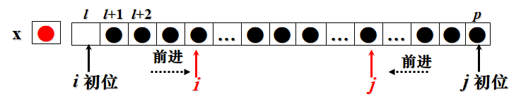

# 插入排序
## 直接插入排序
1. 将元素分成左右两堆，左侧为已排序的，右侧为未排序的
2. 每次取一个右侧元素放在左侧的合适位置
## 二分插入排序
- 在 [直接插入排序](排序算法.md#直接插入排序) 搜索合适位置时采用二分法
- **比较时间**缩减到$O(nlog_2n)$
## 2-路插入排序
- 就是做一个**循环数组**，确定某一个数作为中轴，然后插入时中轴不动，不合适的数以中轴为中心向左或向右移动
- 2路的意思是插入时既可以往中轴左边插，又可以往中轴右边插
- 最后打印数据时从最小的开始打印而不是从中轴开始
- 
- 打印顺序：f..n,1..r
## 表插入排序
- 用链表解决数组需要移动的问题
## 希尔排序
- 希尔排序的思想是让插入排序前数组已经尽量有序
- 
1. 每次将元素间隔分为d组（每组每个元素之间相差d，即步长为d），随后每组内部自行完成插入排序，并保持该组元素所在位置不变
2. 每次减少d（d=d-n，n不一定为1），重复上述步骤直到d=1
# 交换排序
## 冒泡排序
1. 先比较R1与R2,如果R1大,则交换R1和R2；然后对R2和R3做同样的处理,重复此过程直到处理完Rn-1和Rn的比较和交换。
2. 这样从(R1, R2), (R2, R3),直到 (Rn-1, Rn)的n-1次比较和交换过程我们称为一趟起泡。
- 一趟冒泡的明显结果是**将最大的传到了最后(最终位置)**。
- 每趟冒泡可以减少一个元素的参与
- 若一趟起泡中没有发现元素交换，可以直接终止交换（因为已经有序了）
## 快速排序
- 适用于比较混乱的待排序列，采用分治思想
- 
1. 选择一个数（第一个数）作为中轴，然后所有小的都往左边放，大的都往右边放（不管顺序）
2. 将中轴放入自己应该在的位置，即确定好了第一个数的位置
3. 对这两组分别重复上述方法，直到所有记录都排在应有位置上。
- 最坏情况出现：有一组没有元素（变成冒泡排序）
# 选择排序
## 直接选择排序
1. 将元素分成左右两堆，左侧为已排序的，右侧为未排序的，每次只看未排序的一堆
2. 从**未排序堆**选一个最小的放在**未排序堆**的最左侧
3. 此时未排序的一堆的最左元素自动属于已排序一堆的最右元素，然后对剩余未排序的照此递归
- 思想：未排序堆中每次选最小元素作为已排序堆的最大元素
## 树型选择排序（锦标赛排序）
- 
- 充分利用前一趟选择的中间结果,目的是希望减少以后选择的比较次数。
    1. 把n个待排序的记录两两比较，取出$\lfloor \frac{n}{2} \rfloor$个较小者作为第一步的结果保留下来
    2. 再把这$\lfloor \frac{n}{2} \rfloor$个较小者两两比较……,如此反复，直到比较出最小的为止。
- 第1轮树的产生
    - 要比较n-1次，选择了最优者
    - 然后把最优设为∞
    - 然后调整二叉树，此时只要比较树的层数（$log_2n$）次即可
    - 
- 可以把选择时间从$n^2$缩减到$nlog_2n$（n个数，每次比较树的层数即$log_2n$次）
## 堆排序
- 不需要额外增加单元，但时间消耗可以缩减到树型选择排序的同数量级
- 和树型选择排序相比，树型选择排序所有元素都在叶子节点，非叶节点是叶节点的重复，而堆排序节点分布于整棵树，没有重复
- 设L是长度为n的线性表（且是向量存储），当$1≤i≤\lfloor \frac{n}{2} \rfloor$ 时，其数据元素满足：
    - `L(i)（根节点）≤ L(2i)（左子树）`  且 `L(i) ≤ L(2i+1)（右子树）`（或同时换成≥）
    - 则称L是一个堆（线性表中藏了一棵完全二叉树，按字典序编号（可以参考树中完全二叉树的编号））
    - 其中：将  L(1)称为堆顶，L(n)称为堆底
- 即：堆是一棵父节点均≥（或≤）子节点的树（兄弟左右顺序不重要），堆顶是全局最小（最大）元素
### 堆中插入节点(建堆)
- 1. 连接，把当前元素放到堆底（数组尾部）
- 2. 调整，按父比子大交换(小堆顶，往上爬，爬不动就结束))
- 
### 在堆中删除节点（开始排序）
- 1. 交换
    - 堆顶 25 与堆底 45（最后一个，但不一定是最大的）进行交换，用于储存排序顺序
- 2. 调整/筛选（上升元 45 下降）
    - 对比现堆顶元素 45 下面两个元素 48, 35 大小，45 与小的那个(35)比较并决定是否交换，接着 45 再与下面两个比较大小，需要交换则交换，以此类推
    - 即：退位，退不动就结束
    - 最坏比较和交换次数是走一个二叉树的深度
- 
### 利用删除的调整过程建堆——筛选建堆
- 把叶结点看作已经是排序好了的堆，然后从最后一个父节点开始与子节点作比较筛选（即从$A(  \lfloor \frac{i}{2} \rfloor  )$开始往A(1)做筛选
- 
### 堆排序
1. 建堆
2. 进行如下动作n-1次
    1. 删除堆顶元素
    2. 执行筛选算法
- 即建堆再删堆
- 时间复杂度：堆排序的平均和最差性能都是$O(nlog_2n)$，大规模排序可用
- 空间复杂度：$O(1)$
- 堆排序是不稳定的
# 合并排序
1. 先把一个集合中的数据元素分成若干个子集，对每个子集中的元素进行排序
2. 再将所得到的有序子集进行合并。
- 
- 注意第二趟合并：第一趟排序后第三组无法两组合并，就可以先放着，等凑齐偶数对了再合并
- 上图每步合并都是将两个组合并成一个新的组，上述做法称为“二路合并排序”，类似地可以有“三路合并排序”、 “多路合并排序”。
- 评价：
    - 排序是稳定的
    - 比较时间复杂性$O(nlog_2 n)$
    - 移动时间复杂性$O(n)$
    - 总时间复杂性$O(nlog_2 n)$
    - 空间复杂性$O(n)$
# 枚举排序（计数排序）
1. 给每个元素一个计数器，记录扫描时比各个元素大（或小）的各有几个
2. 从第一个数开始，每次针对一个数 `i` 进行扫描比较与右侧其他元素 `j` 的大小，若`i<j`，则j计数加一，否则i计数加一
3. `i++`，重复上述过程
- 
## 分布计数排序
- 适用于部分元素多次重复出现
    - 列表记录每个元素重复出现的次数，最后将元素类别从小到大排列，每类重复该类元素的个数即可
# 分配排序
- 不比较就能排序的一种技术
- 也是一种分配方法，在**多因素排序**中使用更多，但也可移植到单因素排序中
- 比如规定扑克牌中花色重要性大于面值（数字）
- 可以有两种方法排序扑克牌：
    - 1.（最高位优先法，MSD，较复杂）先排序最重要的。先按花色分成4堆，然后每堆按面值由小到大分成13堆，最后依次收起来
        - 
    - 2.（最低位优先法，LSD，较简单），先排序最不重要的，每次都归并。先按面值分成13堆，然后再由小到大收集起来，再由花色分成若干堆，再依次收集起来
        - 
- MSD与LSD的比较:
    - MSD排序法必须将文件按关键字位逐层分成若干子堆，而每堆的排序是独立进行的，存在递归处理各组的问题
    - LSD排序法则不必分成子堆，而是全局进行若干次分配和收集，执行的次数取决于关键字位的个数。
    - 因此一般说来，LSD方法比MSD方法简单。
## 基数排序（桶排序）
- LSD应用于单因素的一个实例就是桶排序（基数排序）（多因素的最低为优先法移植到单因素上来，把单因素仿真（拆分）成多因素）
- 基本方法：
    - 把每个元素看成d元组：
    - $K_i=(k^1_i ,k^2_i, … ,k^d_i)$
    - 其中:  $C_0≤k^j_i≤C_{r-1} (1≤i≤n, 1≤j≤d)$
    - 其中r称为基数，需设立r个**队列**
        - 如处理一堆十进制数时，$259=(2,5,9)$，基数$r=10$ (即十进制)
        - 处理一堆英文单词，Apple=(A,p,p,l,e)，基数$r=27$（26个英文字母+空白符）
        - 记得基数要算入空白符，如100和25，25前面实际有个空白符（即0），Apple和Ant，Ant后面实际要有两个空白符
    - 排序时先按$k^d_i$的值从小到大将记录分配到`r`个盒子中去，然后依次收集这些记录，即最重要的最后处理（权值最大的最后处理）
    - 再按$k_i^{d-1}$的值从小到大将记录分配到`r`个盒子，如此反复，直到对$k^1_i$的分配和收集后就得到完全有序的文件。
    - 每个盒子本质上是一个**队列**（因为需要依次收集起来）
- 举例：
    - (188,371,260,531,287,135,56,299,18,23)
    - 零、使用空白符数字 0 补充前面空位
    - 一、按K(3)即第三位分配 (188,371,260,531,287,135,056,299,018,023)
    - 
                - 依次收集： (260,371,531,023,135,056,287,188,018,299)
    - 二、按K(2)即第二位分配 : (260,371,531,023,135,056,287,188,018,299)
    - 
    - 依次收集   : (018,023,531,135,056,260,371,287,188,299)
    - 三、按K(1)即第一位分配 : (018,023,531,135,056,260,371,287,188,299)
    - 
    - 第3趟收集结果:(018,023,056,135,188,260,287,299,371,531)