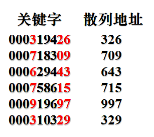
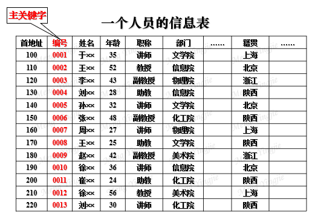

# 检索分类
- 依据**检索的性质**，分两类：
    - 基于关键字的检索：在给定的结构中找出**关键字**等于指定值的结点，即按关键字检索。（是最常见的检索。检索成功时，往往**只得到一个结点**即可）
    - 基于属性的检索：在给定结构中找出**某属性值**等于指定值的结点。（检索成功时，检索结果往往是一批结点，需要检索整个数据结构，**不能只找到一个就停止**）
- 根据检索对象的**组织关系**和检索对象的**存储组织**模式，检索算法有三类：
    - 顺序表和线性表方法
    - 直接访问法（散列方法）
    - 树索引方法
# 检索算法的特性
- 内外有别：分内检索和外检索。内检索是内存能够容纳全部记录的情形。 
- 静态动态：静态检索时，表的内容不变(即一个单纯的查找过程)；动态检索时，表中的内容不断地在变动(即表有频繁地插入/删除记录的操作)。
- 原字变字：原字系指用原来的关键字；所谓变字是指使用经过变换过的关键字（如密码加密）。
- 数字文字：指比较时用不用数字的性质。用数字的性质就是像排序算法中那样做各位数的 [分布计数](排序算法.md#分布计数排序) ，而不是直接对关键字进行比较，例如字符树就是使用数字性质。（把文字转换成数字再检索，如ASCII码）
# 算法效率的度量
- 我们更多关注时间效应
- 衡量检索算法的主要标准是检索过程中对关键字(或属性)要执行的平均运算次数，即**平均检索长度**
- $ASL=\displaystyle \sum^{n}_{i=1}{(C_i*P_i)}$
- 其中，`Ci`是查找第`i`个的比较次数，`Pi`是会去查找第`i`个的概率
- 这里的运算在大多数情况下是**关键字**的比较运算。Pi一般认为是等概率的(即Pi=1/n)
# 顺序结构的检索
## 顺序检索
- 用给定的关键字值与线性表中各结点的相应关键字值进行逐一比较。
- 可用向量，可用链表，元素有序无序都可以。可以逆序查找
- 注意找不到时指针越界问题。解决：可以在末尾先加一个带检索元素（方便停下来，不用考虑越界问题了）
- 分析
    - 检索成功的比较次数：$ASL=\displaystyle \sum^{n}_{i=1}{\frac{i}{n}}=\frac{n+1}{2}$
    - 检索不成功的比较次数：n+1
    - 时间复杂度:O(n)
    - 空间复杂度:O(1)
    - 算法优点：简单易行。
    - 缺点：检索时间长，检索长度与表中结点数成正比。
## 二分检索
- 此方法是将要检索的对象分成两部分，舍弃不包含所需要项目的那一部分，对剩下的部分再用相同的方法进行划分，直到找到所需要的项目或划分部分为空为止。
- 待检索元素**必须**事先有序，且用**向量存储**（随机获取区段首、尾及中间位置）
- 分析
    - 设每个记录检索概率相等。
    - 最坏走个二叉树深度
    - n较大时,$ASL=log_2n$
    - 为换取快速检索所付出的代价是要将**线性表排序**；适应于一旦建立起来就**很少改动而又需要经常检索**的线性表
## 分块检索
- 既有较快的速度，又能够动态变化（偶尔有变化）——比较实用
- 分为两个区：索引区（辅助信息）和数据区
- 分块检索要求把线性表分成若干块，在每一块中记录的存放是**任意**的，但是块与块之间必须**有序**。（即前一块要比后一块小（大），但物理上不一定是顺序的，且不连续更优，块是人为划分的）
- 另外要求建立一个索引表，把每块中最大(或最小)的关键字，按照块的顺序存放在一个辅助数组中，显然这个数组也是按升序排序。
- 块与块的大小可以不同。
- 
- 检索时首先在索引表中进行，以便确定记录在哪一块，方法可以用顺序也可以用二分法；
- 当确定块以后，在块内可以进行顺序检索。
- 优点：既有较高的检索速度，又可以适应数据动态变化（即增/减记录，要求物理不连续）。
- 缺点：平繁进行增/减记录可能导致块中记录的分布很不均匀，此时检索速度将会下降。另外需要支出索引表的空间代价。
- 分析：若块进行连续组织（物理连续的情况），设含有$n$个记录的文件被分成了$b$块,每块$s$个记录,检索等概率,则其平均检索长度最小为多少？
    - 设在索引表中顺序查找，检索由两个阶段构成，则:
    - $ASL=ASL_{index}+ASL_{block}$
    - $ASL_{index}=\displaystyle \sum^b_{i=1}{\frac{i}{b}}=\frac{b+1}{2}$
    - $ASL_{block}=\displaystyle \sum^s_{i=1}{\frac{i}{s}}=\frac{s+1}{2}$
    - 则$ASL=\frac{b+1}{2}+\frac{s+1}{2}=\frac{b+s}{2}+1$
    - 又 $n=b*s$
    - 则$ASL=\frac{\frac{n}{s}+s}{2}+1$
    - 当$S=\sqrt{n}$时，ASL最小$ASL=1+\sqrt{n}$
# 树形结构的检索
- 树形结构的一个重要应用就是用来组织目录和符号表
- 以树形结构组织的目录我们称为树目录；以树形结构组织的符号表我们称为树表。
    - 树目录：字典、书的组织体系；计算机中的文件系统目录的组织。
    - 树表：汇编语言、编译程序等系统软件使用的符号表，是一个名(标识符)——值对的集合，这种表上需要经常进行检索、插入、删除等运算。
- 以下仅谈树目录的检索，树目录的检索基础是**二叉排序树**和中序顺序结构
- 以二叉排序树为结构组织的检索结构也称为二叉检索树或二叉查找树
- 二叉检索树的检索效率取决于该二叉树的深度，但该二叉树是动态生成的，由于输入的结点次序的不同可能导致出现不同的二叉树，也可能出现歪树，使其检索性能退化到与顺序检索等同的情况。
- 要保证其始终具有优良性能，可以采用AVL树
## AVL树
- 这种二叉树它的子树的深度是平衡的,称为平衡二叉树(即AVL-树，或称为均高二叉树)。
- AVL-树：
    1. 一棵空二叉树是AVL-树；
    2. 若T是一棵非空二叉树, 其任何结点的左、右子树的**高度相差不超过1**,则T是AVL-树。
- 结点的平衡因子：结点的左子树高度减去右子树的高度的差值。
- 最优二叉排序树结点的平衡因子取值范围：{-1, 0 ,1}（即尽量接近一棵完全二叉树）
### AVL-树平衡的保持
- 在平衡的二叉树中若进行插入或删除将可能导致不平衡情况的出现，这时就要运用一定的规则进行调整。
- 平衡规则：选择离插入(或删除)结点**最近的不平衡结点**(其平衡因子为±2)开始调整。
- 以下讨论以插入情况为例：
- 平衡类型：找一个**结点A的平衡因子为±2**
- LL型：新结点插在 A 的 左子树的 左子树中导致不平衡;
    - 找两个节点A和B
    - 把A拉下来，B上去当子树的根节点，把B的右子树变成A的左子树（保证了中序的关系）
    - 二叉排序树只要不违反中序的有序性即可
    - 
- RR型：新结点插在 A 的 右子树的 右子树中导致不平衡;
    - 与LL型正好相反
    - 把A拉下来，B上去当子树的根节点，把B的左子树变成A的右子树（保证了中序的关系）
    - 
- LR型：新结点插在 A 的 左子树的 右子树中导致不平衡;
    - 要找三个节点
    - 把X提起来，A往下作为X的右子树，B作为X的左子树，同时X的原左子树成为B的右子树，X的原右子树作为A的左子树
    - 
- RL型：新结点插在 A 的 右子树的 左子树中导致不平衡.
    - 与LR相反
    - 
- 举例：
    - 有一个关键字集合K={xal,wan,wil,zol,yo, xul}对其构造一棵**最优二叉排序树**。
    - 
# 散列表的检索
- 散列表既是一种**存储方法**, 也是一种常见的**检索方法**。（具有双重性质）
- 它是按关键字编址的一种技术（即散列表函数的自变量是关键字）
- 散列法(Hashing, 也称杂凑表、混列表、哈希表)
- 散列法的**基本思想**：将关键字看成一个变量，通过一定的函数关系，将函数值解释为存储地址，将结点存入这样计算得到的地址单元中（先计算地址，然后在存入这个地址），检索的过程是存储过程的逆过程（得到关键字之后计算出地址直接去拿）。
## 散列函数
- 为了获得一个好的散列函数，通常应当使得函数与组成关键字k的所有符号有关。
- 此外如果k是从关键字集合中随机抽取的一个，原则上我们希望H(k)以同等概率取地址空间中的每一个值，如果一个散列函数满足这一性质，则称该散列函数是均匀的（实际很难）。
### 直接定址
- 取关键字的某个线性函数值
- H(k)=a*k+b，a,b为常数。
- 对于由字符组成的关键字在计算散列地址时可将关键字中的符号看成其内部表示编号值或编码值（如ASCII码组合或者按字母表顺序的组合），这样就可以参与运算了
### 除余法
- 选择一个适当的正整数p,用p去除关键字，取其余数作为地址，即modulo-P residue，可形式化表示为：
- H(k)=k MOD P
- 该方法的关键是选取适当的p，经理论和实验分析一般认为选取p为小于基本存区长度n的最大素数为宜（保证均匀）
### 数字分析法
- 对各个关键字内部代码的各位进行分析,抽取分布比较均匀的若干位作为地址,抽取的位数取决于地址码的位数。例：
- 
- 依赖于关键字来分配，要是关键字改变了，可能需要重新分析选取
- 常用于关键字的位数远多于地址码的位数情况下
### 分划法
- 也称折叠法。若关键字很长，且可变的；或者关键字由多个域组成，此时散列技术可将关键字的内部代码分割成多个部份，并将这些部份按某种规律结合起来。
- 
### 平方取中法
- 也称中平法。先计算出关键字的平方值，再抽取它的中间若干几位作为散列地址。
- 有时抽取获得的函数值会超过或达不到地址空间编码的位数，这时可以对函数值再乘以一个比例因子进行变换，使其能够落到基本区地址范围。（数字放大）
### 基数转换法
- 关键字的符号组成一般是建立在一定基数制上的，我们可以将该关键字看成是另一个基数制上的表示，再将其还原为原来基数制上的表示后，抽取其若干位作为散列地址。
- 例：k=236075,为十进制下的关键字，把它看作十三进制下的数字。
- (236075)13==>(841547)10
- 取2、3、4位作为散列地址,H(k)=415
- 其目的主要是希望将关键字之间的距离放大，因此一般要求取大于原来的基数制，同时两个数制之间最好**互素**。
### 随机数法(略)
- 随机数在概率算法设计中扮演着十分重要的角色
## 碰撞的产生及处理
### 产生
- 依据散列函数H计算出地址，若发现此地址已经被别的结点占用,  即就是说有两个不同的关键映射到了同一地址空间,我们把这种现象称为**碰撞**(或冲突,collision)。
- 产生碰撞的两个(或多个)关键字我们称为同义词(相对于H而言)。
- k1≠k2,    H(k1)=H(k2)
- 导致碰撞的主要原因是相对资源的有限性与相对需求的无限性造成的，往往很难在这两者之间建立完美的对应关系(函数).
- 我们把没有碰撞的系统称为**完美散列**
- 选择一个完美的散列函数需要很高的代价，但在需要很高检索性能时也是值得的
### 处理
- 当碰撞发生后处理碰撞的方法基本上有两类：拉链法和开地址法，也有分为**开散列**(open hashing，基本区外，即基本区之外也是开放的)和**闭散列**(closed hashing，基本区内，即基本区之外的区域是不能用的)的。以下逐一讨论。
#### 拉链法
- 当碰撞发生时,就拉出一条链,建立一个链接方式的同义词子表。依据同义词建立区域的不同有两种方式：
    - 分离的同义词子表法
        - 也称外链法(基本区之外也是开放的，属于开散列)。  在基本区之外开辟一个溢出区存储同义词。
        - 
    - 结合的同义词子表法 ^709eaa
        - 也称内链法(属于闭散列)。在基本区内目前还没有被占用的空间开辟溢出区存储同义词。即在基本区内进行拉链。
        - 
        - 易出现堆积现象：
            - 把两个同义词子表结合在一起的现象称为“堆积现象”或“群集现象”
            - 如上图中，a与b是同义词，计算出来的函数都是100，存b的时候只能链出来存到103，但是c的函数值也为103，所以又得链出来存到别的地方（102），导致不是同义词的也链接在了一起，叫堆积现象
#### 开放地址法
- 当碰撞发生时,用某种方法形成一个探测的序列, 沿着这个序列一个个单元地查询,  直到找到这个关键字或者找到一个开放的地址(open addressing,即没有进行存储的空单元)。
    - 如果是存储操作，则遇到开放地址就可进行存储
    - 如果是检索操作，则遇到开放地址就是检索失败
- 针对探测序列的产生不同,主要有：
##### 线性探测（相当于顺序搜索的结合的同义词子表法）
- 是最简单的顺序查找方法。当碰撞发生时,到顺序的下一个基本存区单元去进行探测，即：若H(k)=d，此时发生碰撞，则探测序列为：`d+1,d+2,…,m-1,0,1,2,…,d-1`（m为基本存区长度）
- 也可能产生堆积现象，为改善堆积可以采用双散列函数探测法。
##### 双散列探测法
- 为了改善堆积现象我们可以使用双(重)散列
- 即主散列函数发生碰撞时，启用第二散列函数
- 第二散列函数可以在主函数前后浮动，或者作为第一函数的系数乘上去等等等等方法。
# 基于属性的检索
- 在检索的实际应用中，经常要检索文件中若干个属性满足一定条件的结点，我们把这类检索称为基于属性的检索。
- 要遍查整个数据集，所以代价很大。因此为了保持较高的检索效率，需要采取一些特殊的结构和方法。这里主要讨论倒排表和多重表。
## 倒排表
- 在原来数据表的基础上，对于感兴趣的(即可用来作为检索参数的)**每个属性的每个值都建立一个线性表**，该线性表用作存放与此属性相对应的所有关键字的值。这种辅助线性表称为倒排表。
- 将原来的数据表可以称作主表。
- 倒排表可以看成主表的辅助表，本质实际上是一个主表的索引表。
- 
- 
- 在信息检索中，倒排表实际上是由检索词和信息记录的主控键构成的行列矩阵。
- 花费了保存倒排表的存储代价
- 在倒排表上进行插入或删除操作时，不但要改变主表，还要修改行相应的辅助表，这样还会降低更新运算的效率。
- 但倒排表不能代替原来的主信息表，其必须和主表并存才有实际意义
## 多重表
- 倒排表直接存地址
- 主表中将具体属性值去掉，用链接字段代替，把相同属性值的结点链接起来；倒排表中给出属性值和该属性值的首元素指针，这样倒排表就演变成为表头的表——头表。
- 
